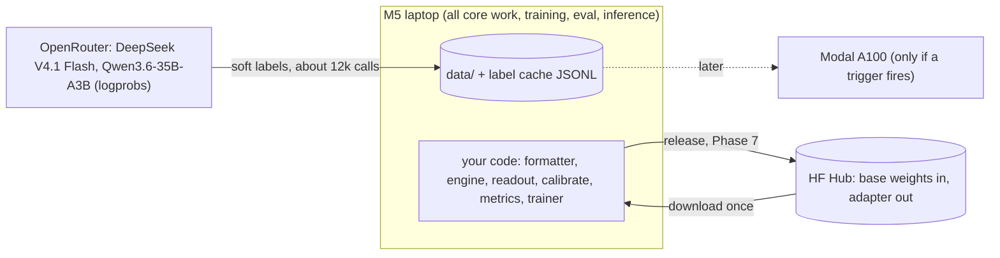

# nanohunch: a minimal Jev-style typed decision model from open small models

**Status:** approved for build (pending Phase 0 measurements). Revision 2 (2026-09-24): minimal layout, open replications as references and baselines.
**Mode:** GREENFIELD, standard depth
**Date:** 2026-09-23  **Author:** orchestrator for @umang  **Reviewers:** sd-redteam (over-engineering, pre-mortem)

> Read this file first (15 minutes). Then `plan.md` is what you work from
> every day. `risks.md` settles any contradiction between the other files.

## 1. Recommendation

pngwn's controlled experiment found all three readout heads **within 0.006
accuracy** of each other on state-derivable decisions, while knowledge
accuracy scaled with parameters (0.625 at 4B vs 0.415 at 0.6B) (`MEASURED` by
pngwn). So we spend the budget on a base model that trains fast and on the
simplest readout, not on a clever head. Build **MiniCPM5-2B-Base, read through
restricted label-token logits, LoRA-tuned in MLX on the M5 on soft labels from
two releasable teachers**, served by a hand-written engine that encodes the
state once and branches the KV cache per question. Expected cash is **5 to 15
USD** of the 200 USD cap. The binding constraint is time, **about 160 hours**,
not money. Since about ten open replications appeared the week after Jev
launched, the claim is **minimal**, not "first" or "best". The core is six
hand-written files of at most 1,000 lines, trained overnight on one Mac, and
measured in one harness against SemIf (frozen Qwen3.5-4B), decider-2b (a
trained 2B model) and pngwn.

**What would change this:** Phase 3 shows Qwen3-4B-Base B0 more than 3 points
above MiniCPM5-2B (train the 4B model on one rented GPU); P0-8 shows under 200
tok/s sustained LoRA on the Mac (move training to Modal); the Phase 5 learning
curve shows under +1 point over B0 at 3k decisions (stop scaling, publish the
B0, engine and calibration story).

## 2. Problem

TypeSafe's Jev (announced 2026-09-15) is a closed "System One" model. It
takes a text state and typed questions and returns calibrated probability
distributions in one parallel pass, with no generated text. Their claims
include "can't hallucinate", calibration, and 40x to 200x speedups. They
publish no calibration evidence, and their "accuracy" means agreement with the
average of two frontier LLMs (`_brief/research-notes.md`).

The goal is a **learning and portfolio project**: rebuild the idea from open
parts, understand every piece, and publish a model plus an honest eval.
pngwn released an open replication on 2026-09-16. Its causal scorer flipped
**37.5%** of rankings when option order was reversed, and its fine-tune lost to
the untouched base above 2k tokens because training was truncated at 384
tokens (`MEASURED` by pngwn). Those two failures are the gap this project
targets.

## 3. Requirements (load-bearing only; full list in `_brief/requirements.md`)

| Requirement | MVP target | Label | Source |
|---|---|---|---|
| Total cash | <= 200 USD, keep >= 50 reserve | constraint | user |
| Time | about 20 h/week, solo | ASSUMPTION A7 | user |
| Accuracy over own zero-shot base (B0), gold + held-out template slices | > 0 with paired 95% CI above 0 (target +3 pts) | requirement, pre-registered | red team R3 |
| ECE after temperature scaling | <= 0.05 (target 0.03, stretch 0.015) | requirement | pngwn 0.047 / 0.026 / 0.015 |
| Top-1 agreement under option reorder | >= 0.90 (target 0.95) | requirement | beats pngwn 0.664 |
| No long-input regression (> 2k tokens) vs B0 | delta >= 0 | requirement | pngwn failure |
| Local inference on the M5, 24 GB (19.07 GB Metal working set) | fits with headroom | MEASURED | capacity.md |
| Branch correctness | isolation diff == 0; fp32 oracle <= 1e-3 | requirement (S10 redefined) | risks.md R8 |
| Release cleanliness | no closed-model outputs, no NC data in training | one-way constraint | ADR-0004 |

**Out of scope for the MVP:** HTTP server and public demo, a Jev head-to-head,
Qwen3.5 hybrid branching, real-text (scraped) data, a dataset release, multi-seed
studies, and rented-GPU training unless a trigger fires. Full list with
triggers: `plan.md`, "Not doing".

## 4. Current state (constraints; there is no existing system)

From `_brief/system-map.md`: Apple M5, 24 GB unified memory, 628 GiB free disk,
uv and Python available. mlx-lm 0.31.3 already exists in `gemma-mlx/.venv`.
Modal was used in `rl-wordle`. The user's convention is that they hand-write
core logic and agents only pair (`rl-wordle/AGENTS.md`). Nothing local already
implements LoRA, an option head, calibration or state branching, so all of it
is new, and all of it is the learning.

## 5. Options considered (detail: `architecture.md`)

| Criterion | A: zero-train letter reader | B: LoRA letter scorer (on A) | C: scalar cross-encoder |
|---|---|---|---|
| Fits 200 USD (must) | pass (~0 to 10 USD) | pass (5 to 15 USD on Mac) | at risk (about 3x training tokens) |
| Beats own base (must, S1) | **fails by definition** (it is the base) | targeted | targeted |
| Order robustness | test-time pooling only | augmentation + P = 2 fallback | invariant by construction |
| Learnability / surface | smallest | medium | largest (new head, per-option data, two-level branching) |
| Zero-shot starting point | yes | yes (step 0 = A) | no (random head) |
| **Verdict** | **Built first as B0 and the engine** | **Chosen** | Rejected: cost and surface for an edge pngwn attributes to parameter count |

Base model (ADR-0001 + amendment): **plain full attention**, not Qwen3.5.
Qwen3.5-4B LoRA ran at **8 tok/s** on the Mac against 178 to 431 for dense
models (`MEASURED`, synthetic weights), and its CUDA kernels are unverified.
Default member: MiniCPM5-2B (Mac-trainable, 232 to 347 tok/s, W1 893 ms). Challenger:
Qwen3-4B-Base (must beat it by more than 3 points in the B0 bake-off).

**Revisit conditions:** C for Choice questions if trained order agreement is
below 0.90 even with P = 2 pooling. Qwen3.5 if its LoRA step runs within 1.5x
of Qwen3-4B with kernels loaded and its B0 is 3 or more points higher.

## 6. Design

### 6.1 How it works, in one paragraph

Every request renders the **state first** as a shared prefix, then each
question as a short branch ending in `Answer:` (format `nanohunch-fmt-v1`,
ADR-0003). The engine prefills the state once in 1k-token chunks, then for
each question runs only the branch tokens on the cached state and trims the
cache back. At the last position it multiplies the hidden state by **only the
LM-head rows of the label tokens** (` A`..` Z` for Choice, ` 0`..` 9` for
Score, ` yes`/` no` for Noul), applies softmax and then a per-type
temperature (ADR-0002). Training uses that exact same function as its loss
(soft cross-entropy against teacher distributions), with option order
reshuffled every epoch and targets remapped by option id. Measured on real
Qwen3-1.7B weights, state sharing gives a **10.2x** speedup at 1k state and 16
questions (`MEASURED`).

### 6.2 Components and contracts

Interface registry: `plan.md` ("Interface registry"). Server JSON contract (later
item): `architecture.md` section 6.2. Data row schema, keyed by option id:
`plan.md` Phase 4 and `data.md`.

### 6.3 Data

About 10k training decisions for the MVP: about 4k public gold (BoolQ, HotpotQA
yes/no, ARC, CommonsenseQA) plus about 6k synthetic workflow decisions (3
workflows x 4 templates, one template held out). Labels are soft
distributions from **top-20 logprobs** of two releasable teachers. Choice
questions are labelled in canonical and reversed order, pooled log-linearly per
teacher and averaged across teachers. Splits are made by **group_key**, hashed
with a salt that freezes at Milestone 1 (one-way door). Everything is keyed by
option id, because pngwn's v1 dataset shipped an inverted label. Full detail:
`data.md`, adjusted by `risks.md`.

## 7. Capacity (detail: `capacity.md`)

All measured on this M5 with synthetic weights of the real configs. Phase 0
re-measures on real weights.

| Workload | MiniCPM5-2B | Qwen3-4B | Qwen3.5-4B |
|---|---|---|---|
| W0: 256-token state, 4 questions | 318 ms | not measured | 642 ms |
| W1: 1k state, 16 questions | 893 ms | 1,664 ms | 1,806 ms |
| W2: 8k state, 16 questions | about 6.6 s, 11.3 GB | copy-branching OOM risk | 11.5 s, 14.6 GB |
| LoRA training tok/s at 2k | 297 | 178 | 8 |

**First bottleneck:** training throughput. A 10k-decision epoch is about
**14 h** on the Mac (DERIVED), so the MVP gets 1 to 2 epochs overnight.
Second: Mac memory for long states with many branches (use trim branching,
not copies). Third: teacher logprob stability (a week-1 gate, not a
throughput limit).

## 8. Reliability and failure modes (detail: `reliability.md`, dispositions `risks.md`)

There is no uptime SLO. The failures that matter are **silently wrong
numbers**. The guards:
- Labels keyed by option id, a permutation property test, and 20 decoded rows
  read by hand for every dataset build (R6).
- An fp32 unbatched branch oracle, plus isolation diff == 0 (R8).
- Batch size 1 until the unexplained 0.12 fp32 MLX batched gap is explained (R9).
- Trainer-vs-engine NLL parity, an "adapter actually applied" assert, and
  overfit-32 through the engine before any overnight run (R3, R9).
- A 100-item human audit before bulk labelling, and 200 before the report (R11).
- Checkpoints every 15 minutes with resume and `caffeinate -i` (R18).

## 9. Security and licensing (detail: `security.md`, ADR-0004)

- OpenAI and Anthropic terms forbid using their outputs to train a model that
  is then distributed. So closed models **never** touch training,
  calibration or published labels.
- DeepSeek's terms (4.2(3)) allow it if published outputs are marked
  AI-generated. Qwen3.6-35B-A3B is Apache-2.0.
- ANLI and all pngwn artefacts are NC-treated and eval-only.
- The first commit is `.gitignore` (with `.env`). The label cache stores
  allowlisted fields only. Uploads use explicit file lists.

## 10. Cost (detail: `cost.md`, re-scoped by the cut line)

| Line | MVP | Notes |
|---|---|---|
| Teacher labels, about 12k decisions x 2 teachers | about 2.6 to 3.8 USD | DeepSeek V4.1 Flash 0.10 / 0.50 per MTok, `MEASURED` 2026-09-23 on OpenRouter |
| Synthetic state generation | about 1.2 to 2.0 USD | |
| P0 probes, retries, 5.5% OpenRouter fee | about 1 USD | |
| GPU | 0 | Mac training |
| **Total** | **about 5 to 15 USD** | about 185 USD left for a 4B target tier |
| Local inference per 1M input tokens (electricity) | about 0.003 USD for 4B | vs Jev 0.042 USD |

The dangerous cost is a forgotten rented GPU (76 USD per A100 weekend). The
MVP has no GPU billing path. If Modal is ever used, every job sets `timeout=`.
OpenRouter is prepaid in steps of at most 20 USD, with auto top-up off.

## 11. Rollout: the plan

`plan.md` has 8 phases totalling about 160 h. Each phase has a "why", the
concepts you will understand, interfaces, tests first, a verification gate, a
rollback and kill criteria.

| Phase | Outcome | Week (20 h/wk) |
|---|---|---|
| 0 | Repo, and 5 unknowns measured (labels, oracle, anomaly, teacher logprobs, Mac LoRA soak) | 1 |
| 1 | Walking skeleton: B0 and a stock-LoRA number | 2 |
| 2 | Hand-written engine reproduces the skeleton; format frozen | 3 |
| 3 | Eval harness, B0 bake-off, SemIf and JevBench anchors, **Milestone 1 public** | 4 |
| 4 | Data v1, labeller, audit before bulk | 5 to 6 |
| 5 | Hand-written trainer, numerics gate, 1k/3k curve, **Milestone 2 kill decision** | 6 to 7 |
| 6 | Data v2, full run, pre-registered eval vs B0, pngwn, SemIf method, decider-2b | 8 to 9 |
| 7 | Release: adapter, calibration, model card, report | 9 to 10 |

Calendar rules: Milestone 1 must be public by the end of week 5, or the scope
is cut. If no model trained on teacher-labelled data has been evaluated by the
end of week 9, publish B0 and a write-up, then stop.

## 12. Risks (top 6; all 23 dispositioned in `risks.md`)

| Risk | State |
|---|---|
| R1/R2: scope and stall before the first result (most likely failure, 35%) | fixed: cut line, walking skeleton by week 2, calendar rules |
| R3: fine-tune does not beat B0 where it counts | fixed: pre-registered metric, 3k kill rule, pivot story already publishable at M1 |
| R4: non-releasable labels or data in the release | fixed: ADR-0004, allowlist assert, fail-closed release gate |
| R10: teacher logprobs unstable on OpenRouter | fixed: week-1 repeatability gate, pinned providers, single-teacher fallback |
| R9: unexplained MLX batched gap | accepted: batch 1 plus parity test until explained |
| R21: crowded field (about ten open replications) | fixed: claim is minimal (<= 1,000 core lines, one Mac), measured against SemIf, decider-2b and pngwn in one harness |

## 13. Decisions log (ADRs, one-way doors)

- ADR-0001: plain-attention base family; amended so MiniCPM5-2B is the MVP default.
- ADR-0002: restricted label-logit readout on a frozen LM head.
- ADR-0003: prompt serialization `nanohunch-fmt-v1` (frozen at the end of Phase 2).
- ADR-0004: training-data licence and teacher policy.
- Also one-way: the split salt (frozen at Milestone 1) and the public release (Phase 7).

## 14. Open questions (ranked by how much they would change the design)

1. Do the OpenRouter hosts return stable top-20 logprobs with thinking off (P0-7)? If not, fall back to a single teacher plus gold labels.
2. Do the Mac LoRA rates hold on real weights for 2 h (P0-8)? If not, training moves to Modal.
3. Is the Qwen3-4B B0 more than 3 points above MiniCPM5-2B (Phase 3)? If so, it becomes the target-tier model.
4. Does mlx-lm 0.31.3 load the real MiniCPM5-2B-Base checkpoint (Phase 0 step 3)? If not, Qwen3-4B leads.
5. Does the DeepSeek V4.1 Flash version fall under the verified DeepSeek terms (before bulk labelling)?

## 15. File map and precedence

| File | Owner | Use it for |
|---|---|---|
| `plan.md` | planner + orchestrator | daily execution |
| `risks.md` | orchestrator | dispositions; **wins any contradiction** |
| `adr/` | architect + orchestrator | one-way decisions |
| `risks-overengineering.md`, `risks-premortem.md` | red team | why scope was cut, what could kill the project |
| `architecture.md` | architect | mechanisms, contracts, why-for-a-learner paragraphs |
| `data.md`, `capacity.md`, `cost.md`, `reliability.md`, `security.md` | specialists | reference; controls outside the cut line are "later" |
| `_brief/` | recon, requirements, orchestrator | ground truth and the assumption ledger |
| `capacity-bench/` | capacity | the benchmark scripts that produced the MEASURED numbers |
| `plan-parts/` | planner | phase sources that were assembled into plan.md |

Note (revision 2): module names in `architecture.md` section 6.4 (`schema.py`,
`formatter.py`, `engine_mlx.py`, `readout.py`, `metrics.py`, `train_mlx.py`,
`build_data.py`) are superseded by the six-file core in `plan.md` ("Repository
layout" and "Interface registry"). The contracts are unchanged; only the file
grouping moved.

Note: the P0 ids in `capacity.md` (P0-1..P0-10) predate the plan and do not
line up with the plan's ids. The plan's P0-1/4/6/7/8 are authoritative.

## Definition of done (orchestrator check)

- [x] Load-bearing numbers labelled MEASURED / DERIVED / ASSUMPTION
- [x] At least two alternatives rejected, with reasons (C, Qwen3.5, rented-GPU training)
- [x] Simplest baseline compared: Candidate A is built as B0 and is the fallback story
- [x] Cost at MVP and target scale (target tier and 10x in `cost.md`)
- [x] First bottleneck named, with the load at which it binds (Mac training, 14 h per 10k-decision epoch)
- [x] SPOFs removed or accepted with a tripwire (the single laptop: label cache backup and checkpoints; `risks.md`)
- [x] One-way doors have ADRs or explicit freeze points
- [x] Every plan phase has a verification gate and a rollback
- [x] Open questions listed
- [x] Claims about existing code cite path:line (in the specialist files)
