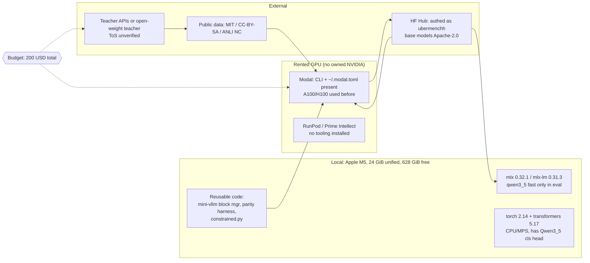

# System map (GREENFIELD constraint map)

Recon date 2026-09-23. Mode GREENFIELD: there is no existing system. The new repo
`/Users/umangkaushik/fun/nanohunch` has zero commits (`git log`: "branch
'master' does not have any commits yet") and contains only `docs/`. This file maps
the constraints the design must live inside. Nothing here is a proposal.

Labels: MEASURED = observed by a read-only command today, or read from a file/API
today. DERIVED = arithmetic on MEASURED values. ASSUMPTION = not verified today.

---

## 0. Premise check (read this first)

1. **mlx-lm DOES support Qwen3.5 hybrid layers, but only the inference path is fast.
   Training Qwen3.5 on the Mac runs the Gated DeltaNet as a per-token Python loop.**
   The research notes mark mlx-lm support as UNVERIFIED (research-notes.md:86-88).
   It is present in the installed mlx-lm 0.31.3
   (`gemma-mlx/.venv/.../mlx_lm/models/qwen3_5.py`, `models/gated_delta.py`). But
   `qwen3_5.py:193` passes `use_kernel=not self.training`, and
   `gated_delta.py:262-283` then routes to `gated_delta_ops`, which is a
   `for t in range(T)` loop over the sequence (`gated_delta.py:214-259`). The Metal
   kernel (`gated_delta.py:110`, `mx.fast.metal_kernel`) has no custom VJP
   (grep for `vjp|custom_function|grad` in that file returns nothing). At
   2k-token training sequences that is 2,048 sequential steps in each of 24 DeltaNet
   layers per forward (DERIVED: 32 layers x 3/4 linear, `qwen3_5.py:212`
   `full_attention_interval` default 4 at `qwen3_5.py:43`). Expect local Qwen3.5
   LoRA training to be slow, and treat its speed as unmeasured.
   The CUDA side has the same shape of problem: transformers 5.17 Qwen3.5 uses
   `use_kernel_func_from_hub_with_fallback` for `chunk_gated_delta_rule` and
   `causal_conv1d` (`modeling_qwen3_5.py:249-301,437`) and falls back to pure
   torch when the hub kernels are missing. That matches pngwn's report that the
   DeltaNet/conv layers "fell back to slow reference PyTorch kernels"
   (research-notes.md:137).
   **MiniCPM5-2B is plain `LlamaForCausalLM` (HF API, MEASURED) and uses mlx-lm's
   standard `llama.py`, so it has no such penalty on either backend.**
2. **mlx-lm's built-in training loss computes full-vocab logits.**
   `tuner/trainer.py:86-99` `default_loss` calls `model(inputs)` and
   `nn.losses.cross_entropy` over every vocab row. Qwen3.5's vocab is 248,320
   (research-notes.md:74); pngwn OOM'd at 20.7 GiB with full logits
   (research-notes.md:109-110). A candidate-rows-only loss must be custom on the
   Mac too. mlx-lm has no sequence-classification head (grep for
   `SequenceClassification|classification` in the mlx_lm package: no match), while
   transformers does (`modeling_qwen3_5.py:2076` `Qwen3_5TextForSequenceClassification`).
3. **Dataset license in research notes disagrees with the dataset card.** Research
   notes say the pngwn ticket component is CC-BY-NC-4.0 (research-notes.md:100).
   The HF API card for `pngwn/typed-decisions-v2` reports `cc-by-sa-4.0` (MEASURED,
   README.md line 2 of that dataset). The NC claim may come from the REPORT and apply
   to a subset. Unresolved; see section 5.
4. **The user writes the core code themselves.** Their most recent project states
   "The user is writing this code. Not you. The learning is the deliverable"
   (`rl-wordle/AGENTS.md:9-10`) and forbids frameworks in the from-scratch core
   (`rl-wordle/AGENTS.md:52-60`). If this project follows the same pattern, the plan
   must leave the scoring head, loss, calibration and KV branching for the user to
   write. It should not rely on `trl`/`peft` trainers for those parts. Neither
   `peft` nor `trl` is installed in any local venv (MEASURED, section 1).
5. **Disk and memory are NOT a problem.** 628 GiB free (MEASURED). Qwen3.5-4B-Base
   checkpoint is 4,659,865,088 params in safetensors (MEASURED, HF API; includes the
   vision tower, arch `Qwen3_5ForConditionalGeneration`), i.e. about 9.3 GB bf16
   (DERIVED). This fits 24 GiB unified memory for inference. Whether LoRA training
   with activations fits the macOS GPU wired limit is unmeasured (section 4).

---

## 1. Local machine (MEASURED, read-only commands, 2026-09-23)

| item | value | label / source |
|---|---|---|
| chip | Apple M5, GPU arch `applegpu_g17g` | MEASURED `sysctl machdep.cpu.brand_string`, `mx.device_info()` |
| memory | 25,769,803,776 B = 24 GiB unified | MEASURED `sysctl hw.memsize` |
| cores | 10 (4 perf + 6 eff) | MEASURED `sysctl hw.ncpu hw.perflevel0/1.physicalcpu` |
| GPU wired limit | `iogpu.wired_limit_mb: 0` (OS default, not raised) | MEASURED `sysctl iogpu.wired_limit_mb` |
| OS | macOS 26.6.2 (25G83) | MEASURED `sw_vers` (notes say 26.6) |
| disk | 926 GiB volume, 628 GiB free (31% used) | MEASURED `df -h ~` |
| system python | 3.14.7 at /opt/homebrew/bin/python3, `mlx` NOT importable | MEASURED |
| uv | 0.11.21 (2026-06-11) at ~/.local/bin/uv | MEASURED |
| M5 fp16 GEMM ceiling | MPS 10.65 TFLOP/s at 2048^3; hand `simdgroup_matrix` 3.04 | MEASURED 2026-08-19, `metal_kernels/roadmap/ROADMAP.md:68-75` |
| docker | 29.4.0 | MEASURED |
| gh | present /opt/homebrew/bin/gh | MEASURED |
| git-lfs | not found | MEASURED (hf CLI with xet backend exists, `~/.cache/huggingface/xet`) |
| nvidia-smi | not found (no local NVIDIA GPU) | MEASURED |

**ML packages by venv** (MEASURED, `ls .venv/lib/*/site-packages`):

| venv | python | mlx | mlx-lm | torch | transformers | other |
|---|---|---|---|---|---|---|
| gemma-mlx | 3.12 | 0.31.2 | **0.31.3** | 2.12.1 | 5.12.1 | safetensors, numpy, pytest |
| metal_kernels | 3.14 | 0.32.1 | none | 2.13.0 | none | numpy |
| mlx-learn | 3.13 | 0.31.2 | none | none | none | |
| gpt2-inference-engine | 3.13 | none | none | 2.14.0 | **5.17.0** (has qwen3_5) | safetensors |
| rl-wordle | 3.13 | none | none | 2.13.0 | 5.14.1 | accelerate 1.14.0 |
| dist-train, linear-attention, kimi-k3 | 3.13 | none | none | 2.13.0 | none | |

Not installed anywhere: `peft`, `trl`, `datasets`, `vllm`, `wandb`, `flash-linear-attention`,
`kernels`. mini-vllm has no local venv (CUDA-only project).

**HF cache** (`~/.cache/huggingface/hub`, 26 GiB MEASURED): gemma-4-E4B-it (15 GiB),
Qwen3-1.7B (3.8 GiB), Llama-3.2-1B-Instruct, gemma-3-1b-it, Qwen3-0.6B (1.4 GiB),
Qwen2.5-0.5B-Instruct, SmolLM2-360M, gemma-3-270m, gpt2, DeepSeek-V4.1-Flash (small,
config only). **None of the candidate models (Qwen3.5-*, MiniCPM5-*) is cached.**
Qwen3-0.6B (pngwn arm B's base, research-notes.md:106) is cached, but only the
non-Base variant.

---

## 2. Reusable local projects

| project | lang / framework | what it contains | reusable for this project |
|---|---|---|---|
| `mini-vllm` | Python, torch, Triton, CUDA only | Paged KV block allocator with ref counts (`mini_vllm/block_manager.py:12-50`); content-hash prefix cache with LRU eviction (`block_manager.py:52-112`); Triton paged-attention kernel (`kernels/attention.py:61-139`); HF model monkeypatch of attention for GPT-2 and Llama layouts only (`model.py:116-128`); chunked prefill (`model.py:158+`, `sequence.py:33`); Modal A100 app (`app.py:17-46`); PyPI publish workflow (`.github/workflows/publish.yml`). 26 commits, MIT (`LICENSE`). | Mental model and code for "encode prefix once, share blocks by ref count": the full-attention half of KV branching. Applies directly only to Llama-layout models, which includes MiniCPM5. It has no concept of recurrent/conv state, so it cannot branch Qwen3.5 DeltaNet layers. The Modal app pattern and PyPI workflow are reusable as-is. |
| `linear-attention` | Python, torch | 63-line single file: elu+1 linear attention in parallel form (`lin_attn.py:19-28`) and recurrent form with running `S`, `Z` (`lin_attn.py:30-48`). No delta rule, no gating, no chunked form. No git history. | Only for teaching: it explains why a recurrent state (not a KV list) must be copied when you branch. It does not implement Gated DeltaNet. The real reference is `mlx_lm/models/gated_delta.py:127-168` (`_gated_delta_step_ops`). |
| `gemma-mlx` | Python, MLX + torch reference | Gemma-4-E4B inference from scratch at milestone 0 to 1 (`gemma.py:10-30` embeddings + RMSNorm only; `TODO.md` boxes unchecked). Per-layer parity harness: forward hooks on HF torch model dump activations to npz and compare with tolerance (`parity.py:29-49`, `parity.py:93-104`). 1 commit. | (a) The parity-harness pattern fits "branched cache equals full re-encode" tests. (b) Its venv is the only one with mlx-lm 0.31.3, which is how this recon checked Qwen3.5 support. No LoRA or fine-tuning code exists here. |
| `mlx-learn` | Python, MLX | `main.py` is a hello world (6 lines); notebook has 6 trivial cells. | Nothing. |
| `metal_kernels` | C++ metal-cpp, MSL | `src/add_one.cpp` (107 lines), `shaders/layernorm.metal` (9 lines), a learning roadmap with measured M5 GEMM numbers (`roadmap/ROADMAP.md:68-75`). | Only the measured M5 throughput anchors. No kernel is usable for DeltaNet or attention. |
| `gpt2-inference-engine` | C++ CPU (Metal/CUDA planned) | Hand-written GPT-2 124M with a contiguous per-layer KV cache (`gpt2.cpp:206-212`) and attention over cached positions (`gpt2.cpp:363-400`). Plan at `PLAN.md:1-30`. | Background understanding of the KV cache only. Not reusable code. |
| `rl-wordle` | Python, torch + transformers + accelerate | Wordle env and scorer (`wordle.py:44`), prompt renderer (`render.py`), gated reward (`reward.py:24`), pass@k gate harness (`gate.py:73`), trie-constrained decoding over a fixed candidate list as a `LogitsProcessor` (`constrained.py:16-50`). Plain-assert `run_tests()` in each module. Tasks 1 to 5 done (last commit 2026-09-22); the Modal harness is planned but not built (`TASKS.md:189-214`). No training loop yet. | (a) `constrained.py` is the nearest existing code to "restrict the model to caller-supplied options". (b) `PLAN.md:89-121` holds Modal pricing and operational facts from earlier research. (c) AGENTS.md conventions (section 3). |
| `dist-train` | Python, torch | `torchfeather/model/` DeepSeek-V3 model skeleton (`model.py:14-201`, `rope.py`, `model_args.py`). No training loop, no distributed code. | Nothing. |
| `gemm-optimization` | CUDA C + Modal | Modal runner that ships source files to an A100 and runs `nvcc` (`run_on_modal.py:14-30`). | Modal CUDA-image pattern (`nvidia/cuda:12.4.0-devel` + `add_python`) if custom CUDA kernels ever become necessary. |

**Nothing local implements:** LoRA, a training loop for an LLM, a classification or
option-scoring head, calibration (temperature scaling, ECE), Gated DeltaNet state
copying, or a Modal training job with checkpoints. All of these are new work.

**Known defect in reusable code:** mini-vllm's prefix cache hashes each 16-token
block by its own contents only (`block_manager.py:63-64`, `hash(tuple(token_ids))`),
with no chaining to the preceding blocks. K is stored after RoPE
(`model.py:139-150`), so two identical chunks at different positions would share a
block with the wrong positional encoding. Its tests turn prefix caching off
(`tests/test_chunked_prefill.py:14`). Anyone porting this code must fix the hash.

---

## 3. Conventions the user already follows

- **uv for everything**, `pyproject.toml` + `uv.lock` in every Python project
  (MEASURED: present in all 9 inspected). Never pip/conda/poetry
  (`rl-wordle/AGENTS.md:121`).
- **Python version**: `.python-version` is 3.12 in 5 repos and 3.13 in 4. Most recent
  projects use `requires-python = ">=3.13"` (`rl-wordle/pyproject.toml`,
  `dist-train/pyproject.toml`). mlx 0.32.1 works on 3.14 (`metal_kernels/.venv`).
- **ruff** for lint + format, **ty** for types, check mode only
  (`rl-wordle/AGENTS.md:122`). Existing ruff config: line-length 100, select
  `E,F,I,B,UP,SIM,RUF` (`argus/pyproject.toml`, `anki-cli/pyproject.toml`).
- **Tests**: mini-vllm uses a `tests/` dir with pytest; rl-wordle keeps plain-assert
  `_test_*` functions next to the code with `run_tests()` (`rl-wordle/AGENTS.md:124-127`,
  e.g. `wordle.py:229-354`).
- **Repo shape for learning projects**: `PLAN.md` (research + decisions with sources)
  + `TASKS.md`/`TODO.md` (ordered build steps with exit criteria), flat modules at
  the root until a split is needed ("Start in one file. Split when it hurts",
  `gpt2-inference-engine/PLAN.md:25`).
- **Agent config**: per-repo `AGENTS.md` as the source of truth, `CLAUDE.md` imports it
  (`rl-wordle/CLAUDE.md:3`), `opencode.json` with `default_agent: "pair"` and edits
  denied (`rl-wordle/opencode.json`, `metal_kernels/opencode.json`). There is no
  global `~/.claude/CLAUDE.md` or global AGENTS.md (MEASURED: not found).
- **Discipline rules**: verify before asserting, label measured vs recalled
  (`rl-wordle/AGENTS.md:84-93`); a go/no-go gate before expensive training
  (`rl-wordle/AGENTS.md:73-79`, `TASKS.md` task 4).
- **Licensing**: public repos are MIT (`mini-vllm/LICENSE`, `gemma-mlx/LICENSE`,
  `gemm-optimization/LICENSE`).
- **Numerical parity first**: every backend is checked op by op against a HF reference
  (`gpt2-inference-engine/PLAN.md:17-24`, `gemma-mlx/PLAN.md:10-14`).

---

## 4. Cloud GPU and hub tooling (existence only, no secrets read)

| item | state | label |
|---|---|---|
| Modal CLI | 1.5.5 installed as uv tool (`uv tool list`), `~/.local/bin/modal` | MEASURED |
| `~/.modal.toml` | exists (207 B, 2026-06-14) | MEASURED (contents not read) |
| Modal usage history | A100 used by `mini-vllm/app.py:39`, `gemm-optimization/run_on_modal.py:26` | MEASURED |
| HF CLI | `hf` 1.30.0 (1.32.0 available) | MEASURED |
| HF token | `~/.cache/huggingface/token` exists; `hf auth whoami` authenticates as user `ubermenchh` (orgs include `nanochat-students`) | MEASURED |
| RunPod | `runpodctl` not found, no `~/.runpod` or `~/.config/runpod` | MEASURED |
| Tinker | no local config found; rl-wordle documents Qwen3.5-4B as its smallest model, LoRA only, logprobs only, 0.737 USD/M train tokens (`rl-wordle/PLAN.md:129-133`) | ASSUMPTION (prior research, not re-fetched) |
| W&B | not installed in any venv | MEASURED |

**GPU prices documented in the user's prior research** (`rl-wordle/PLAN.md:91-101`,
headed "verified pricing", date not recorded; ASSUMPTION today, not re-fetched):
Modal A10 24 GB 1.10 USD/hr, L40S 1.95, A100 80 GB 2.50, H100 3.95, plus CPU
0.047/core/hr and memory 0.008/GiB/hr; **free tier 30 USD/month**; academic
credits up to 10k USD. RunPod Community H100 2.69, Prime Intellect H100 2.43
on-demand / 0.94 spot (`rl-wordle/PLAN.md:212-213`). Modal operating facts from the
same file: GPU functions are always preemptible, 300 s default timeout, 24 h max,
`--detach` needed, 1-day log retention on free tier (`rl-wordle/PLAN.md:109-116`,
`TASKS.md:201-208`).

DERIVED: at 2.50 USD/hr (A100 80 GB, ASSUMPTION above), 200 USD buys 80 A100-hours
if nothing else is spent. pngwn arm B took 68 min on one A100 (research-notes.md:108).
A Modal free tier of 30 USD/month would add 15% to the budget per month used
(DERIVED, if the account is still on that tier; unverified).

---

## 5. External license constraints on a public release

MEASURED via `huggingface.co/api/{models,datasets}/<id>` `cardData.license`, 2026-09-23:

| artifact | license | gated | binds |
|---|---|---|---|
| Qwen/Qwen3.5-4B-Base | apache-2.0 | no | permissive; keep NOTICE. Safetensors 4.66B params, arch `Qwen3_5ForConditionalGeneration` |
| Qwen/Qwen3.5-2B-Base | apache-2.0 | no | 2.27B params |
| Qwen/Qwen3.5-0.8B-Base | apache-2.0 | no | 0.87B params |
| openbmb/MiniCPM5-2B-Base | apache-2.0 | no | `LlamaForCausalLM`, 2.52B params |
| openbmb/MiniCPM5-2B-MLX | apache-2.0 | no | same weights count, MLX build |
| TIGER-Lab/MMLU-Pro | mit | no | permissive |
| hotpotqa/hotpot_qa | cc-by-sa-4.0 | no | **share-alike**: derived datasets must be CC-BY-SA |
| google/boolq | cc-by-sa-3.0 | no | **share-alike** |
| stanfordnlp/snli | cc-by-sa-4.0 | no | **share-alike** |
| facebook/anli | **cc-by-nc-4.0** | no | **non-commercial**: excludes it from any commercially usable release |
| nyu-mll/glue (MNLI) | "other" | no | per-subtask licenses; needs manual check |
| pngwn/typed-decisions-v2 | cc-by-sa-4.0 (card) | no | conflicts with notes' CC-BY-NC-4.0 claim (research-notes.md:100) |
| typesafe-ai/system-one-adapter-python | MIT (GitHub API), last push 2026-09-22 | n/a | permissive; usable as a teacher-labeling harness |

Not verified (ASSUMPTION, in open questions): whether share-alike data licenses
carry over to trained weights (legally unsettled; usually treated as applying to
redistributed data, not weights). Also whether API-teacher terms of service (the
closed 2026 teacher models in research-notes.md:156-159) restrict using outputs to
train and publish a model. Open-weight teachers (Qwen family, Apache-2.0) avoid
the second question.

---

## 6. Constraint landscape

---

## 7. Binding constraints summary

- Solo learner, about 20+ h/week, under 200 USD total (research-notes.md:15-19).
- The user writes the core (inference from rl-wordle AGENTS.md; confirm for this repo).
- Stack the user already knows: Python + uv + ruff + ty, torch + transformers, MLX
  basics, Triton, Modal. Nothing with Kubernetes, Terraform, or CI beyond a PyPI publish
  workflow (`mini-vllm/.github/workflows/publish.yml`).
- Mac is good for inference and eval of all candidates. Local training is fast for
  Llama-layout models (MiniCPM5). Qwen3.5 DeltaNet training takes the slow path on
  both MLX and torch fallback unless kernels are available (section 0.1).
- Public release: Apache-2.0 bases. Anything including ANLI must be non-commercial;
  HotpotQA/BoolQ/SNLI-derived data must be share-alike.

> TODO: unverified. Wall-clock of an mlx-lm LoRA step on Qwen3.5-0.8B/4B at 512 and
> 2,048 tokens on this M5. Nothing was run (read-only recon).
> TODO: unverified. Whether HF hub kernels (`fla`, `causal_conv1d`) load for
> Qwen3.5 on a Modal CUDA image with transformers 5.17.
> TODO: unverified. Current Modal account tier and remaining credit.
