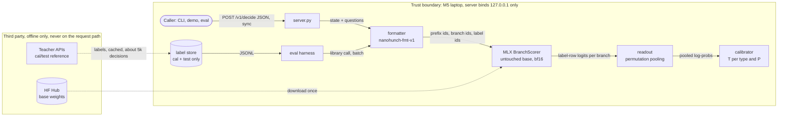
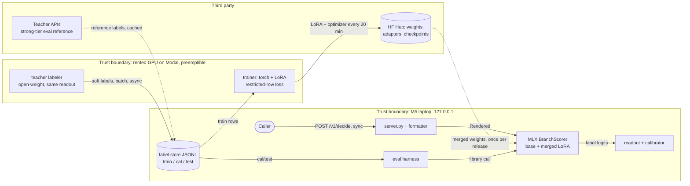
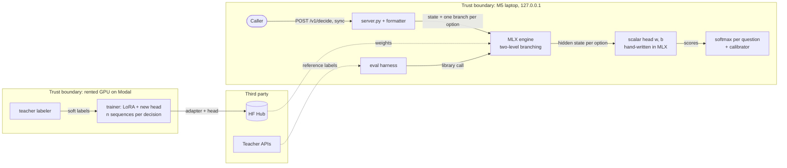
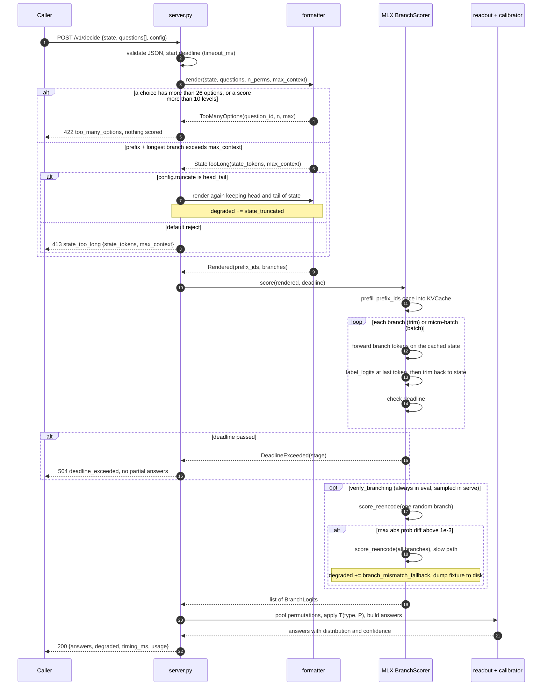

# Architecture: nanohunch

Author: sd-architect. Mode: GREENFIELD. Depth: standard. Date: 2026-09-23.

Labels: `MEASURED` (observed today, or published by the named source),
`DERIVED` (arithmetic shown), `ASSUMPTION` (guess with range). Sources:
`RN:<line>` = `_brief/research-notes.md`, `SM:<line>` = `_brief/system-map.md`,
`REQ:<line>` = `_brief/requirements.md`. Code citations into mlx-lm refer to the
installed copy at `gemma-mlx/.venv/lib/python3.12/site-packages/mlx_lm/` (mlx-lm
0.31.3, `SM:87`), written below as `mlx_lm/<path>:<line>`.

This file owns: candidates, the decision, the contracts, the primary flow, and
door classification. It does not own capacity math (`capacity.md`), cost
(`cost.md`), failure analysis (`reliability.md`), data storage and splits
(`data.md`), or the build sequence (`plan.md`). Where a number from those
files is needed, it is carried here as a labelled assumption and listed in
section 10.

Each major decision has a short **Why** paragraph written for a learner. They
are the point of this document: the user wants to know what to build and why.

---

## 1. Binding constraints

- **200 USD total, one-off, for teacher labels plus rented GPUs** (`RN:17-18`,
  `REQ:296`, MEASURED constraint). This is the number that constrains the
  design most. With about 90 USD for GPUs, a 4B LoRA run costs 1 to 8
  A100-hours (DERIVED, `REQ:330-335`), so every readout or base-model choice
  that multiplies training tokens (per-option scoring, slow DeltaNet kernels)
  directly removes runs from the budget.
- **Local inference on an M5 with 24 GiB unified memory** (`SM:70`, MEASURED),
  of which Metal can wire about 16 to 18 GB by default (`REQ:463`, ASSUMPTION
  A15). The shipped model is capped at about 4B parameters in bf16 (`REQ:104`).
- **Order robustness is a success criterion:** top-1 agreement under option
  reversal and permutation >= 0.90 MVP, >= 0.95 target (`REQ:414`), against
  0.664 for the only open causal prior art (`RN:124-125`, MEASURED by pngwn).
- **Knowledge scales with parameters, readout head type barely matters on
  state-derivable questions:** pngwn's three arms were within 0.006 accuracy
  on state-derivable decisions, while the MMLU-Pro slice went 0.625 (4B) vs
  0.415 (0.6B) (`RN:121-123`, MEASURED by pngwn).
- **Solo learner who hand-writes the core** (`rl-wordle/AGENTS.md:10-11`,
  `SM:50-56`), about 20 h/week (`REQ:383`, ASSUMPTION A7). Frameworks are fine
  for what is not the learning objective (model definitions, tokenizer, Modal,
  HTTP) (`rl-wordle/AGENTS.md:56-57`). Nothing local implements LoRA, a
  training loop, an option head, calibration or state branching (`SM:120-122`):
  all of it is new work for this author.

---

## 2. Candidates

All three candidates share the same outer shell: a formatter that turns
`(state, questions)` into token ids, an engine that encodes the state once and
scores each question on a branch of the cached state, a calibrator, an eval
harness, and a localhost server. They differ in **what is read out of the model
and whether the model is trained**, which is where cost, order robustness and
effort actually diverge.

### 2.0 The shared mechanism: encode state once, branch per question

A causal decoder processes tokens left to right, and the representation of a
token depends only on the tokens before it. If every question is rendered
**after** the state, the state's cached attention keys and values (the KV
cache) are identical for every question. So the engine runs the state through
the model once, then for each question continues from a copy (a "branch") of
that cache with only the question's tokens. For W1 (1,024-token state, 16
questions of 32 tokens) that is 1,536 tokens of work instead of 16,896, an 11x
ceiling (DERIVED, `REQ:169-171`); pngwn measured 14.1x context removal at k=16
(`RN:128-129`, MEASURED by pngwn).

**Why (for a learner):** this is the whole trick that makes "adding questions
barely changes response time" (`RN:41`) true. It only works if the state is a
shared prefix, which is why the prompt format (ADR-0003) puts the state first
and why the base model architecture (ADR-0001) matters: a plain attention layer
stores its past as a KV list you can share or trim, while a Gated DeltaNet
layer stores a recurrent state that must be snapshotted and copied
(`RN:134-137`).

Two engine strategies implement the branch. Both are internal and swappable
(two-way door); the correctness oracle for both is a full re-encode of
`prefix_ids + branch_ids`.

| Strategy | How | Memory | Forwards | Works for |
|---|---|---|---|---|
| `trim` (build first) | Prefill state into `KVCache`; for each branch run its tokens, gather logits, then `cache.trim(len(branch))` back to the state | one state KV + one branch | k small forwards | plain attention: `KVCache.is_trimmable()` is True and `trim` just moves `offset` (`mlx_lm/models/cache.py:375-381`) |
| `batch` | Repeat the state KV along the batch axis (the `state` setter accepts any batch size, `mlx_lm/models/cache.py:370-373`), right-pad branches, one forward per micro-batch, gather at each row's last real token | one state KV copy per branch in the micro-batch | ceil(k / B) forwards | plain attention; hybrid needs recurrent state repeated too |

Shape fact that forces micro-batching in `batch` mode (capacity.md should
verify): KV bytes per token for Qwen3-4B-Base = 36 layers x 2 x 8 KV heads x
128 x 2 B = 147,456 B, about 144 KiB (DERIVED from config, MEASURED via HF API
today: 36 layers, 8 KV heads, head_dim 128). At an 8,192-token state, 16 full
copies would be 16 x 1.21 GB = 19.3 GB (DERIVED), above the 16 to 18 GB Metal
budget (ASSUMPTION A15). MiniCPM5-2B-Base is 42 x 2 x 2 x 128 x 2 B = 43,008 B
(about 42 KiB) per token (DERIVED, config MEASURED: 42 layers, 2 KV heads).

### 2.1 Candidate A: zero-train letter reader (the simplest thing that could work)

No training at all. An untouched base model (the same checkpoint Candidate B
would fine-tune, so A is exactly baseline B0 in `REQ:66-67`), read through the
logits of the option-label tokens only. Choice options are labelled A, B, C...;
the model's next-token logits after `Answer:` are gathered at those label rows
and softmaxed. Order bias is reduced at test time by scoring P permutations of
the options on P branches and pooling. A per-type temperature is fitted on a
labelled cal split (>= 2,000 decisions, `REQ:284`).



What to notice: nothing crosses the laptop boundary at request time, and the
only paid external call is labelling about 5,000 cal and test decisions, which
every candidate needs anyway. No AZs exist in this system; the boundaries that
matter are laptop, rented GPU, and third-party API.

**Request flow.** Validate JSON, render state as the shared prefix and each
question (times P permutations for Choice) as a branch, prefill the state once,
score branches with `trim`, gather label-row logits, pool permutations in
log space, divide by the fitted temperature for (type, P), softmax, build
answers.

**Assumes.** (1) The base model already reads states well enough that
calibration plus debiasing is the main missing piece; pngwn saw the untouched
base match the fine-tune on judgement questions and beat it above 2,000 tokens
(`RN:139-142`, MEASURED by pngwn). (2) Cyclic or reversed permutation pooling
lifts order agreement above 0.90 (unmeasured). (3) The label tokens are single
tokens in the chosen tokenizer (checked at startup, ADR-0003).

**Cost of novelty.** Low. Everything here is new code for the author
(`SM:120-122`) but none of it needs a GPU.

### 2.2 Candidate B: causal letter scorer (A plus a LoRA adapter)

Identical readout and engine to A. The difference is a LoRA adapter trained on
a rented GPU with the LM head **frozen**, so the label rows keep their
pretrained meaning and training starts exactly at A's behaviour. The loss is
cross-entropy between the teacher soft-label distribution (or gold one-hot) and
the softmax over **only the candidate label rows** of the head, computed from
the final hidden state with a `[n_labels, hidden]` slice of the head weight
(pngwn's trick, which cut training memory about 6x and avoided a 20.7 GiB
full-vocab OOM, `RN:109-110`). Every training example is shown with a fresh
random option permutation (target permuted with it), so position is not a
usable shortcut.



What to notice: the GPU boundary is entered only by batch jobs (labelling,
training) that write to durable places (label store, Hub); the request path is
the same as A. The teacher labeler reuses the formatter and the restricted
readout, so an open-weight teacher yields a full soft distribution per question
from one forward, with no sampling (`RN:160-162`).

**Request flow.** Same as A. The only runtime difference is the weights file.

**Assumes.** (1) 5k to 15k labelled decisions lift consensus accuracy >= 3
points over A (`REQ:453`, ASSUMPTION A5). (2) Permutation augmentation cuts
the 37.5% flip rate to 5 to 15% (`REQ:460`, ASSUMPTION A12). (3) Training at
realistic lengths (4k to 8k) avoids pngwn's long-input regression
(`REQ:461`, ASSUMPTION A13). (4) The base trains on fast kernels (true for
plain attention; unverified for Qwen3.5, `SM:15-34`).

**Cost of novelty.** Medium. LoRA, a training loop, checkpoint/resume on
preemptible Modal GPUs (`SM:185`), and a restricted-row loss are all new for
the author (`SM:120-122`). The author has used Modal A100s before
(`SM:171`), which lowers the tax.

### 2.3 Candidate C: scalar cross-encoder per (state, question, option)

pngwn arm A shape (`RN:103-105`): a new linear head maps the final hidden
state of `state + question + one option` to one scalar; the scalars of a
question's options are softmaxed. Each option is its own branch. Score levels
and Noul yes/no are rendered as options. Order invariant by construction,
because no option ever sees another.



What to notice: the branch count per request becomes the total number of
options, not the number of questions, and the head starts from random weights,
so there is no zero-shot behaviour to fall back on or to compare against.

**Request flow.** Prefill state; branch per question; branch again per option
(two-level branching, or one level with the question repeated per option);
read the scalar at each option's last token; softmax per question; temperature.

**Assumes.** (1) The per-option training cost is affordable: training tokens
scale with options per decision, about 3x B's for a mix of Noul (2), Choice
(p50 4, `REQ:165`) and Score (5) (DERIVED, ASSUMPTION on the mix), so a 1 to 8
A100-hour B run becomes about 3 to 24 A100-hours unless shared-prefix packing
is built. (2) The set-size weakness (gold mass 0.49 at 26 candidates vs B's
0.61, `RN:126`) is acceptable. (3) mlx-lm has no classification head
(`SM:42-44`), so the head and its weight loading are hand-written (small).

**Cost of novelty.** Medium to high: everything in B plus the head, per-option
data expansion, and two-level branching. pngwn trained it on 4 A100s
(`RN:104-105`, MEASURED by pngwn).

### 2.4 Cross-cutting decision: the base model

This is decided separately because it applies to all three candidates.

| Base | Params | Arch | Branching on MLX | Training kernels | Evidence on knowledge | Mac W1 at P=1 |
|---|---|---|---|---|---|---|
| Qwen3-4B-Base | 4.02B (MEASURED, HF API) | plain `Qwen3ForCausalLM`, 36 layers, GQA 32Q/8KV, tied head, 32,768 positions (MEASURED, config) | `KVCache` only, trim or repeat (`mlx_lm/models/qwen3.py:178-182` same structure as llama) | standard attention, SDPA/flash on CUDA | none in our notes; decided by Phase 0 B0 | about 1.7 s: 1,536 / 895 tok/s (DERIVED: non-embedding 4.02B minus 151,936 x 2,560 = 3.63B; 6.5e12 / (2 x 3.63e9), method `REQ:147`) |
| MiniCPM5-2B-Base | 2.52B (MEASURED) | plain `LlamaForCausalLM`, 42 layers, GQA 16Q/2KV (MEASURED) | `KVCache` only (`mlx_lm/models/llama.py:209-221`); official MLX build (`SM:205`) | standard attention | MMLU-Pro 70.8 vs Qwen3.5-4B 78.0 in one table (`RN:76`, MEASURED by openbmb, thinking mode) | about 0.9 s: 1,536 / 1,650 (DERIVED, `REQ:152`) |
| Qwen3.5-4B-Base | 4.66B incl. vision (MEASURED, `SM:59`) | hybrid: 24 Gated DeltaNet + 8 gated attention layers (`SM:26-27`) | `ArraysCache` (conv + recurrent, not trimmable, `mlx_lm/models/cache.py:146-147`) for 24 layers plus `KVCache` for 8 (`mlx_lm/models/qwen3_5.py:304-305`): snapshot and restore or repeat | Mac training uses a per-token Python loop (`mlx_lm/models/qwen3_5.py:193`, `SM:19-23`); CUDA falls back to pure torch unless hub kernels load (`SM:29-34`, A3 unverified) | best published: MMLU-Pro 79.1 (`RN:74`) | about 1.6 s (DERIVED, `REQ:191`, kernel efficiency unmeasured) |
| Qwen3.5-0.8B / 2B-Base | 0.87B / 2.27B (MEASURED, `SM:202-203`) | same hybrid | same as above | same penalty | fewer params, less knowledge (`RN:121-123`) | about 0.24 s for 0.8B (DERIVED, `REQ:195`) |

**Decision (ADR-0001, one-way):** the trained and released model is a
**plain full-attention decoder**. Default is the Qwen3 ladder: Qwen3-0.6B-Base
(reproduces pngwn arm B's base, `RN:106`) and Qwen3-1.7B-Base for pilots,
Qwen3-4B-Base for the release. MiniCPM5-2B-Base replaces Qwen3-4B-Base if its
Phase 0 B0 on the cal split is within 1 point of Qwen3-4B's, because it is then
about 1.8x faster (DERIVED: 1,650 / 895) and has a 3.4x smaller KV cache per
token (DERIVED: 147,456 / 43,008). Qwen3.5-4B-Base is measured in Phase 0 as a
B0 reference only (its MLX inference path uses the Metal kernel,
`mlx_lm/models/qwen3_5.py:193`).

**Why (for a learner):** three reasons, in order of weight. First, money:
a Gated DeltaNet layer trains through a slow fallback on both Mac and CUDA
unless optional kernels load (`SM:15-34`), and a 3 to 10x slowdown pushes a
4B run to 8 to 25 A100-hours (`REQ:451`), which is most of the GPU budget.
Second, understanding: with plain attention, a branch is "the same KV list,
plus a few more rows, then trim back", which you can reason about from the
`KVCache` code in 40 lines (`mlx_lm/models/cache.py:325-381`) and from your
own `mini-vllm` block manager (`SM:110`). Hybrid branching also requires
snapshotting recurrent state, which is interesting but is a second topic.
Third, the ladder: Qwen3 0.6B, 1.7B and 4B share a tokenizer and architecture,
so a prompt format and training recipe debugged cheaply at 0.6B/1.7B (on the
Mac or a small GPU) transfer unchanged to 4B, and 0.6B lets you reproduce a
published number (pngwn arm B, 0.752) before trusting your own pipeline. The
price is giving up the best published knowledge scores (Qwen3.5), which is
exactly what the Phase 0 bake-off is there to price.

---

## 3. One readout for three question types

All three types become "pick one label token out of a small set", read from
the frozen LM head at the last token of the branch. Only the label vocabulary
and the permutation rule differ.

| Type | Rendered as | Label tokens (vocab rows read) | Permutations | Output fields |
|---|---|---|---|---|
| Choice | `A. opt`, `B. opt`, ... up to 26 | ` A` ... ` Z` (space-prefixed, single token, checked) | P in {1, 2, n}: identity, then reversed, then cyclic shifts; P from calibration default or request | `choice`, `choice_index`, `distribution[n]`, `confidence`, `entropy_norm` |
| Score | `0: label`, `1: label`, ... values ascending, ints in 0..9 | ` 0` ... ` 9` restricted to the caller's values | none (ordinal scale is always shown ascending) | `score` (argmax value), `expected` (sum of p times value), `distribution`, `confidence`, `entropy_norm` |
| Noul | question plus `(yes/no)` | ` yes`, ` no` | none (labels are the words, not positions) | `p_yes`, `confidence` |

**Why (for a learner):** one readout means one training loss, one engine code
path, one calibration procedure and one set of tests; the three "primitives"
are just three rendering rules. Noul uses the words ` yes`/` no` instead of
letters A/B because the answer token then carries its own meaning: there is no
option order to be biased by, and the untouched base model (Candidate A)
already has a strong prior for those tokens. Score uses digits for the same
reason and is never shuffled, because shuffling an ordinal scale would ask the
model to do something unnatural. Choice is the only type with position bias,
so it is the only one that gets permutations. The cap of 26 options and 10
levels comes from needing every label to be exactly one token; 26 covers the
p99 option count (`REQ:165`, ASSUMPTION) and pngwn's 26-candidate protocol
(`RN:126`).

**Permutation pooling.** For each Choice question scored under P
permutations, map each branch's display-order log-softmax back to canonical
option order and take the mean of log-probabilities, then renormalize. The
temperature is applied to the pooled log-probs.

**Why:** averaging log-probs ("log-linear pooling") keeps the result in logit
space, so a single temperature still makes sense after pooling. Because
pooling changes how sharp the distribution is, the temperature is fitted
**per (type, P)**: a temperature fitted at P=1 is wrong at P=2. Mean of
probabilities is the ablation (two-way door).

**Confidence.** `confidence` = the maximum calibrated probability (for Noul,
max(p_yes, 1 minus p_yes)). `entropy_norm` = H(p) / log(n) is returned as a
secondary signal.

**Why:** requirements define confidence as max probability after
temperature (`REQ:274`), and top-label ECE (`REQ:228-231`) measures exactly
that quantity. So after calibration, "confidence 0.8" is a testable claim:
among answers with confidence near 0.8, about 80% agree with the reference.
Entropy is not what ECE checks, so it cannot carry that promise.

**What the caller does with it.** (1) Selective answering: if `confidence` is
below a per-type threshold tau, route the question to a bigger model or a
human. The eval harness publishes the risk-coverage table (accuracy vs
fraction answered, per type, on the cal split) from which tau is picked.
(2) Thresholds on Score use `expected` or cumulative mass (P(level >= 3) is a
sum over `distribution`). (3) Dependent decisions are combined in caller code
(`RN:143-145`, `REQ:99-100`), for example multiplying probabilities of
independent Nouls, which is only honest because each question is scored in
isolation.

---

## 4. Decision matrix

Hard requirements first, pass/fail. A failed must eliminates the candidate
regardless of other rows. "Budget" and "latency" rows carry order-of-magnitude
numbers derived from the brief; `cost.md` and `capacity.md` own the real ones.

| Criterion | A: zero-train reader | B: LoRA letter scorer (on A) | C: scalar cross-encoder |
|---|---|---|---|
| **Must: fits 200 USD** | PASS. Only cal+test labels: 5,000 x 2 cheap teachers x 0.00025 = 2.5 USD plus 8 to 20 USD strong-tier reference (DERIVED, `REQ:305-318`) | PASS at plain-attention kernel speed: 2 to 4 full runs x 1 to 8 A100-h plus pilots, inside the 15 to 125 USD envelope (DERIVED, `REQ:336-339`); upper end needs the ADR-0001 base choice | AT RISK: about 3x B's training tokens (DERIVED, section 2.3) gives 3 to 24 A100-h per run; 2 to 4 runs can exceed the 90 USD GPU line unless shared-prefix packing is built |
| **Must: local inference fits 24 GB** | PASS: 4B bf16 about 9.5 to 11 GB at 8k (`REQ:206`, DERIVED), `trim` adds one branch | PASS: same weights size after merge | PASS: more branches, same weights; micro-batched |
| **Must: order robustness >= 0.90 top-1** | UNVERIFIED: depends on test-time pooling; P=n cyclic makes the output invariant to rotations only | UNVERIFIED but targeted: augmentation (A12) plus P=2 fallback | PASS by construction |
| **Must: learnable, core hand-written** | PASS: formatter, readout, branching, calibration, metrics | PASS: adds LoRA, restricted-row loss, training loop | PASS but largest surface: adds head, per-option expansion, two-level branching |
| **Must: MVP S1, >= B0 + 3 pts** (`REQ:412`) | **FAIL by definition**: A is B0 | targeted (A5) | targeted |
| Accuracy expectation vs consensus | = B0, unknown until Phase 0; strong on judgement and long inputs in pngwn (`RN:139-142`) | B0 + 3 to 6 pts target (`REQ:247`); pngwn B 0.752 at 0.6B | pngwn A 0.807 at 4B, but its edge over B came from params (knowledge slice), not head type (`RN:121-123`) |
| Calibration expectation (T-scaled ECE) | unknown; T-scaling usually does most of the work | pngwn B 0.015 (`RN:118`) | pngwn A 0.026 (`RN:118`) |
| Mac W1 latency, Qwen3-4B | P=1 about 1.7 s; P=2 about 2.3 s (DERIVED: 2,048 / 895); P=4 about 3.4 s | P=1 about 1.7 s if augmentation suffices | about 2.1 s with two-level branching, 3.4 s without (DERIVED: 1,024 + 16x24 + 64x8 = 1,920 tokens vs 3,072; 24/8 token split ASSUMPTION) |
| One-off spend, order of magnitude | about 10 to 25 USD | about 40 to 120 USD | about 60 to 200 USD |
| Moving parts that can fail during work (no pager: no SLO, `REQ:33`) | 1 (local process) | 3 (labeler job, training job, local engine) | 3, plus head/weight loading |
| Familiarity | MLX, KV cache: familiar (`SM:110-112`); calibration new | + Modal familiar (`SM:171`); LoRA and training loop new | + classification head new, per-option data new |
| Build effort, engineer-days (ASSUMPTION, planner owns) | 10 to 13 | A + 8 to 11 = 18 to 24 | 22 to 30 |
| Reversibility | two-way: no money spent on weights | readout and format baked into the adapter: one-way per run (ADR-0002, ADR-0003) | same, plus head weights |
| **Verdict** | **Built first as B0 and the shared engine; not the shipped model** (fails S1 by definition) | **Chosen** | Rejected: budget at risk and no zero-shot starting point, for an accuracy edge the evidence attributes to parameter count |

---

## 5. Recommendation

pngwn measured that on state-derivable decisions all three readout heads
landed within 0.006 accuracy of each other while knowledge accuracy scaled
with parameters (MMLU-Pro slice 0.625 at 4B vs 0.415 at 0.6B, `RN:121-123`),
so this design spends the 200 USD on the largest base that trains on fast
kernels and on the cheapest readout, not on a more elaborate head. We
recommend Candidate B built as a strict superset of Candidate A: a plain
full-attention base (Qwen3-4B-Base by default) read through restricted label
logits over its frozen LM head, LoRA-tuned on teacher soft labels with
option-permutation augmentation, served on the Mac with state-once KV
branching and per-(type, P) temperature scaling. Candidate A is built first as
baseline B0 and as the complete engine, so the paid training run only adds an
adapter and every hand-written component (formatter, readout, branching,
calibrator, eval) is proven before any GPU money is spent.

**What would change this recommendation** (Phase 0 measurements from
`REQ:447-468`; `plan.md` owns their order):

| Phase 0 measurement | Flip condition | New decision |
|---|---|---|
| M1: Candidate A (B0) accuracy on the cal split vs the cheap teacher (A5) | B0 within 3 pts of the cheap teacher | Ship A plus calibration; training becomes a long-input ablation only. Portfolio claim shifts to engine plus calibration evidence |
| M2: order pilot on Qwen3-1.7B-Base, with and without augmentation (A12) | top-1 agreement < 0.90 even with augmentation and P=2 | Hybrid: keep B for Score and Noul, use C (per-option scalar) for Choice only |
| M3: 50-step LoRA on Qwen3.5-4B-Base on Modal, fla/conv kernels loaded (A3) | step time <= 1.5x Qwen3-4B-Base at seq 2k | Qwen3.5-4B-Base becomes eligible (then M4 decides) |
| M4: B0 bake-off on the cal split: Qwen3-4B, MiniCPM5-2B, Qwen3.5-4B | Qwen3.5-4B B0 >= best plain model + 3 pts and M3 passes; or MiniCPM5-2B within 1 pt of Qwen3-4B | switch base (ADR-0001 revisit) |
| M5: Mac W1 p50 for Qwen3-4B-Base via `mlx_lm.benchmark` (A11) | W1 p50 > 2.5 s at P=1 | MiniCPM5-2B-Base |
| S6: consensus vs author audit (A1) | agreement < 75% | architecture unchanged; reference and teacher mix change (`data.md`) |

---

## 6. Components, responsibilities, contracts

### 6.1 Components and data ownership

| Component | File (flat, per `SM:147-150`) | Owns (only writer) | Sync / async | Author writes by hand? |
|---|---|---|---|---|
| Schema | `schema.py` | dataclasses, JSON validation, error types | n/a | yes |
| Formatter | `formatter.py` | `format_version`, template text, label vocab, permutation generation, token-boundary rule | sync, pure | yes |
| MLX branch scorer | `engine_mlx.py` | prefix cache lifetime (per request only), branch strategy | sync | yes (model forward from mlx-lm) |
| Torch reference scorer | `engine_torch.py` | full re-encode oracle; `label_logits` shared with training | sync | yes (model from transformers) |
| Readout | `readout.py` | pooling, answer construction, confidence | sync, pure | yes |
| Calibrator | `calibrate.py` | `calibration.json` per (model revision, format version) | offline fit, sync apply | yes |
| Trainer | `train.py` (Modal) | LoRA adapters, optimizer state, data cursor | async batch job | loss, loop, LoRA by hand; `peft` allowed (two-way) |
| Teacher labeler | `label.py` (Modal / API) | raw teacher responses (storage and dedupe: `data.md`) | async batch job | yes |
| Eval harness | `evaluate.py` | eval reports, plots, risk-coverage tables | offline batch | yes |
| Server | `server.py` | nothing persistent; one request at a time behind a lock | sync HTTP | thin; any HTTP library (two-way) |

Nothing asynchronous sits on the request path. Asynchronous work (labelling,
training, eval) is batch jobs writing files or Hub revisions. There is no
queue and no database.

**Why:** the baseline in `anti-patterns.md` is "one service, one database,
one cache, one queue". Here the honest baseline is smaller: one Python process,
files on disk plus the HF Hub, and a per-request KV cache. The only additions
beyond it are a rented-GPU training job (forced by S1, which needs a trained
model) and a torch reference path (forced by S10 parity, `REQ:421`). A
cross-request prefix cache is skipped; add it if the demo repeatedly asks new
questions about the same state.

### 6.2 Server contract (`/v1`, localhost)

`POST /v1/decide`

```json
{
  "state": "string, any text; JSON program state is passed as text",
  "questions": [
    {"id": "sev", "type": "score", "text": "How severe is this incident?",
     "levels": [{"value": 0, "label": "none"}, {"value": 1, "label": "low"},
                {"value": 2, "label": "medium"}, {"value": 3, "label": "high"},
                {"value": 4, "label": "critical"}]},
    {"id": "team", "type": "choice", "text": "Which team should own this?",
     "options": ["Billing", "Infra", "Security", "Support"]},
    {"id": "esc", "type": "noul", "text": "Should this be escalated to on-call?"}
  ],
  "config": {
    "permutations": null,
    "truncate": "reject",
    "timeout_ms": 30000,
    "verify_branching": false,
    "return_logits": false
  }
}
```

Rules: `id` unique per request; `choice` needs 2 to 26 options; `score` needs 2
to 10 levels with integer values in 0..9, strictly ascending; `noul` takes no
options; at most 128 questions (`REQ:164`, ASSUMPTION range). `permutations:
null` means "use the calibration default for this model"; an explicit value
must be one the calibration file has a temperature for. `truncate` is
`"reject"` (default) or `"head_tail"`.

`200` response:

```json
{
  "model": {"id": "nanohunch-4b-v1", "revision": "hf-commit-sha",
            "format_version": "nanohunch-fmt-v1", "calibration_id": "sha256-of-calibration.json"},
  "answers": [
    {"id": "sev", "type": "score", "score": 3, "expected": 2.71,
     "distribution": [{"value": 0, "p": 0.01}, {"value": 1, "p": 0.06},
                      {"value": 2, "p": 0.21}, {"value": 3, "p": 0.62}, {"value": 4, "p": 0.10}],
     "confidence": 0.62, "entropy_norm": 0.64},
    {"id": "team", "type": "choice", "choice": "Infra", "choice_index": 1,
     "distribution": [0.05, 0.81, 0.09, 0.05], "confidence": 0.81, "entropy_norm": 0.47},
    {"id": "esc", "type": "noul", "p_yes": 0.73, "confidence": 0.73}
  ],
  "degraded": [],
  "timing_ms": {"tokenize": 3, "prefill": 1102, "branches": 540, "readout": 2, "total": 1655},
  "usage": {"state_tokens": 1024, "branch_tokens": 512, "branches": 16, "permutations": 1}
}
```

The numbers in the example are illustrative, not measurements. `distribution`
for Choice is in the caller's original option order. `degraded` values:
`state_truncated`, `branch_mismatch_fallback`, `reencode_mode` (startup
self-test failed).

Errors (JSON body `{"error": code, "detail": {...}}`): `400 invalid_request`,
`413 state_too_long {state_tokens, max_context}`, `422 too_many_options
{question_id, n, max}`, `422 too_many_levels`, `422 unsupported_permutations
{requested, available}`, `504 deadline_exceeded {stage}`, `500 engine_error`.
No partial answers are ever returned: a request is all-or-nothing.

`GET /v1/info` returns model id, revision, `format_version`, `calibration_id`,
and limits `{max_context, max_options: 26, max_levels: 10, max_questions: 128,
available_permutations}`.

**Why (for a learner):** the contract says only what the caller needs to
make a decision in code: the answer, the distribution and a calibrated
confidence, plus enough provenance (`revision`, `format_version`,
`calibration_id`) that any number in a report can be traced to exact weights
and exact calibration. `degraded` exists so the server never silently changes
behaviour: if it truncated or fell back, the caller can see it. The request is
deterministic and side-effect free, so a client retry is always safe and the
server does no retries of its own.

### 6.3 Training example schema (one JSONL row = one state)

```json
{
  "schema_version": "nanohunch.train.v1",
  "state_id": "sha256 of normalized state text",
  "source": {"dataset": "hotpotqa", "license": "cc-by-sa-4.0",
             "workflow": null, "generator": null},
  "state": "string",
  "decisions": [
    {
      "question_id": "sha256 of (state_id, type, text, options)",
      "type": "choice",
      "text": "Which paragraph supports the answer?",
      "options": ["P1", "P2", "P3", "P4"],
      "values": null,
      "targets": {
        "gold": 2,
        "teachers": [
          {"teacher_id": "open-weight-teacher@hf-sha", "method": "logits_direct",
           "dist": [0.04, 0.10, 0.81, 0.05], "format_version": "nanohunch-fmt-v1",
           "request_hash": "sha256 of teacher prompt"},
          {"teacher_id": "second-teacher@version", "method": "logits_after_thinking",
           "dist": [0.02, 0.08, 0.86, 0.04], "format_version": "nanohunch-fmt-v1",
           "request_hash": "sha256"}
        ],
        "consensus": [0.03, 0.09, 0.835, 0.045],
        "weight": 1.0
      }
    }
  ]
}
```

Rules: `options` and every `dist` are in **canonical order**; permutation is
applied at load time with a seeded RNG, and the target is permuted with it.
`method` is one of `logits_direct`, `logits_after_thinking`, `verbalized`,
`samples_k`. `consensus` is the mean of teacher `dist` (Jev's reference
definition, `REQ:222-225`). The split key is the `state_id`, so no state
appears in two splits (`REQ:359`; owned by `data.md`). Training target per
decision: `consensus` if present, else one-hot `gold`; if both exist, a mix
`lambda x gold + (1 - lambda) x consensus` with lambda a two-way config.

**Why (for a learner):** one row per state, not per decision, keeps the
shared-prefix structure visible in the data, so the loader can expand rows to
one sequence per decision (simple, build first) or later pack all decisions of
a state behind one copy of the state (cheaper, same loss). Storing full
distributions instead of a single "correct" letter is what makes this
distillation: a teacher that says 0.55/0.45 teaches uncertainty, and that is
the raw material for calibration. Canonical order plus load-time permutation
means one stored row yields a different option order every epoch for free.

### 6.4 Internal Python interfaces

These are contracts, not implementations. The author writes the bodies.

```python
# schema.py : pure data, no torch or mlx imports
from dataclasses import dataclass
from typing import Callable, Iterable, Literal, Mapping, Protocol, Sequence
import numpy as np
from numpy.typing import NDArray

QType = Literal["choice", "score", "noul"]
Perm = tuple[int, ...]                 # perm[display_pos] = canonical option index

@dataclass(frozen=True, slots=True)
class Question:
    id: str
    type: QType
    text: str
    options: tuple[str, ...]           # choice: options; score: level labels; noul: ()
    values: tuple[int, ...] = ()       # score only: ascending ints in 0..9

@dataclass(frozen=True, slots=True)
class Branch:
    question_id: str
    qtype: QType
    perm: Perm
    token_ids: tuple[int, ...]         # question block, ends with the "Answer:" tokens
    label_ids: tuple[int, ...]         # vocab id per display position

@dataclass(frozen=True, slots=True)
class Rendered:
    format_version: str                # "nanohunch-fmt-v1"
    prefix_ids: tuple[int, ...]        # preamble + state, shared by every branch
    branches: tuple[Branch, ...]       # questions x permutations
    truncated: bool

class TooManyOptions(ValueError): ...
class StateTooLong(ValueError): ...
class LabelNotSingleToken(ValueError): ...
class DeadlineExceeded(TimeoutError): ...

# formatter.py
def permutations_for(n_options: int, n_perms: int) -> list[Perm]:
    """identity first, then reversed, then cyclic shifts; deterministic."""
def render(tokenizer, state: str, questions: Sequence[Question], *, n_perms: int,
           max_context: int, truncate: Literal["reject", "head_tail"] = "reject") -> Rendered:
    """Tokenizes prefix and each branch SEPARATELY and never re-tokenizes the join.
    Raises TooManyOptions, StateTooLong, LabelNotSingleToken."""

# engine_mlx.py / engine_torch.py
@dataclass(frozen=True, slots=True)
class BranchLogits:
    question_id: str
    perm: Perm
    logits: NDArray[np.float32]        # [n_options], label-row logits, DISPLAY order, T = 1

class Scorer(Protocol):
    def score(self, r: Rendered, *, deadline: float | None = None) -> list[BranchLogits]: ...
    def score_reencode(self, r: Rendered, only: Sequence[int] | None = None) -> list[BranchLogits]:
        """Oracle: full forward of prefix_ids + branch.token_ids per branch, no cache reuse."""

class MLXBranchScorer:                 # implements Scorer
    def __init__(self, model_path: str, *, strategy: Literal["trim", "batch"] = "trim",
                 max_branch_batch: int = 16) -> None: ...

def label_logits(hidden_last, head_weight, label_ids):
    """[B, H] x head_weight[label_ids] ([n, H]) -> [B, n]. The only readout, used by
    inference (MLX and torch) and by the training loss. Never builds full-vocab logits."""

# train.py
def restricted_ce(logits, target_probs, valid_mask):
    """logits [B, n_max] padded; target_probs [B, n_max] (soft or one-hot, display order);
    valid_mask [B, n_max]. Returns sum over decisions / B_global (fixed normalizer)."""

# readout.py
def pool(branches: Sequence[BranchLogits]) -> dict[str, NDArray[np.float32]]:
    """per question: mean over perms of log_softmax, mapped to CANONICAL order."""

@dataclass(frozen=True, slots=True)
class Answer:
    question_id: str
    qtype: QType
    probs: NDArray[np.float32]         # calibrated, canonical order
    confidence: float                  # max(probs)
    entropy_norm: float
    expected: float | None             # score only

def to_answer(q: Question, probs: NDArray[np.float32]) -> Answer: ...

# calibrate.py
@dataclass(frozen=True)
class Calibration:
    model_revision: str
    format_version: str
    temperature: Mapping[tuple[QType, int], float]   # (type, n_perms) -> T
    noul_bias: float                   # 0.0 unless Platt-style bias improves cal NLL
    default_perms: Mapping[QType, int]
    fitted_on: str                     # content hash of the cal split

def fit_temperature(pooled: Sequence[NDArray[np.float32]], targets: Sequence[int]) -> float:
    """argmin over log T of mean NLL against the consensus argmax; T bounded to [0.05, 20]."""
def apply(cal: Calibration, qtype: QType, n_perms: int, pooled: NDArray[np.float32]) -> NDArray[np.float32]: ...

# evaluate.py
@dataclass(frozen=True)
class Target:
    gold: int | None
    consensus: NDArray[np.float32] | None

@dataclass(frozen=True)
class EvalItem:
    state_id: str
    state: str
    question: Question
    target: Target
    meta: Mapping[str, str]            # source, workflow, length bucket

class Predictor(Protocol):
    name: str                          # "A-qwen3-4b-base", "B-nanohunch-4b-v1", "B1-api-cheap", ...
    def predict(self, state: str, questions: Sequence[Question], *, n_perms: int = 1) -> list[Answer]: ...

def evaluate(pred: Predictor, items: Iterable[EvalItem], *, perm_suites: Sequence[int] = (1, 2),
             bootstrap: int = 10_000, seed: int = 0) -> dict: ...
    # accuracy vs consensus and vs gold (separate), ECE equal-width and equal-mass (15 bins),
    # NLL, Brier, order agreement and flip rate, set-size curve, length buckets,
    # isolation check, risk-coverage table, paired bootstrap vs a named baseline.
```

**Why (for a learner):** three seams carry the design. `Rendered` is the
only thing that crosses from text to tokens, so training, teacher labelling,
the torch oracle and the MLX engine cannot disagree on format.
`label_logits` is the only readout, so "what the model is trained on" and
"what the server returns" are literally the same function. `Predictor` is the
only thing the eval harness sees, so Candidate A, Candidate B, an API
baseline (B1) and Jev (B2) are evaluated by identical code, which is what
makes a comparison table honest.

### 6.5 Template (nanohunch-fmt-v1, detail in ADR-0003)

```
You will answer questions about the STATE. Answer with the label of exactly one option.

### STATE
{state}
### END STATE

                                   <- prefix ends here: shared by every branch
### QUESTION
{text}
A. {option_0}
B. {option_1}
Answer:                            <- read label rows at this last token
```

Noul replaces the option lines with `(yes/no)`; Score lists `{value}: {label}`
lines. No chat template (base models).

---

## 7. Primary flow with failure paths



What to notice:

- **Validation happens before any compute.** Option count, level count and
  context length are all known after tokenization, so the two cheap failures
  (422, 413) never touch the model.
- **Truncation is opt-in and always visible.** Silently dropping the middle of
  a state changes answers, so the default is to refuse. `max_context` is the
  trained maximum plus the validated margin (`REQ:270-271`: trained 4,096 MVP,
  supported 8,192), exposed via `/v1/info`.
- **The branch equivalence check has a correct fallback.** If branching and
  full re-encode disagree beyond the bf16 isolation tolerance (1e-3,
  `REQ:260`), the engine answers the request the slow, known-correct way and
  says so. At server start a golden fixture runs through both paths; if it
  fails, the server runs in `reencode_mode` and every response carries that
  flag. The eval harness always verifies.
- **Deadline is checked between stages**, since an MLX forward cannot be
  interrupted midway. A single forward is bounded by `max_context`, which
  bounds the overshoot.

**Why (for a learner):** the dangerous failure in this system is not a crash,
it is a wrong probability that looks fine. Branching bugs (wrong positions,
wrong mask, a stale cache) produce plausible numbers. That is why the oracle
path exists in the engine interface, why it runs in every eval, and why a
mismatch degrades to the slow correct path rather than returning the fast
suspicious one. Watch the token boundary: the check compares branched and
re-encoded runs of the **same** token ids; re-tokenizing the joined text can
merge tokens across the prefix boundary and create false mismatches (and
worse, a train/serve skew), so the formatter never does it.

---

## 8. Revisit conditions for rejected options

| Rejected option | Reopen it when |
|---|---|
| A as the shipped model | Phase 0 M1 shows B0 within 3 pts of the cheap teacher, or the first 4B run gains < 1 pt over B0 with 15k decisions (kill signal, `REQ:436-438`) |
| C scalar cross-encoder | M2 shows augmentation plus P=2 leaves Choice top-1 agreement < 0.90, or order invariance becomes a hard requirement (Q1, `REQ:478`); then C for Choice only |
| Qwen3.5-4B-Base (trained) | M3 shows hub kernels load and step time <= 1.5x Qwen3-4B at seq 2k, and M4 shows its B0 >= best plain model + 3 pts |
| MiniCPM5-2B-Base as default | M4 B0 within 1 pt of Qwen3-4B-Base, or M5 Mac W1 p50 > 2.5 s for Qwen3-4B, or Q2 answered "latency headline" (`REQ:479`) |
| Qwen3.5-0.8B / 2B or Qwen3-1.7B as release | Q2 answered "latency headline" and the 4B model misses S7 stretch (W1 <= 0.5 s) by more than 2x |
| More than 26 options (multi-token labels or per-option spans) | a real eval workflow has Choice questions above 26 options in > 1% of items (`REQ:484`) |
| `batch` branch strategy as default | M6 (A20) shows `trim` W1 branch stage > 600 ms (`REQ:187` budget) on the Mac |
| Shared-prefix (tree) packing in training | cost.md shows the full-run token count breaks the 20 USD per-run cap (`REQ:340-341`) with per-decision expansion |
| Cross-request prefix cache | demo logs show the same state asked twice within a minute in > 30% of requests |
| Exact Jev JSON schema | Q9 answered yes and the adapter licence (MIT, `SM:213`) is confirmed for reuse |

---

## 9. Door classification

| # | Decision | Door | Why that door | ADR |
|---|---|---|---|---|
| D1 | Base family: plain full-attention decoder, Qwen3 ladder default | one-way | engine branching, training kernels and every paid run depend on it; changing it later re-pays all runs | `adr/0001-plain-attention-base-family.md` |
| D2 | Readout: restricted label-token logits over the frozen LM head | one-way | fixes the loss, the data shape, the engine readout and what order robustness means; switching to a scalar head retrains from scratch | `adr/0002-restricted-label-logit-readout.md` |
| D3 | Serialization: nanohunch-fmt-v1 (state-first prefix, label tokens, `Answer:` suffix, split tokenization) | one-way | baked into every adapter and every teacher soft label; a new format invalidates labels read from logits and all checkpoints | `adr/0003-prompt-serialization-format-v1.md` |
| D4 | Released artefacts use only redistributable data and open-weight teacher labels | one-way | relabelling after a release costs budget and a published dataset cannot be unpublished | `adr/0004-training-data-license-and-teacher-policy.md` |
| D5 | Split key = `state_id` | one-way | changing it invalidates every past eval (`REQ:399`) | owned by `data.md` |
| D6 | Confidence = max calibrated probability | two-way | computed after the model; can add or change fields any time | none |
| D7 | Temperature per (type, P), fitted on hard consensus argmax | two-way | refit in seconds from stored logits | none |
| D8 | Log-linear permutation pooling | two-way | readout-time only | none |
| D9 | Branch strategy `trim` then `batch` | two-way | internal, oracle-checked | none |
| D10 | Server contract `/v1` | two-way | no third-party callers (`REQ:75-76`) and the path is versioned; requirements flagged it one-way (`REQ:400-401`), but the cost of change is one demo and one model card section | none |
| D11 | Caps: 26 options, 10 levels, 128 questions | two-way at the API | raising 26 needs a format v2 (see D3), which is the real door | none |
| D12 | LoRA by hand vs `peft`; rank and targets | two-way | adapter is merged at release | none |
| D13 | Training in torch on Modal, inference in MLX | two-way | parity tests (S10) make either side swappable | none |
| D14 | No queue, no database: files plus HF Hub | two-way | trigger to add one is concurrent labelling jobs clobbering files | none |
| D15 | Dependencies between questions handled in caller code | two-way | `RN:143-145` showed no accuracy gain from joint refinement | none |
| D16 | Train-time max length 4k MVP, 8k target | two-way | per-run hyperparameter | none |

**Why doors matter here:** on a 200 USD budget the expensive mistakes are the
ones that force a retrain or a relabel, not the ones that force a code change.
D1 to D4 each do; everything else can be changed after seeing data.

---

## 10. What this file assumes from other agents

| From | Assumed here | Used in |
|---|---|---|
| capacity.md | Mac prefill about 895 tok/s for Qwen3-4B-Base and 1,650 for MiniCPM5-2B (DERIVED from `REQ:147`); `trim` k small forwards fit the 600 ms branch budget; `batch` micro-batch size at 8k states | section 4 latency row, D9 |
| cost.md | A about 10 to 25 USD, B about 40 to 120 USD, C about 60 to 200 USD one-off; 3x token multiplier for C | section 4 must row |
| data.md | split by `state_id`, label store append-only and content-addressed (`REQ:356`), teacher selection and `method`, mix proportions | 6.3, D5 |
| reliability.md | preemption checkpoints every <= 20 min (`REQ:354`), analysis of the fallback modes in section 7 | 2.2, 7 |
| security.md | localhost binding, licence review of teacher terms (A8) | 6.2, ADR-0004 |
| plan.md | Phase 0 order for M1 to M6; build A before B | 5 |
