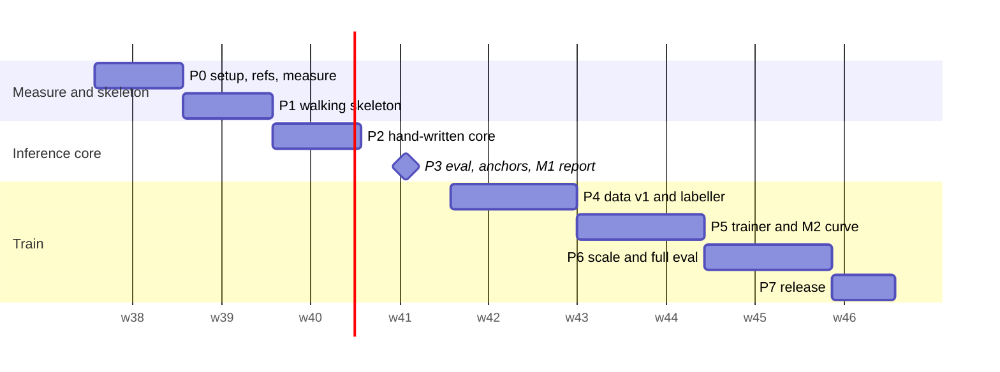

# Implementation plan: nanohunch

Owner: the author (solo). Written by the orchestrator (skeleton, shared
contracts, plan-level sections) and sd-planner instances (phase detail).
Design: `README.md`. Risk dispositions and the precedence rule: `risks.md`.
Scope: the MVP cut line in `risks-overengineering.md` section 4, adjusted by
`risks.md`. Anything not in this file is on the "Not doing" list at the end.
Revision 2 (2026-09-24): minimal layout with a 1,000-line core budget, open
replications as reference reading and baselines (see "What changed in revision 2").
Revision 3 (2026-09-24): execution follows the jarvis contract. The step-by-step checklist
is `.jarvis/PROGRESS.md`; this file stays the reference for gates, commands and kill criteria
(see "What changed in revision 3").

## Summary

We are building **the minimal open System One model**: a small open model that
does what TypeSafe's Jev does. It reads a text **state**, answers many typed
questions about it (Choice, Score, Noul) in parallel, and returns **calibrated
probability distributions** instead of generated text.

About ten open Jev replications appeared in the week after Jev launched. None
is minimal: the trained ones are 2k to 12k lines, and the small ones are
untrained wrappers. So the product here is the nanoGPT version: **six core
files, at most 1,000 lines, that you write yourself, trained overnight on one
M5 Mac**, with an honest calibrated eval against the replications that already
exist.

The MVP is MiniCPM5-2B-Base, read through restricted label-token logits,
LoRA-tuned in MLX on soft labels from two releasable teacher models, and served
by an engine that encodes the state once and branches the KV cache per
question.

The headline claim is pre-registered: **the fine-tune beats its own zero-shot
base (B0) on gold slices and a held-out template slice.** It is reported with
order flips and long-input accuracy against pngwn arm B, and with accuracy and
calibration against SemIf (frozen Qwen3.5-4B) and decider-2b (a trained 2B
model), all in one harness.

- **Total effort:** about **160 hours** (26.7 engineer-days at 6 focused hours).
  That is **8 weeks at 20 h/week, or 10 to 11 weeks at 15 h/week**.
- **Expected cash:** **5 to 15 USD** (teacher API calls only; training runs on
  the Mac).
- **Public artefacts:** Milestone 1 (week 4, B0 bake-off report) and the release
  (week 8 to 10, model + eval report).

## What changed in revision 2

| Change | Why |
|---|---|
| Core collapsed to six files (`fmt`, `engine`, `calibrate`, `train`, `dataset`, `evaluate`) with a hard 1,000-line budget enforced by `tools/loc.py` | "Minimal" is the differentiator in a crowded field; a budget you check every phase is what keeps it minimal |
| Glue moved out of the core: `sources/` (dataset adapters, generator), `label.py` (HTTP), `cli.py`, `tools/`, `skeleton/`, `bench/` | Matches nanoGPT and nanochat: the model and its training loop are small; data scripts sit beside them |
| Phase 0 pins six reference repos under `refs/` (reading only) | They already solved parts of this; reading them before writing saves days and avoids known traps |
| Phase 3 adds external anchors: SemIf authored144 (with a sanity gate against SemIf's published MiniCPM5-2B 0.686) and JevBench public items | Makes M1 comparable with published work, and catches readout bugs early |
| Phase 4 excludes all external eval items from training | JevBench's own README warns that its public half can be trained on |
| Phase 6 adds decider-2b as an external trained baseline and an open-replication table | A reader's first question will be "how does this compare to the others?" |
| Phase 3 adds a calibration-grouping rule (T per option-count bucket if needed) | MiniSystemOne and poorjev both found that a single global T does not transfer across option counts |

## What changed in revision 3

| Change | Why |
|---|---|
| Every test file (`tests/**`, `gates/**`) is written and run by the agent (jarvis) | tests are specification, not the learning; writing them cost many of the old ~160 h |
| Scaffolding, glue (`sources/public.py`, `sources/external.py`, `label.py`, `cli.py`, `release.py`, `tools/`, `bench/`, most of `skeleton/`) and all runs are the agent's | ceremony; removing it is what brings your hands-on time to about 57 h |
| Core code arrives as **full-code hand-offs** of at most ~40 lines, each turning named tests green; you type every line | you still write the whole core; say "hints only" on any step for the old interface-plus-algorithm mode |
| `skeleton/b0_reader.py` is yours (about 35 lines) | first contact with the label readout |
| `.jarvis/PROGRESS.md` is the executable checklist; `(Pn sk)` there points back here | one list of `[jarvis]` / `[you]` steps instead of reading 2,000 lines per session |

Unchanged: phases, gates, kill criteria, calendar rules, budgets, the 1,000-line core limit.
Wherever a phase below says "write the failing tests", the agent does it; wherever it says
"you write", you type the hand-off.

## How to read this plan

Every phase opens with **Why this phase exists** and **What you will
understand after this phase**. Phases 2, 3 and 5 add **Read before writing**:
specific files in the reference repos to read first. Then come the files, the
interfaces the phase produces for later phases, the steps (tests first), a
verification gate with a command and an expected result, a rollback, and where
relevant a kill criterion.

Core logic is **yours to type** (see "How to use this plan with an AI pair").
The plan gives each core component's interface, the algorithm as numbered steps
and the tests that define it; during the build the agent turns that into
full-code hand-offs (revision 3). Glue (config, HTTP, file IO) is the agent's.

## Sequence at a glance

| Phase | Title | Hours | Days | Calendar (20 h/wk) | Depends on | One-way door? |
|---|---|---|---|---|---|---|
| 0 | Set up the repo, pin references, measure the five unknowns | 14 | 2.3 | week 1 | none | no |
| 1 | Walking skeleton: B0 and a trained number with stock tools | 16 | 2.7 | week 2 | 0 | no |
| 2 | Hand-write the inference core and match the skeleton | 20 | 3.3 | week 3 | 1 | format v1 frozen at end (soft) |
| 3 | Eval harness, B0 bake-off, external anchors: Milestone 1 | 23 | 3.8 | week 4 | 2 | **yes: split salt frozen when M1 test numbers are published** |
| 4 | Data v1 and the teacher labeller, audit before bulk | 24 | 4.0 | weeks 5 to 6 | 0 (P0-7), 3 | no (reuses the frozen split) |
| 5 | Hand-write the trainer, pass the numerics gate, learning curve: Milestone 2 | 24 | 4.0 | weeks 6 to 7 | 3, 4 | **yes: format v1 baked into adapters** |
| 6 | Scale data, full run, pre-registered eval vs B0, pngwn, SemIf, decider-2b | 27 | 4.5 | weeks 8 to 9 | 5 (kill rule passed) | no |
| 7 | Release: model card, report, upload | 12 | 2.0 | week 9 to 10 | 6 | **yes: public release licence mix** |
| | **Total** | **160** | **26.7** | **8 weeks nominal** | | |

Critical path: 0, 1, 2, 3, 5, 6, 7. Phase 4 can start in week 4 alongside
Phase 3 for its non-core parts (public dataset download and adapters). There is
only one person, so this parallelism means interleaving evenings, not saving
calendar time.



## Calendar rules (pre-committed, from `risks.md` R17)

- **Milestone 1** must be public by the end of week 4. If it is not public by
  the end of week 5, cut to 2 synthetic workflows and a 100-item audit.
- **Milestone 2** (learning curve and kill decision) is due by the end of week 7.
- **Stop rule:** if no model trained on teacher-labelled data has been
  evaluated by the end of week 9, publish B0 plus a training write-up and stop.
- **Hours log:** record hours weekly in `ledger/hours.csv`. Two consecutive
  weeks under 12 h trigger the week-5 cut immediately.

## Pre-requisites (do these before Phase 0 starts, about 1 h)

1. **OpenRouter account.** Prepay **10 USD** (never more than 20 USD in the
   account), turn auto top-up **off**, and create one API key with a credit
   limit of 20 USD. Store it in `.env` as `OPENROUTER_API_KEY`.
2. **Hugging Face account and token.** Create a **fine-grained** token with
   write access only to your own repos. Store it in `.env` as `HF_TOKEN`.
3. **Modal config permissions.** Run `chmod 600 ~/.modal.toml` (it is 644 today,
   MEASURED). Modal is not used in the MVP; this is hygiene.
4. **Disk space.** 628 GiB is free (MEASURED). The MVP needs about 35 GB: two
   base models in bf16, decider-2b, checkpoints, and `refs/`.
5. **Read `risks.md` once.** It is 250 lines and tells you what we decided not
   to worry about.

## Repository layout (shared contract for all phases)

Flat modules at the repo root, matching the user's existing projects. **Core** =
the six files the line budget counts. Everything else is glue, tools or
reference, and is not counted.

```
nanohunch/
  # ---- core: you write these, at most 1,000 non-blank non-comment lines total ----
  fmt.py            130  Question/Branch/Rendered types, errors, nanohunch-fmt-v1 render, label vocab, permutations
  engine.py         200  label_logits, MLXBranchScorer (chunked prefill, trim branching, fp32 oracle), pool, Answer
  calibrate.py      170  temperature fit/apply, Calibration; accuracy, ECE, NLL, Brier, flip rate, bootstrap, risk-coverage
  train.py          220  LoRALinear, restricted_soft_ce, permutation remap, loop, checkpoint/resume
  dataset.py        150  row schema by option id, assign_split, renormalize, pool_orders, consensus, filters, audit sampler
  evaluate.py       130  EvalItem, Predictor, run_eval, family balanced accuracy, audit agreement
  # ---- glue and tools: not counted ----
  sources/          public.py, triage.py (+ workflows), external.py (pngwn, SemIf, JevBench converters)
  label.py          OpenRouter teacher calls, JSONL cache, spend ledger (calls dataset.renormalize)
  cli.py            `uv run python cli.py decide|eval|fit-cal|train|build|label|audit`
  release.py        Phase 7 licence and secret gate, staging
  tools/            loc.py (line budget), decider_predictor.py (external baseline)
  skeleton/         Phase 1 stock-tool reference scripts (kept forever as the numeric reference)
  bench/            Phase 0 measurement scripts (copied from docs/design/.../capacity-bench)
  refs/             gitignored: six pinned reference repos, reading only (configs/refs.yaml)
  tests/            pytest, one file per concern (`testpaths`; plain `uv run pytest -q` runs these)
  gates/            Phase 5 gate tests run by explicit path only (overfit-32, numerics gate)
  configs/          YAML run configs, committed
  prompts/          generator prompts
  data/  runs/      gitignored: raw/, labels/, built/; adapters, checkpoints, logs
  reports/  ledger/ committed: eval JSON, plots, markdown reports; hours.csv, spend.csv
  pyproject.toml  uv.lock  .gitignore  .env.example  AGENTS.md  README.md
```

**Line budget rule.** `uv run python tools/loc.py` runs in every verification
gate from Phase 2 on. The per-file numbers are soft targets (it warns). The
1,000-line total is hard (it exits 1). If you go over:
1. Delete before you add.
2. If a piece of code is glue, move it out of the core.
3. Only then consider raising a per-file budget, and never the total.

## Reference repos (reading only; pinned in Phase 0 step 14)

| Repo | Read | Used as |
|---|---|---|
| TheoLeeCJ/SemIf-OpenJev @23cf1f3 (MIT) | `src/semif_phase1/mlx_backend.py`, `direct.py`, `benchmarks/calibrate.py` | zero-shot reference; authored144 eval set; published MiniCPM5-2B 0.686 and Qwen3.5-4B 0.813 |
| Mapika/decider @b44b4c9 (Apache-2.0) | `decider/model.py` (`slot_logits`), `decider/train.py` | external trained baseline (HF `Mapika/decider-2b`) |
| kshetrajna12/reflex @231f896 (MIT) | `src/reflex/train/calibrate.py`, `docs/results/frozen-vs-trained.md` | loss reference; evidence that LoRA can hurt |
| wfzyx/von @1d86116 (Apache-2.0) | `src/von/models/option_marker.py` | order-invariant masks (later list only) |
| Colvin0315/MiniSystemOne @016c6dd (Apache-2.0) | `trainer/calibrate_temperature.py` | per-group temperatures |
| fstandhartinger/jevbench @2fa63fa (MIT) | `datasets/public/*.jsonl`, README scoring section | public eval items (eval-only) |
| karpathy/nanoGPT, karpathy/nanochat | overall structure | the style being copied, not the code |

## Interface registry (names every phase must use)

These come from `architecture.md` section 6.4, with the torch path removed
(MVP trains in MLX, `risks.md` R7), regrouped into the six core files. Phase
detail may add private helpers but must not rename these.

```python
# fmt.py
QType = Literal["choice", "score", "noul"]
Perm = tuple[int, ...]                       # perm[display_pos] = canonical option index
@dataclass(frozen=True, slots=True)
class Question:   id: str; type: QType; text: str; options: tuple[str, ...]; values: tuple[int, ...] = ()
@dataclass(frozen=True, slots=True)
class Branch:     question_id: str; qtype: QType; perm: Perm; token_ids: tuple[int, ...]; label_ids: tuple[int, ...]
@dataclass(frozen=True, slots=True)
class Rendered:   format_version: str; prefix_ids: tuple[int, ...]; branches: tuple[Branch, ...]; truncated: bool
class TooManyOptions(ValueError): ...
class StateTooLong(ValueError): ...
class LabelNotSingleToken(ValueError): ...
FORMAT_VERSION = "nanohunch-fmt-v1"
def label_vocab(tokenizer, qtype: QType, n: int) -> tuple[int, ...]   # Score labels per ADR-0003 Amendment 1 (P0-1)
def permutations_for(n_options: int, n_perms: int) -> list[Perm]
def render(tokenizer, state: str, questions: Sequence[Question], *, n_perms: int,
           max_context: int) -> Rendered   # raises StateTooLong; no truncation in the MVP (O8)

# engine.py
def label_logits(hidden_last, head_weight, label_ids)  # mx: [B,H] x [n,H]^T -> [B,n]; never full vocab
@dataclass(frozen=True, slots=True)
class BranchLogits: question_id: str; perm: Perm; logits: np.ndarray   # [n], display order, T=1
class MLXBranchScorer:
    def __init__(self, model_path: str, *, adapter_path: str | None = None,
                 prefill_chunk: int = 1024, dtype: str = "bfloat16") -> None
    def score(self, r: Rendered) -> list[BranchLogits]                  # trim branching
    def score_reencode(self, r: Rendered) -> list[BranchLogits]  # oracle, unbatched, at the scorer's own dtype
def pool(branches: Sequence[BranchLogits]) -> dict[str, np.ndarray]    # canonical order log-probs
@dataclass(frozen=True, slots=True)
class Answer: question_id: str; qtype: QType; probs: np.ndarray; confidence: float; entropy_norm: float; expected: float | None
def to_answer(q: Question, probs: np.ndarray) -> Answer

# calibrate.py
@dataclass(frozen=True)
class Calibration: model_revision: str; format_version: str; temperature: dict[str, float]  # f"{qtype}:{n_perms}" (+ ":{bucket}" if Phase 3 rule fires)
                   default_perms: dict[str, int]; fitted_on: str
def fit_temperature(pooled_logprobs: Sequence[np.ndarray], targets: Sequence[int]) -> float  # log-T search, T in [0.05, 20]; a T on a bound is a bug (fit-cal exits 1)
def apply(cal: Calibration, qtype: QType, n_perms: int, pooled: np.ndarray) -> np.ndarray
def accuracy(probs: Sequence[np.ndarray], targets: Sequence[int]) -> float
def ece(conf: np.ndarray, correct: np.ndarray, *, bins: int = 15, scheme: Literal["width", "mass"] = "width") -> float
def nll(probs, targets) -> float
def brier(probs, targets) -> float
def flip_rate(canon_top1: Sequence[int], perm_top1: Sequence[int]) -> float
def paired_bootstrap(a_correct: np.ndarray, b_correct: np.ndarray, *, n: int = 10_000, seed: int = 0,
                     groups: np.ndarray | None = None) -> tuple[float, float, float]  # delta, lo, hi; resamples whole groups if given
def bootstrap_ci(stat, *arrays, n: int = 10_000, seed: int = 0) -> tuple[float, float, float]   # Phase 6
def risk_coverage(conf, correct, coverages=(1.0, 0.9, 0.8, 0.7, 0.5)) -> list[tuple[float, float, float]]  # Phase 6

# evaluate.py
@dataclass(frozen=True)
class EvalItem: state_id: str; group_key: str; state: str; question: Question; gold: int | None
                consensus: np.ndarray | None; meta: dict[str, str]     # source, template, length_bucket, family
class Predictor(Protocol):
    name: str
    def predict(self, state: str, questions: Sequence[Question], *, n_perms: int = 1) -> list[Answer]
def run_eval(pred: Predictor, items: Sequence[EvalItem], *, cfg: dict, baseline: str | None = None,
             out_dir: Path) -> dict   # cfg: bins, flip_suite or perm_suite, length_edges, coverages, slices, bootstrap
def family_balanced_accuracy(items: Sequence[EvalItem], correct: np.ndarray) -> float   # SemIf's metric, Phase 3
def audit_agreement(csv_path: Path, *, against: str = "consensus_top1") -> dict[str, tuple[float, int]]  # Phase 4; Phase 6 reuses it

# dataset.py  (row schema nanohunch.data.v1, keyed by OPTION ID; see Phase 4)
def assign_split(group_key: str, source: str, fractions: dict[str, float], salt: str) -> str
def route_split(row: dict, held_out_templates: Sequence[str], fractions: dict[str, float], salt: str) -> str  # "test_ood" first
def to_display(probs_by_option_id: dict[str, float], canonical_order: Sequence[str], perm: Perm) -> np.ndarray  # t[j] == target[perm[j]]; the ONLY remap
def renormalize(top: list[dict], labels: list[str], qtype: QType) -> tuple[float, list[float]]  # (candidate_mass, probs in display order)
def pool_orders(a: dict[str, float], b: dict[str, float]) -> dict[str, float]   # log-linear, keyed by option id
def consensus(per_teacher: Sequence[dict[str, float]]) -> dict[str, float]      # arithmetic mean, keyed by option id
LICENSE_ALLOWLIST: frozenset[str]; RELEASABLE_TEACHERS: frozenset[str]
def assert_row_releasable(row: dict) -> None

# train.py
def restricted_soft_ce(label_logits, target_probs, valid_mask) -> "mx.array"   # sum over decisions / global batch
def train(cfg_path: Path) -> Path                                               # returns adapter dir; resumes automatically

# glue, not core (names fixed because phases import them)
# label.py:  TeacherSpec(teacher_id, model, provider_order, top_logprobs=20);
#            label_decision(spec, state, q, perm, *, cache, option_ids, client=None) -> dict | None
# sources/external.py:  norm_hash(text) -> str  (sha256 of lowercased, whitespace-collapsed text; all overlap checks)
# tools/decider_predictor.py:  DeciderPredictor(model_dir: Path, device: str = "mps")  implements Predictor
# sources/external.py:  convert_pngwn, convert_semif, convert_jevbench -> EvalItem | None
```

## Phases

The detailed phases follow in order. Source fragments live in `plan-parts/`
(edit there, then re-assemble with the command at the top of `plan-parts/_tail.md`).
