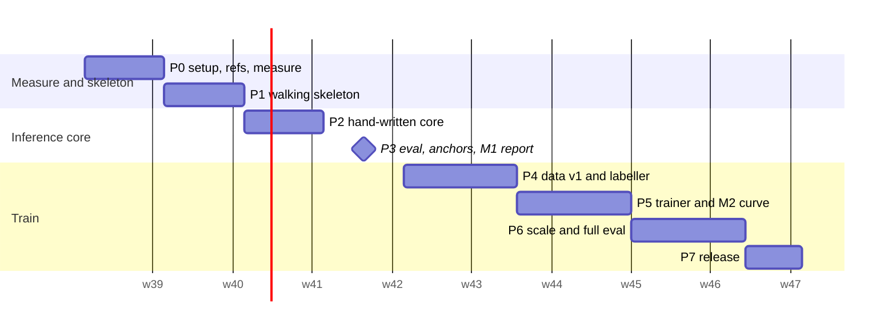

# Implementation plan: nanohunch

Owner: the author (solo). Written by the orchestrator (skeleton, shared
contracts, plan-level sections) and sd-planner instances (phase detail).
Design: `README.md`. Risk dispositions and the precedence rule: `risks.md`.
Scope: the MVP cut line in `risks-overengineering.md` section 4, adjusted by
`risks.md`. Anything not in this file is on the "Not doing" list at the end.
Revision 2 (2026-09-24): minimal layout with a 1,000-line core budget, open
replications as reference reading and baselines (see "What changed in revision 2").

## Summary

We are building **the minimal open System One model**: a small open model that
does what TypeSafe's Jev does. It reads a text **state**, answers many typed
questions about it (Choice, Score, Noul) in parallel, and returns **calibrated
probability distributions** instead of generated text.

About ten open Jev replications appeared in the week after Jev launched. None
is minimal: the trained ones are 2k to 12k lines, and the small ones are
untrained wrappers. So the product here is the nanoGPT version: **six core
files, at most 1,000 lines, that you write yourself, trained overnight on one
M5 Mac**, with an honest calibrated eval against the replications that already
exist.

The MVP is MiniCPM5-2B-Base, read through restricted label-token logits,
LoRA-tuned in MLX on soft labels from two releasable teacher models, and served
by an engine that encodes the state once and branches the KV cache per
question.

The headline claim is pre-registered: **the fine-tune beats its own zero-shot
base (B0) on gold slices and a held-out template slice.** It is reported with
order flips and long-input accuracy against pngwn arm B, and with accuracy and
calibration against SemIf (frozen Qwen3.5-4B) and decider-2b (a trained 2B
model), all in one harness.

- **Total effort:** about **160 hours** (26.7 engineer-days at 6 focused hours).
  That is **8 weeks at 20 h/week, or 10 to 11 weeks at 15 h/week**.
- **Expected cash:** **5 to 15 USD** (teacher API calls only; training runs on
  the Mac).
- **Public artefacts:** Milestone 1 (week 4, B0 bake-off report) and the release
  (week 8 to 10, model + eval report).

## What changed in revision 2

| Change | Why |
|---|---|
| Core collapsed to six files (`fmt`, `engine`, `calibrate`, `train`, `dataset`, `evaluate`) with a hard 1,000-line budget enforced by `tools/loc.py` | "Minimal" is the differentiator in a crowded field; a budget you check every phase is what keeps it minimal |
| Glue moved out of the core: `sources/` (dataset adapters, generator), `label.py` (HTTP), `cli.py`, `tools/`, `skeleton/`, `bench/` | Matches nanoGPT and nanochat: the model and its training loop are small; data scripts sit beside them |
| Phase 0 pins six reference repos under `refs/` (reading only) | They already solved parts of this; reading them before writing saves days and avoids known traps |
| Phase 3 adds external anchors: SemIf authored144 (with a sanity gate against SemIf's published MiniCPM5-2B 0.686) and JevBench public items | Makes M1 comparable with published work, and catches readout bugs early |
| Phase 4 excludes all external eval items from training | JevBench's own README warns that its public half can be trained on |
| Phase 6 adds decider-2b as an external trained baseline and an open-replication table | A reader's first question will be "how does this compare to the others?" |
| Phase 3 adds a calibration-grouping rule (T per option-count bucket if needed) | MiniSystemOne and poorjev both found that a single global T does not transfer across option counts |

## How to read this plan

Every phase opens with **Why this phase exists** and **What you will
understand after this phase**. Phases 2, 3 and 5 add **Read before writing**:
specific files in the reference repos to read first. Then come the files, the
interfaces the phase produces for later phases, the steps (tests first), a
verification gate with a command and an expected result, a rollback, and where
relevant a kill criterion.

Core logic is **yours to write** (see "How to use this plan with an AI pair").
For core components the plan gives the interface, the algorithm as numbered
steps, and the exact tests with assertions, but never the implementation.
Glue (config, HTTP, file IO) is spelled out concretely.

## Sequence at a glance

| Phase | Title | Hours | Days | Calendar (20 h/wk) | Depends on | One-way door? |
|---|---|---|---|---|---|---|
| 0 | Set up the repo, pin references, measure the five unknowns | 14 | 2.3 | week 1 | none | no |
| 1 | Walking skeleton: B0 and a trained number with stock tools | 16 | 2.7 | week 2 | 0 | no |
| 2 | Hand-write the inference core and match the skeleton | 20 | 3.3 | week 3 | 1 | format v1 frozen at end (soft) |
| 3 | Eval harness, B0 bake-off, external anchors: Milestone 1 | 23 | 3.8 | week 4 | 2 | **yes: split salt frozen when M1 test numbers are published** |
| 4 | Data v1 and the teacher labeller, audit before bulk | 24 | 4.0 | weeks 5 to 6 | 0 (P0-7), 3 | no (reuses the frozen split) |
| 5 | Hand-write the trainer, pass the numerics gate, learning curve: Milestone 2 | 24 | 4.0 | weeks 6 to 7 | 3, 4 | **yes: format v1 baked into adapters** |
| 6 | Scale data, full run, pre-registered eval vs B0, pngwn, SemIf, decider-2b | 27 | 4.5 | weeks 8 to 9 | 5 (kill rule passed) | no |
| 7 | Release: model card, report, upload | 12 | 2.0 | week 9 to 10 | 6 | **yes: public release licence mix** |
| | **Total** | **160** | **26.7** | **8 weeks nominal** | | |

Critical path: 0, 1, 2, 3, 5, 6, 7. Phase 4 can start in week 4 alongside
Phase 3 for its non-core parts (public dataset download and adapters). There is
only one person, so this parallelism means interleaving evenings, not saving
calendar time.



## Calendar rules (pre-committed, from `risks.md` R17)

- **Milestone 1** must be public by the end of week 4. If it is not public by
  the end of week 5, cut to 2 synthetic workflows and a 100-item audit.
- **Milestone 2** (learning curve and kill decision) is due by the end of week 7.
- **Stop rule:** if no model trained on teacher-labelled data has been
  evaluated by the end of week 9, publish B0 plus a training write-up and stop.
- **Hours log:** record hours weekly in `ledger/hours.csv`. Two consecutive
  weeks under 12 h trigger the week-5 cut immediately.

## Pre-requisites (do these before Phase 0 starts, about 1 h)

1. **OpenRouter account.** Prepay **10 USD** (never more than 20 USD in the
   account), turn auto top-up **off**, and create one API key with a credit
   limit of 20 USD. Store it in `.env` as `OPENROUTER_API_KEY`.
2. **Hugging Face account and token.** Create a **fine-grained** token with
   write access only to your own repos. Store it in `.env` as `HF_TOKEN`.
3. **Modal config permissions.** Run `chmod 600 ~/.modal.toml` (it is 644 today,
   MEASURED). Modal is not used in the MVP; this is hygiene.
4. **Disk space.** 628 GiB is free (MEASURED). The MVP needs about 35 GB: two
   base models in bf16, decider-2b, checkpoints, and `refs/`.
5. **Read `risks.md` once.** It is 250 lines and tells you what we decided not
   to worry about.

## Repository layout (shared contract for all phases)

Flat modules at the repo root, matching the user's existing projects. **Core** =
the six files the line budget counts. Everything else is glue, tools or
reference, and is not counted.

```
nanohunch/
  # ---- core: you write these, at most 1,000 non-blank non-comment lines total ----
  fmt.py            130  Question/Branch/Rendered types, errors, nanohunch-fmt-v1 render, label vocab, permutations
  engine.py         200  label_logits, MLXBranchScorer (chunked prefill, trim branching, fp32 oracle), pool, Answer
  calibrate.py      170  temperature fit/apply, Calibration; accuracy, ECE, NLL, Brier, flip rate, bootstrap, risk-coverage
  train.py          220  LoRALinear, restricted_soft_ce, permutation remap, loop, checkpoint/resume
  dataset.py        150  row schema by option id, assign_split, renormalize, pool_orders, consensus, filters, audit sampler
  evaluate.py       130  EvalItem, Predictor, run_eval, family balanced accuracy, audit agreement
  # ---- glue and tools: not counted ----
  sources/          public.py, triage.py (+ workflows), external.py (pngwn, SemIf, JevBench converters)
  label.py          OpenRouter teacher calls, JSONL cache, spend ledger (calls dataset.renormalize)
  cli.py            `uv run python cli.py decide|eval|fit-cal|train|build|label|audit`
  release.py        Phase 7 licence and secret gate, staging
  tools/            loc.py (line budget), decider_predictor.py (external baseline)
  skeleton/         Phase 1 stock-tool reference scripts (kept forever as the numeric reference)
  bench/            Phase 0 measurement scripts (copied from docs/design/.../capacity-bench)
  refs/             gitignored: six pinned reference repos, reading only (configs/refs.yaml)
  tests/            pytest, one file per concern
  configs/          YAML run configs, committed
  prompts/          generator prompts
  data/  runs/      gitignored: raw/, labels/, built/; adapters, checkpoints, logs
  reports/  ledger/ committed: eval JSON, plots, markdown reports; hours.csv, spend.csv
  pyproject.toml  uv.lock  .gitignore  .env.example  AGENTS.md  README.md
```

**Line budget rule.** `uv run python tools/loc.py` runs in every verification
gate from Phase 2 on. The per-file numbers are soft targets (it warns). The
1,000-line total is hard (it exits 1). If you go over:
1. Delete before you add.
2. If a piece of code is glue, move it out of the core.
3. Only then consider raising a per-file budget, and never the total.

## Reference repos (reading only; pinned in Phase 0 step 14)

| Repo | Read | Used as |
|---|---|---|
| TheoLeeCJ/SemIf-OpenJev @23cf1f3 (MIT) | `src/semif_phase1/mlx_backend.py`, `direct.py`, `benchmarks/calibrate.py` | zero-shot reference; authored144 eval set; published MiniCPM5-2B 0.686 and Qwen3.5-4B 0.813 |
| Mapika/decider @b44b4c9 (Apache-2.0) | `decider/model.py` (`slot_logits`), `decider/train.py` | external trained baseline (HF `Mapika/decider-2b`) |
| kshetrajna12/reflex @231f896 (MIT) | `src/reflex/train/calibrate.py`, `docs/results/frozen-vs-trained.md` | loss reference; evidence that LoRA can hurt |
| wfzyx/von @1d86116 (Apache-2.0) | `src/von/models/option_marker.py` | order-invariant masks (later list only) |
| Colvin0315/MiniSystemOne @016c6dd (Apache-2.0) | `trainer/calibrate_temperature.py` | per-group temperatures |
| fstandhartinger/jevbench @2fa63fa (MIT) | `datasets/public/*.jsonl`, README scoring section | public eval items (eval-only) |
| karpathy/nanoGPT, karpathy/nanochat | overall structure | the style being copied, not the code |

## Interface registry (names every phase must use)

These come from `architecture.md` section 6.4, with the torch path removed
(MVP trains in MLX, `risks.md` R7), regrouped into the six core files. Phase
detail may add private helpers but must not rename these.

```python
# fmt.py
QType = Literal["choice", "score", "noul"]
Perm = tuple[int, ...]                       # perm[display_pos] = canonical option index
@dataclass(frozen=True, slots=True)
class Question:   id: str; type: QType; text: str; options: tuple[str, ...]; values: tuple[int, ...] = ()
@dataclass(frozen=True, slots=True)
class Branch:     question_id: str; qtype: QType; perm: Perm; token_ids: tuple[int, ...]; label_ids: tuple[int, ...]
@dataclass(frozen=True, slots=True)
class Rendered:   format_version: str; prefix_ids: tuple[int, ...]; branches: tuple[Branch, ...]; truncated: bool
class TooManyOptions(ValueError): ...
class StateTooLong(ValueError): ...
class LabelNotSingleToken(ValueError): ...
FORMAT_VERSION = "nanohunch-fmt-v1"
def label_vocab(tokenizer, qtype: QType, n: int) -> tuple[int, ...]
def permutations_for(n_options: int, n_perms: int) -> list[Perm]
def render(tokenizer, state: str, questions: Sequence[Question], *, n_perms: int,
           max_context: int, truncate: Literal["reject", "head_tail"] = "reject") -> Rendered

# engine.py
def label_logits(hidden_last, head_weight, label_ids)  # mx: [B,H] x [n,H]^T -> [B,n]; never full vocab
@dataclass(frozen=True, slots=True)
class BranchLogits: question_id: str; perm: Perm; logits: np.ndarray   # [n], display order, T=1
class MLXBranchScorer:
    def __init__(self, model_path: str, *, adapter_path: str | None = None,
                 prefill_chunk: int = 1024, dtype: str = "bfloat16") -> None
    def score(self, r: Rendered) -> list[BranchLogits]                  # trim branching
    def score_reencode(self, r: Rendered, *, dtype: str = "float32") -> list[BranchLogits]  # oracle, unbatched
def pool(branches: Sequence[BranchLogits]) -> dict[str, np.ndarray]    # canonical order log-probs
@dataclass(frozen=True, slots=True)
class Answer: question_id: str; qtype: QType; probs: np.ndarray; confidence: float; entropy_norm: float; expected: float | None
def to_answer(q: Question, probs: np.ndarray) -> Answer

# calibrate.py
@dataclass(frozen=True)
class Calibration: model_revision: str; format_version: str; temperature: dict[str, float]  # f"{qtype}:{n_perms}" (+ ":{bucket}" if Phase 3 rule fires)
                   default_perms: dict[str, int]; fitted_on: str
def fit_temperature(pooled_logprobs: Sequence[np.ndarray], targets: Sequence[int]) -> float  # log-T search, T in [0.05, 20]
def apply(cal: Calibration, qtype: QType, n_perms: int, pooled: np.ndarray) -> np.ndarray
def accuracy(probs: Sequence[np.ndarray], targets: Sequence[int]) -> float
def ece(conf: np.ndarray, correct: np.ndarray, *, bins: int = 15, scheme: Literal["width", "mass"] = "width") -> float
def nll(probs, targets) -> float
def brier(probs, targets) -> float
def flip_rate(canon_top1: Sequence[int], perm_top1: Sequence[int]) -> float
def paired_bootstrap(a_correct: np.ndarray, b_correct: np.ndarray, *, n: int = 10_000, seed: int = 0) -> tuple[float, float, float]  # delta, lo, hi
def bootstrap_ci(stat, *arrays, n: int = 10_000, seed: int = 0) -> tuple[float, float, float]   # Phase 6
def risk_coverage(conf, correct, coverages=(1.0, 0.9, 0.8, 0.7, 0.5)) -> list[tuple[float, float, float]]  # Phase 6

# evaluate.py
@dataclass(frozen=True)
class EvalItem: state_id: str; group_key: str; state: str; question: Question; gold: int | None
                consensus: np.ndarray | None; meta: dict[str, str]     # source, template, length_bucket, family
class Predictor(Protocol):
    name: str
    def predict(self, state: str, questions: Sequence[Question], *, n_perms: int = 1) -> list[Answer]
def run_eval(pred: Predictor, items: Sequence[EvalItem], *, perm_suite: Sequence[int] = (1,),
             baseline: str | None = None, out_dir: Path) -> dict
def family_balanced_accuracy(items: Sequence[EvalItem], correct: np.ndarray) -> float   # SemIf's metric, Phase 3
def audit_agreement(csv_path: Path) -> dict[str, tuple[float, int]]                    # Phase 4

# dataset.py  (row schema nanohunch.data.v1, keyed by OPTION ID; see Phase 4)
def assign_split(group_key: str, source: str, fractions: dict[str, float], salt: str) -> str
def renormalize(top: list[dict], labels: list[str], qtype: QType) -> tuple[float, list[float]]  # (candidate_mass, probs in display order)
def pool_orders(a: dict[str, float], b: dict[str, float]) -> dict[str, float]   # log-linear, keyed by option id
def consensus(per_teacher: Sequence[dict[str, float]]) -> dict[str, float]      # arithmetic mean, keyed by option id
LICENSE_ALLOWLIST: frozenset[str]; RELEASABLE_TEACHERS: frozenset[str]
def assert_row_releasable(row: dict) -> None

# train.py
def restricted_soft_ce(label_logits, target_probs, valid_mask) -> "mx.array"   # sum over decisions / global batch
def train(cfg_path: Path) -> Path                                               # returns adapter dir; resumes automatically

# glue, not core (names fixed because phases import them)
# label.py:  TeacherSpec(teacher_id, model, provider_order, top_logprobs=20); label_decision(spec, state, q, perm, *, cache) -> dict
# tools/decider_predictor.py:  DeciderPredictor(model_dir: Path, device: str = "mps")  implements Predictor
# sources/external.py:  convert_pngwn, convert_semif, convert_jevbench -> EvalItem | None
```

## Phases

The detailed phases follow in order. Source fragments live in `plan-parts/`
(edit there, then re-assemble with the command at the top of `plan-parts/_tail.md`).

### Phase 0: Set up the repo, pin references, measure the five unknowns

**Goal:** a committed repo with secrets ignored from commit 1, both base models on disk, and `reports/phase0.md` holding a measured value, a pass/fail and a decision for P0-1, P0-4, P0-6, P0-7 and P0-8.
**Effort:** 14 h (2.3 engineer-days). **Depends on:** the plan-level prerequisites. **Parallel with:** nothing (solo); inside the phase, the unattended 2 h soak (step 12) overlaps with the teacher probe (step 11), which uses only the network.
**Risk:** medium, because two results (P0-7, P0-8) can move Phase 4 and Phase 5 onto their fallbacks.

**Why this phase exists.** Five numbers the design leans on are ASSUMPTION or were measured on synthetic weights: label tokens being single ids, the branch oracle on real weights, an unexplained 0.12 fp32 gap, teacher logprob stability through OpenRouter, and Mac LoRA speed on real weights. Each one, if wrong, changes a later phase. Measuring them costs about a week and under 0.20 USD; discovering them in week 6 costs a redesign (R8, R9, R10, R18). Planning also found a sixth, already MEASURED fact: stock `mlx_lm.lora` wraps every `{"prompt","completion"}` row in the tokenizer's chat template (`mlx_lm/tuner/datasets.py:107-127`, mlx-lm 0.31.3), which would silently break the raw nanohunch-fmt-v1 format. Step 4 neutralises it.

**What you will understand after this phase**
- **Restricted label readout.** The answer is not generated text: you take the logits at the last token of `Answer:`, keep only the rows for ` A`, ` B`, ` yes` and so on, and softmax those. This only works if every label is exactly one token, which is why P0-1 comes first.
- **KV-cache branching and its oracle.** Encoding the state once and appending each question to a copy of its KV cache must give the same probabilities as encoding state plus question from scratch. In bf16 the two differ by rounding (1.3e-2 MEASURED), so correctness is checked in fp32 (4.0e-4 MEASURED on random tokens), and "isolation" checks that batching branches never lets one row influence another.
- **Logprob repeatability.** A teacher's top-20 logprobs are a soft label only if the same request gives the same distribution twice. Jensen-Shannon divergence (JSD, base 2, range 0 to 1) is the run-to-run distance; candidate mass is how much probability lands on valid labels at all.
- **Sustained versus burst throughput.** A 30-iteration benchmark measures the chip cold; a 2 h soak measures thermals, allocator growth and sleep. Only the soak predicts an overnight run.

**Changes**
| File | Change |
|---|---|
| `.gitignore` | **Done 2026-09-24.** GitHub Python template (initial commit, already ignores `.env` and `.venv`) plus a nanohunch block: `/data/`, `/runs/`, `/refs/`, `*.safetensors`, `.DS_Store`. |
| `.env.example` | **Done 2026-09-24.** Two lines: `OPENROUTER_API_KEY=` and `HF_TOKEN=`. |
| `AGENTS.md` | **Done 2026-09-24.** Learn-by-writing rule, reference-repo rule, line budget, pre-push check. |
| `ledger/hours.csv` | **Done 2026-09-24.** Header `week_start,phase,hours,note`. |
| `ledger/spend.csv` | **Done 2026-09-24.** Header `date,phase,item,model,host,quantization,prompt_tokens,completion_tokens,usd,note`. |
| `pyproject.toml`, `uv.lock`, `.python-version` | New, from `uv init --bare` and `uv python pin 3.12` (`README.md` already exists and is kept). |
| `bench/__init__.py`, `skeleton/__init__.py` | New, empty, so scripts run as `uv run python -m bench.<name>`. |
| `bench/equiv.py`, `bench/synth_bench.py`, `bench/branch_bench.py` | Copied unchanged from `docs/design/2026-09-23-nanohunch/capacity-bench/`. |
| `bench/check_labels.py` | New (P0-1). Code in step 5. |
| `bench/make_raw_model.py` | New. Builds a model dir with a passthrough chat template. Code in step 4. |
| `skeleton/fmt_ref.py` | New. Reference nanohunch-fmt-v1 text fill (ADR-0003), shared by bench and skeleton. Code in step 6. |
| `tests/test_fmt_ref.py` | New. 3 tests (step 6). |
| `bench/sample_items.py` | New. 25 BoolQ + 25 ARC-Challenge items to `data/raw/p0_items.jsonl`. |
| `bench/equiv_real.py` | New (P0-4), adapted from `bench/equiv.py`. |
| `bench/anomaly.py` | New (P0-6), hypothesis toggles on `bench/equiv.py` line 20. |
| `bench/teacher_probe.py` | New (P0-7). Glue, core parts in step 11. |
| `configs/teachers_p0.yaml` | New. One entry per teacher: `teacher_id`, `model`, `provider_order`, `quantization`. |
| `bench/make_synth_lora.py`, `bench/soak_parse.py`, `configs/p0_lora.yaml` | New (P0-8). |
| `reports/phase0.md`, `reports/phase0/teacher_probe.csv` | New. Results table and per-call probe rows. |
| `tools/loc.py` | New, glue (code in step 14). Counts core lines against the 1,000-line budget. |
| `configs/refs.yaml` | New. Pinned reference repos (step 14). `refs/` is gitignored. |

**Produces (interfaces later phases use)**
- `skeleton/fmt_ref.py`: `PREAMBLE: str`, `prefix_text(state: str) -> str`, `branch_text(qtype: str, question: str, options: Sequence[str], values: Sequence[int] = ()) -> str`, `label_strings(qtype: str, n: int, values: Sequence[int] = ()) -> list[str]`. Phase 2 `fmt.render` must produce the same token ids as `tok.encode(prefix_text(s)) + tok.encode(branch_text(...), add_special_tokens=False)`.
- `runs/models/minicpm5-2b-base-raw/` and `runs/models/qwen3-4b-base-raw/`: symlinked weights, passthrough chat template. Every stock `mlx_lm` command in Phase 1 uses these paths.
- `configs/teachers_p0.yaml`: fields named exactly as `label.TeacherSpec` (`teacher_id`, `model`, `provider_order`) plus `quantization`. Phase 4 loads it.
- `bench/teacher_probe.py`: `candidate_mass(top: list[dict], labels: list[str], qtype: str) -> tuple[float, list[float]]` and `jsd(p: list[float], q: list[float]) -> float`, the reference Phase 4 `label.py` is tested against.
- `reports/phase0.md`: the values Phase 2 (oracle tolerance, batch policy), Phase 4 (teacher set, hosts) and Phase 5 (training location) read.

**Decision table (what each measurement changes)**
| ID | Pass rule | If it fails | Phases that change |
|---|---|---|---|
| P0-1 | all 38 labels single-token in both tokenizers, alone and after `Answer:` | amend the ADR-0003 label set (for example ` Yes`/` No`, or letters for Score) and rerun, before any other step | 1, 2 |
| P0-4 | fp32 unbatched max abs prob diff <= 1e-3 and isolation diff == 0.0 | 1e-3 to 1e-2: S10 tolerance becomes 2x measured, noted in `reports/phase0.md`; above 1e-2: a cache-copy bug, fix before Phase 2; isolation != 0: `MLXBranchScorer.score` runs branches one at a time | 2 |
| P0-6 | cause found within 2 h | accepted (R9): batch 1 plus gradient accumulation in training, no batched re-encode anywhere, NLL parity test in Phase 5 | 2, 5 |
| P0-7 | per teacher: mean candidate_mass >= 0.9 and mean JSD < 0.01 | one passes: single teacher plus gold labels (R10); none passes: gold-only training and generator-derived gold for synthetic spec-fact questions | 4 |
| P0-8 | median tok/s after minute 30 >= 200 at 2k, no OOM, drop <= 20%, peak memory growth <= 0.5 GB | the Modal later item moves forward to Phase 5 (R7, R18); the Mac does eval only | 5, 6 |

**Steps**
1. (1.5 h) Repo hygiene. **Already done on 2026-09-24** in `/Users/umangkaushik/fun/nanohunch` (remote `ubermenchh/nanohunch`, public): `.gitignore`, `.env.example`, `AGENTS.md`, both ledger headers, README, and these design docs under `docs/design/2026-09-23-nanohunch/`. Your part: read `AGENTS.md` and confirm it states the rules you want (it is the contract any AI pair reads first). Then `cp .env.example .env`, fill both keys, and run `git check-ignore .env data/a runs/a refs/a w.safetensors`; expect 5 lines echoed back. Pre-push check, run before every push: `git grep -nE "sk-or-v1-|hf_[A-Za-z0-9]{30,}"`; expect no output. Use the saved time to read `docs/design/2026-09-23-nanohunch/README.md` and `risks.md` once.
2. (0.5 h) `uv init --bare --python 3.12 --name nanohunch && uv python pin 3.12` (`--bare` writes only `pyproject.toml`, so the existing README and `.gitignore` are untouched), then `uv add mlx "mlx-lm>=0.31.3" numpy pyyaml httpx python-dotenv datasets matplotlib` and `uv add --dev pytest ruff`. Run `uv run python -c "import mlx.core as mx, mlx_lm; print(mlx_lm.__version__, mx.default_device())"`. Expect `0.31.3 Device(gpu, 0)` or a newer version. Copy the three capacity-bench scripts into `bench/`, add the empty `__init__.py` files, commit `chore: uv project and bench scripts`.
3. (0.5 h) `hf --version` (MEASURED 1.30.0 at `~/.local/bin/hf`; if missing use `uv run huggingface-cli download`). Run `hf download openbmb/MiniCPM5-2B-Base` and `hf download Qwen/Qwen3-4B-Base`; each prints its snapshot path. Then `uv run python -c "from mlx_lm import load; load('openbmb/MiniCPM5-2B-Base'); print('ok')"`. Expect `ok`. If it raises `ValueError: Model type ... not supported`, stop and record it as a BLOCKING row in `reports/phase0.md`: ADR-0001 then promotes Qwen3-4B-Base and every later MiniCPM path switches to it. Record `uv run python -c "import mlx.core as mx; print(mx.device_info())"` (older mlx: `mx.metal.device_info()`); expect `max_recommended_working_set_size` near 19.07e9 (A15, MEASURED).
4. (0.5 h) Write `bench/make_raw_model.py`:
   ```python
   """Model dir with a passthrough chat template. Stock mlx_lm.lora applies the chat template to
   every prompt/completion row (mlx_lm/tuner/datasets.py:107-127); this makes it prompt + completion."""
   import json, sys
   from pathlib import Path
   from huggingface_hub import snapshot_download
   repo, out, bos = sys.argv[1], Path(sys.argv[2]), sys.argv[3] == "bos"
   src = Path(snapshot_download(repo, local_files_only=True))
   out.mkdir(parents=True, exist_ok=True)
   for f in src.iterdir():
       if f.name not in ("tokenizer_config.json", "chat_template.jinja", "chat_template.json"):
           (out / f.name).unlink(missing_ok=True)
           (out / f.name).symlink_to(f.resolve())
   cfg = json.loads((src / "tokenizer_config.json").read_text())
   cfg["chat_template"] = ("{{ bos_token }}" if bos else "") + "{{ m['content'] }}"
   (out / "tokenizer_config.json").write_text(json.dumps(cfg, indent=2))
   print(f"{out}: passthrough template, bos={bos}")
   ```
   Run it after step 5 tells you `adds_bos` per model: `uv run python -m bench.make_raw_model openbmb/MiniCPM5-2B-Base runs/models/minicpm5-2b-base-raw <bos|nobos>` and the same for `Qwen/Qwen3-4B-Base` into `runs/models/qwen3-4b-base-raw`. Verify: `uv run python -c "from mlx_lm import load; _,t=load('runs/models/minicpm5-2b-base-raw'); print(repr(t.apply_chat_template([{'role':'user','content':'X'},{'role':'assistant','content':' B'}], tokenize=False)))"`. Expect `'X B'`, preceded by the BOS string only if `bos` was passed.
5. (1.0 h) P0-1. Write `bench/check_labels.py`:
   ```python
   import sys
   from huggingface_hub import snapshot_download
   from transformers import AutoTokenizer
   LABELS = [f" {c}" for c in "ABCDEFGHIJKLMNOPQRSTUVWXYZ"] + [f" {d}" for d in range(10)] + [" yes", " no"]
   bad = 0
   for repo in sys.argv[1:]:
       tok = AutoTokenizer.from_pretrained(snapshot_download(repo, local_files_only=True))
       ctx = tok.encode("Answer:", add_special_tokens=False)
       adds_bos = tok.bos_token_id is not None and tok.encode("x")[0] == tok.bos_token_id
       for s in LABELS:
           ids = tok.encode(s, add_special_tokens=False)
           joint = tok.encode("Answer:" + s, add_special_tokens=False)
           if len(ids) != 1 or joint != ctx + ids:
               bad += 1
               print(f"FAIL {repo} {s!r} alone={ids} after_answer={joint[len(ctx):]}")
       print(f"{repo}: adds_bos={adds_bos} labels={len(LABELS)}")
   print("ALL SINGLE-TOKEN" if bad == 0 else f"{bad} FAILURES")
   sys.exit(1 if bad else 0)
   ```
   Run `uv run python -m bench.check_labels openbmb/MiniCPM5-2B-Base Qwen/Qwen3-4B-Base`. Expect two `adds_bos=` lines, last line `ALL SINGLE-TOKEN`, exit code 0. If a tokenizer asks for `trust_remote_code`, read the `.py` file in its snapshot before passing `trust_remote_code=True`. Any `FAIL` line: amend ADR-0003 rule 4 per the decision table, rerun until exit 0.
6. (1.0 h) Tests first: write `tests/test_fmt_ref.py` with `test_prefix_matches_adr` (asserts `prefix_text("S") == PREAMBLE + "### STATE\nS\n### END STATE\n\n"` and `PREAMBLE == "You will answer questions about the STATE. Answer with the label of exactly one option.\n\n"`), `test_choice_branch` (asserts `branch_text("choice", "Q?", ("x", "y")) == "### QUESTION\nQ?\nA. x\nB. y\nAnswer:"`), `test_noul_branch_and_labels` (asserts `branch_text("noul", "Q?", ("yes", "no")) == "### QUESTION\nQ?\n(yes/no)\nAnswer:"`, `label_strings("noul", 2) == [" yes", " no"]`, `label_strings("choice", 3) == [" A", " B", " C"]`). Run `uv run pytest tests/test_fmt_ref.py -q`; expect `ModuleNotFoundError: No module named 'skeleton.fmt_ref'`. Then write `skeleton/fmt_ref.py`:
   ```python
   PREAMBLE = "You will answer questions about the STATE. Answer with the label of exactly one option.\n\n"
   def prefix_text(state):
       return f"{PREAMBLE}### STATE\n{state}\n### END STATE\n\n"
   def option_lines(qtype, options, values=()):
       if qtype == "choice":
           return "\n".join(f"{chr(65 + i)}. {o}" for i, o in enumerate(options))
       if qtype == "score":
           return "\n".join(f"{v}: {o}" for v, o in zip(values, options))
       return "(yes/no)"
   def branch_text(qtype, question, options, values=()):
       return f"### QUESTION\n{question}\n{option_lines(qtype, options, values)}\nAnswer:"
   def label_strings(qtype, n, values=()):
       if qtype == "choice":
           return [f" {chr(65 + i)}" for i in range(n)]
       return [f" {v}" for v in values] if qtype == "score" else [" yes", " no"]
   ```
   Rerun; expect `3 passed`. Write `bench/sample_items.py`: `load_dataset("google/boolq", revision="35b264d0", split="validation")` and `load_dataset("allenai/ai2_arc", "ARC-Challenge", revision="210d026f", split="test")`, `random.Random(0).sample` 25 of each, rows in the Phase 1 schema (see Phase 1 step 1). Run `uv run python -m bench.sample_items`; expect `wrote 50 rows to data/raw/p0_items.jsonl`. Commit.
7. (2.0 h) P0-4. Write `bench/equiv_real.py`, adapting `bench/equiv.py`: load `runs/models/minicpm5-2b-base-raw`; cast parameters with `tree_map(lambda p: p.astype(mx.float32), ...)` as `equiv.py:9`; state = `prefix_text` of 5 BoolQ passages from `p0_items.jsonl` joined by `"\n\n"` (about 1k real tokens); 16 branches = `branch_text` of 8 BoolQ and 8 ARC items, each with its own label ids. (a) Branched: prefill the prefix ids once with `make_prompt_cache`, then for each branch alone copy every layer's `(k, v)` into a fresh `KVCache` (`equiv.py:16-17` with B = 1), run the branch ids, softmax over its label rows at the last position. (b) Oracle: one forward of prefix ids + branch ids, same readout. Print `fp32 branch_vs_reencode=<max abs diff>`. (c) Isolation: crop the 16 branches to the shortest length and compare batched-16 against one-at-a-time as `equiv.py:22-28`; print `isolation=<diff>`. Rerun without the cast and print the bf16 value for the record. Run `uv run python -m bench.equiv_real`. Pass: fp32 <= 1e-3 (expect near 4.0e-4) and `isolation=0.00e+00`. Apply the decision table.
8. (2.0 h, hard time box) P0-6. Reproduce first: `uv run python bench/equiv.py Qwen3-0.6B 1024 16 fp32`; expect `batched_naive_vs_isolated` near `1.2e-01`. Write `bench/anomaly.py` taking the same arguments plus toggles, testing in this order: (1) `--B 2,4,16` (does it appear at B = 2?); (2) `--cpu` via `mx.set_default_device(mx.cpu)` (if CPU matches isolated, the Metal kernel is at fault); (3) `--naive-sdpa`, which replaces the module attribute `mlx_lm.models.qwen3.scaled_dot_product_attention` with an fp32 reference (repeat keys and values for GQA, add a `-inf` upper-triangular mask when `mask == "causal"`, softmax, matmul); (4) `--same-rows`, a batch of 16 identical rows compared against row 0 alone. Stop at 2 h. Outcome A, explained: write the cause and the passing configuration into `reports/phase0.md` and mark R9 for re-review. Outcome B, not explained: write "accepted: batch 1 everywhere (R9)", and file a minimal repro on `ml-explore/mlx` only if outcome (2) isolated it to Metal.
9. (0.5 h) P0-7 setup. List slugs at run time: `curl -s https://openrouter.ai/api/v1/models | uv run python -c "import json,sys; [print(m['id']) for m in json.load(sys.stdin)['data'] if 'deepseek' in m['id'] or 'qwen3.6' in m['id']]"`. Pick the DeepSeek V4.1 Flash and Qwen3.6-35B-A3B ids. For each: `curl -s https://openrouter.ai/api/v1/models/<the id you picked>/endpoints | uv run python -c "import json,sys; [print(e.get('tag'), e['provider_name'], e.get('quantization'), 'top_logprobs' in e['supported_parameters'], e['pricing']['prompt']) for e in json.load(sys.stdin)['data']['endpoints']]"`. Keep endpoints printing `True`; prefer bf16 or fp8 over int4. Write `configs/teachers_p0.yaml` with, per teacher, `teacher_id` (`deepseek-v4.1-flash`, `qwen3.6-35b-a3b`), `model` (the id), `provider_order` (a one-element list, the endpoint `tag`) and `quantization`. If no endpoint of a model prints `True`, that teacher fails P0-7 now.
10. (0.5 h) Write `bench/teacher_probe.py`. Loop: for each teacher, each of the 50 items, 2 runs; POST to `https://openrouter.ai/api/v1/chat/completions` with `httpx`, key from `.env` via `python-dotenv`. Errors: HTTP 404 whose `error.message` starts with `No endpoints found`: retry once with `provider_name` in place of `tag`, then mark the teacher failed; HTTP 429: sleep 10 s, retry once; HTTP 402: stop the run (credit limit hit); `choices[0].logprobs` null: row with `note=no_logprobs`, candidate_mass 0. Per call, append to `ledger/spend.csv` (`phase=0`, `item=P0-7`, host from the response's top-level `provider`, quantization from the config, tokens and `usage.cost`) and to `reports/phase0/teacher_probe.csv`. Core parts:
    ```python
    SYSTEM = "Reply with only the label of one option: a capital letter, or yes, or no."
    def body(model, host, prompt):
        return {"model": model, "max_tokens": 1, "temperature": 0, "logprobs": True, "top_logprobs": 20,
                "reasoning": {"enabled": False}, "usage": {"include": True},
                "provider": {"order": [host], "allow_fallbacks": False, "require_parameters": True},
                "messages": [{"role": "system", "content": SYSTEM}, {"role": "user", "content": prompt}]}
    def candidate_mass(top, labels, qtype):   # top = choices[0].logprobs.content[0].top_logprobs
        mass = [0.0] * len(labels)             # variants "B", " B", "B." of one label are summed
        for t in top:
            s = t["token"].strip().rstrip(".")
            for j, lab in enumerate(labels):
                a, b = (s.lower(), lab.strip()) if qtype == "noul" else (s, lab.strip())
                mass[j] += math.exp(t["logprob"]) if a == b else 0.0
        total = sum(mass)
        return total, ([m / total for m in mass] if total > 0 else [1 / len(labels)] * len(labels))
    def jsd(p, q):                             # base 2, in [0, 1]
        m = [(a + b) / 2 for a, b in zip(p, q)]
        kl = lambda x, y: sum(a * math.log2(a / b) for a, b in zip(x, y) if a > 0)
        return 0.5 * kl(p, m) + 0.5 * kl(q, m)
    ```
    The prompt is `prefix_text(state) + branch_text(...)` from `skeleton/fmt_ref.py`.
11. (1.0 h) Run `uv run python -m bench.teacher_probe --config configs/teachers_p0.yaml --items data/raw/p0_items.jsonl --runs 2`. Expect one line per teacher: `<teacher_id> n=50 mean_candidate_mass=<x> mean_jsd=<y> no_logprobs=<k> usd=<z>` and a total under 0.20 USD (DERIVED: 200 calls at about 500 tokens). If a teacher fails on its first host, try one more host from step 9 (bounded: 1 extra run). Record host, quantization and both means in `reports/phase0.md`; Q1 and Q7 close here.
12. (1.5 h active, 2 h unattended) P0-8. `configs/p0_lora.yaml` holds `lora_parameters: {rank: 16, scale: 20.0, dropout: 0.0}` and `seed: 0` (rank is not a CLI flag). `bench/make_synth_lora.py` writes `data/p0_synth/train.jsonl` (200 rows) and `valid.jsonl` (5 rows) of `{"prompt": <decoded random token ids in [1000, 30000)>, "completion": " A"}`, trimmed until the templated length is 2,000 to 2,047 tokens. Short run: `mkdir -p runs/p0_soak && uv run mlx_lm.lora --model runs/models/minicpm5-2b-base-raw --train --data data/p0_synth --iters 30 --batch-size 1 --num-layers 16 --max-seq-length 2048 --grad-checkpoint --mask-prompt --steps-per-report 10 --steps-per-eval 100000 --val-batches 1 --adapter-path runs/p0_soak -c configs/p0_lora.yaml`. Expect `Iter 30: ... Tokens/sec <t> ... Peak mem <m> GB` with t near 297 (MEASURED synthetic at 2k). Soak: iters = ceil(7200 x t / 2048), then `caffeinate -i uv run mlx_lm.lora <same flags, --iters <that number>> 2>&1 | tee runs/p0_soak/train.log`. Then `uv run python -m bench.soak_parse runs/p0_soak/train.log`, which parses each `Iter` line, accumulates wall time from `It/sec`, and prints `median_tok_s_after_30min=<a> min_tok_s=<b> drop_pct=<c> peak_mem_30min=<d> peak_mem_end=<e> iters=<n>`. Do not run steps 7 or 8 during the soak (GPU contention).
13. (1.0 h) Write `reports/phase0.md`: one table row per ID, columns `| ID | Measurement | Value | Pass/fail | Decision taken |`, rows starting `| P0-1 |`, `| P0-4 |`, `| P0-6 |`, `| P0-7 |`, `| P0-8 |`, plus setup rows for the model load, `adds_bos` per model and the working set. Log the week in `ledger/hours.csv`. `uv run ruff format . && uv run ruff check --fix .`, commit `phase0: measurements and decisions`.
14. (0.5 h, taken from the buffer) Reference repos and the line budget. Append `refs/` to `.gitignore`. Write `configs/refs.yaml` with these pinned commits (checked 2026-09-24) and clone each shallowly: `git clone --filter=blob:none https://github.com/<repo> refs/<name> && git -C refs/<name> checkout <sha>`.
    | name | repo | sha | licence | what you read it for |
    |---|---|---|---|---|
    | semif | TheoLeeCJ/SemIf-OpenJev | 23cf1f39fc95 | MIT | zero-shot baseline, MLX cache copy, authored144 eval data |
    | decider | Mapika/decider | b44b4c9880a6 | Apache-2.0 | trained letter-slot readout; external trained baseline |
    | reflex | kshetrajna12/reflex | 231f896d818a | MIT | proper-score LoRA loss on restricted logits |
    | von | wfzyx/von | 1d86116dcc76 | Apache-2.0 | order-invariant option masks (later list only) |
    | minisystemone | Colvin0315/MiniSystemOne | 016c6dd0c36a | Apache-2.0 | per-group temperature fitting |
    | jevbench | fstandhartinger/jevbench | 2fa63fa3226c | MIT | public eval items, scoring conventions |
    Rule (AGENTS.md): refs are for **reading**, never imports. If a line of your core is materially adapted from one, add a one-line `# adapted from <repo>@<sha>:<path>` comment and keep the licence notice (all six allow it). Then write `tools/loc.py`:
    ```python
    import sys, pathlib
    BUDGET = {"fmt.py": 130, "engine.py": 200, "calibrate.py": 170, "train.py": 220, "dataset.py": 150, "evaluate.py": 130}
    TOTAL = 1000
    def loc(p):
        return sum(1 for l in p.read_text().splitlines() if l.strip() and not l.strip().startswith("#"))
    rows = {f: (loc(pathlib.Path(f)) if pathlib.Path(f).exists() else 0) for f in BUDGET}
    for f, n in rows.items():
        print(f"{f:14s} {n:5d} / {BUDGET[f]:4d}{'  OVER (soft)' if n > BUDGET[f] else ''}")
    total = sum(rows.values()); print(f"{'core total':14s} {total:5d} / {TOTAL}")
    sys.exit(1 if total > TOTAL else 0)
    ```
    Run `uv run python tools/loc.py`; expect every file at `0` and exit 0. Per-file budgets are soft (a warning); the 1,000-line total is a hard gate from Phase 2 on.

**Verification gate**
- `uv run pytest -q` prints `3 passed`; `uv run ruff check .` prints `All checks passed!`.
- `git log --reverse --stat --format=%s | head -20` shows `.gitignore` in the first commit and `.env.example` in the second, both before any code; `git check-ignore .env` prints `.env`.
- `uv run python -m bench.check_labels openbmb/MiniCPM5-2B-Base Qwen/Qwen3-4B-Base` exits 0.
- `grep -cE "^\| P0-(1|4|6|7|8) \|" reports/phase0.md` prints `5`, and every such row has a non-empty "Decision taken" cell.
- `uv run python -c "import csv; print(round(sum(float(r['usd']) for r in csv.DictReader(open('ledger/spend.csv'))), 4))"` prints a value below `0.2`.
- `ls refs` lists 6 directories; `uv run python tools/loc.py` exits 0.
- The phase passes when every measurement has a decision. A failed measurement is a valid result that selects a fallback, not a failed phase.

**Rollback**
- Undo: `git revert` the phase commits and `rm -rf runs/models runs/p0_soak data/p0_synth data/raw/p0_items.jsonl`; the Hugging Face cache stays and is harmless.
- Point of no return: the first `git push` to a public remote. Do not push in this phase; if you do, run the pre-push check first.
- Data written during a failed window: `ledger/spend.csv` rows are real spend and stay; a half-written `reports/phase0/teacher_probe.csv` is deleted and the probe rerun (about 0.05 USD per full run).

**Kill criteria**
- A9 / A10: if the median tok/s after minute 30 of the soak is below 200 at 2k (or it OOMs) after one retry with `--num-layers 8` (bounded 1 h), then Phase 5 and Phase 6 train on one Modal A100 function (the "later" item, `timeout=` set, cost per `cost.md`) and the Mac does eval only.
- R10: if both teachers show mean candidate_mass < 0.9 or mean JSD >= 0.01 after trying 2 hosts each (bounded 1 h, 0.20 USD), then Phase 4 drops teacher soft labels: gold-only training on public sets plus generator-derived gold for synthetic spec-fact questions. If exactly one passes, that teacher plus gold labels.

### Phase 1: Walking skeleton: B0 and a trained number with stock tools

**Goal:** by the end of week 2, `reports/skeleton.md` shows zero-shot B0 and a stock-LoRA MiniCPM5-2B side by side (accuracy, 15-bin ECE, reversed-order flip rate) on a 1,000-item gold eval.
**Effort:** 16 h (2.7 engineer-days). **Depends on:** Phase 0 (P0-1 passed, raw model dir built). **Parallel with:** nothing (solo); the unattended LoRA run (step 7) overlaps with writing `skeleton/tiny_eval.py`.
**Risk:** low, because every component is stock `mlx_lm` and nothing here is frozen.

**Why this phase exists.** The pre-mortem's most likely failure (R2) is weeks of hand-written infrastructure with no end-to-end number. A walking skeleton is the thinnest version of the whole pipeline that runs from data to a metric: data in, model read, model trained, number out, each piece as crude as allowed. We accept stock tools here because their job is to be the reference: from Phase 2 on, each hand-written module (R20) replaces a stock piece and must reproduce these numbers before you move on. A bug then shows up as a disagreement with a known number instead of as a plausible-looking wrong result.

**What you will understand after this phase**
- **Walking skeleton.** An end-to-end path first, depth later. It turns "is my engine right?" into "does my engine match `reports/skeleton.json`?".
- **Expected calibration error (ECE).** Sort predictions into 15 equal-width bins by their top probability; in each bin compare mean confidence with the fraction correct; ECE is the item-weighted mean gap. A model that says 0.9 and is right 90% of the time scores 0.
- **Order flip rate.** Reverse the option order and ask again; if the top-1 option changes, the model answered the letter position, not the content. pngwn's arm B flipped 37.5%; this is the number the project exists to lower (R14).
- **Prompt-masked fine-tuning.** `--mask-prompt` puts loss only on the answer token, so 950 examples teach "which letter", not "continue this passage". Phase 5 replaces this full-vocab hard-label loss with restricted soft cross-entropy.

**Changes**
| File | Change |
|---|---|
| `skeleton/prep_gold.py` | New. BoolQ and ARC to `data/skeleton/gold_train.jsonl` and `gold_eval.jsonl`; exposes `split_of`. |
| `skeleton/b0_reader.py` | New. Stock load, one sequence per question, restricted readout. Code in step 3. |
| `skeleton/tiny_eval.py` | New. Accuracy, 15-bin ECE, flip rate per type; writes `reports/skeleton.json`. |
| `skeleton/to_lora_jsonl.py` | New. Gold rows to `data/skeleton/train.jsonl` and `valid.jsonl` in completions format; exposes `make_example`. |
| `configs/skeleton_lora.yaml` | New. `lora_parameters: {rank: 16, scale: 20.0, dropout: 0.0}`, `seed: 0`. |
| `tests/test_skeleton.py` | New. 6 tests (steps 2, 4, 5). |
| `reports/skeleton/*.json`, `reports/skeleton.json`, `reports/skeleton.md` | New. Per-item probabilities (about 80 KB each), metrics, write-up. |

**Produces (interfaces later phases use)**
- Row schema of `data/skeleton/gold_*.jsonl`: `{"id": str, "group_key": str, "type": "noul" | "choice", "state": str, "question": str, "options": list[str], "gold_index": int}`. Ids are `boolq:<row index>`, `arc-easy:<ARC id>`, `arc-challenge:<ARC id>`. Noul options are `["yes", "no"]`, gold 0 = yes.
- `skeleton.prep_gold.split_of(source: str, group_key: str, salt: str) -> Literal["train", "eval"]`. Salt `nanohunch-skeleton-v0`. This is NOT the Phase 3 frozen salt; skeleton numbers are never published as test results.
- `skeleton.b0_reader.read(model, tok, row: dict, reverse: bool = False) -> list[float]`, probabilities in canonical (dataset) option order.
- `skeleton.tiny_eval.accuracy`, `ece15(conf, correct) -> float`, `flip_rate(fwd_top1, rev_top1) -> float`: Phase 3 `calibrate.accuracy`, `calibrate.ece(..., bins=15, scheme="width")` and `calibrate.flip_rate` must return identical values on the same inputs.
- `reports/skeleton.json`: `{"b0": {"noul": {"n", "acc", "ece15"}, "choice": {"n", "acc", "ece15", "flip"}, "all": {...}}, "lora": {same}}`. Phase 2 reproduces the `b0` block with `MLXBranchScorer`; Phase 5 reproduces the `lora` block with `train.train` on the same 950 items and hard labels.

**Steps**
1. (3.0 h) `skeleton/prep_gold.py`. BoolQ: `load_dataset("google/boolq", revision="35b264d0")`, train and validation pooled; print `column_names`. `group_key` = the `title` column if present, else `"passage:" + sha256(passage)[:16]`; write which one into `reports/skeleton.md`. State = the passage; question = the BoolQ question with the first letter capitalised and `?` appended; options `["yes", "no"]`; gold 0 if `answer` is true. ARC: `load_dataset("allenai/ai2_arc", c, revision="210d026f")` for `c` in `ARC-Easy`, `ARC-Challenge`, all splits pooled; keep rows with 3 to 5 choices; `gold_index = choices["label"].index(answerKey)` (labels are `A` to `E` or `1` to `5`); `group_key` = the ARC `id`. ARC has no passage, so state = `"Science exam question. There is no passage; answer from general knowledge.\n\n" + stem` and question = `"Which option correctly answers the question in the STATE?"`. Say honestly in `reports/skeleton.md` that the ARC slice tests knowledge, not reading. Split: `split_of` computes `int(hashlib.sha256(f"{salt}|{source}|{group_key}".encode()).hexdigest()[:8], 16) / 2**32` and returns `"train"` below 0.5; then `random.Random(0).sample` per split: 500 BoolQ, 250 ARC-Easy, 250 ARC-Challenge. `--show 20` prints 20 fully rendered rows with the gold option text; read them (R6). Run `uv run python -m skeleton.prep_gold --show 20`. Expect `train=1000 eval=1000 shared_group_keys=0` and 20 rows whose gold option text is correct.
2. (included above) Tests in `tests/test_skeleton.py`; import the module under test inside each test function, so later tests can be written before their modules exist: `test_split_deterministic` (`split_of("boolq", "Tie", "nanohunch-skeleton-v0")` returns the same value on 3 calls and is in `{"train", "eval"}`) and `test_groups_disjoint` (reads both built files, asserts the two `group_key` sets are disjoint). Run `uv run pytest tests/test_skeleton.py -q`; expect `2 passed`.
3. (2.5 h) `skeleton/b0_reader.py` (stock code, the numeric reference):
   ```python
   """B0 / stock-LoRA reader: one full sequence per question, no branching."""
   import argparse, json
   import mlx.core as mx
   from mlx_lm import load
   from skeleton.fmt_ref import prefix_text, branch_text, label_strings

   def encode_split(tok, prefix, branch):   # ADR-0003 rule 2: tokenized separately, ids concatenated
       return tok.encode(prefix) + tok.encode(branch, add_special_tokens=False)

   def read(model, tok, row, reverse=False):
       n = len(row["options"])
       order = list(range(n))[::-1] if reverse and row["type"] == "choice" else list(range(n))
       shown = [row["options"][i] for i in order]
       label_ids = [tok.encode(s, add_special_tokens=False)[0] for s in label_strings(row["type"], n)]
       ids = encode_split(tok, prefix_text(row["state"]), branch_text(row["type"], row["question"], shown))
       last = model(mx.array(ids)[None])[0, -1]                     # logits at the last token of "Answer:"
       p = mx.softmax(last[mx.array(label_ids)].astype(mx.float32)).tolist()
       canon = [0.0] * n
       for disp, c in enumerate(order):                             # display position -> canonical option
           canon[c] = p[disp]
       return canon

   def main():
       ap = argparse.ArgumentParser()
       ap.add_argument("--model", required=True)
       ap.add_argument("--adapter", default=None)
       ap.add_argument("--data", required=True)
       ap.add_argument("--out", required=True)
       ap.add_argument("--reverse", action="store_true")
       ap.add_argument("--limit", type=int, default=0)
       a = ap.parse_args()
       model, tok = load(a.model, adapter_path=a.adapter)
       rows = [json.loads(line) for line in open(a.data)]
       rows = rows[: a.limit] if a.limit else rows
       out = []
       for i, r in enumerate(rows):
           out.append({"id": r["id"], "type": r["type"], "gold_index": r["gold_index"],
                       "reversed": a.reverse, "probs": read(model, tok, r, a.reverse)})
           if i % 100 == 0:
               print(f"{i}/{len(rows)}", flush=True)
       json.dump(out, open(a.out, "w"))
       print(f"wrote {len(out)} rows to {a.out}")

   if __name__ == "__main__":
       main()
   ```
   Smoke: `uv run python -m skeleton.b0_reader --model runs/models/minicpm5-2b-base-raw --data data/skeleton/gold_eval.jsonl --out /tmp/b0_smoke.json --limit 5`. Expect `wrote 5 rows`, each `probs` summing to 1 within 1e-5.
4. (1.5 h) `skeleton/tiny_eval.py`. Tests first in `tests/test_skeleton.py`: `test_ece_perfect` (`ece15([1.0, 1.0], [1, 1]) == 0.0`), `test_ece_known` (ten predictions at 0.9 with 8 correct give `abs(ece15(...) - 0.1) < 1e-9`), `test_flip_rate` (`flip_rate([0, 1, 2], [0, 2, 2]) == 1/3`). Run `uv run pytest tests/test_skeleton.py -q`, expect `3 failed, 2 passed` with `ModuleNotFoundError: No module named 'skeleton.tiny_eval'`. Then:
   ```python
   def accuracy(probs, gold):
       return float(np.mean([int(np.argmax(p)) == g for p, g in zip(probs, gold)]))
   def ece15(conf, correct):
       conf, correct = np.asarray(conf, float), np.asarray(correct, float)
       idx = np.minimum((conf * 15).astype(int), 14)                 # bin 14 includes conf == 1.0
       return float(sum(abs(correct[idx == b].mean() - conf[idx == b].mean()) * (idx == b).mean()
                        for b in range(15) if (idx == b).any()))
   def flip_rate(fwd_top1, rev_top1):
       return float(np.mean([a != b for a, b in zip(fwd_top1, rev_top1)]))
   ```
   The CLI `--name <b0|lora> --fwd <file> --rev <file> --json reports/skeleton.json` prints `name type n acc ece15 flip` rows for `noul`, `choice`, `all` (flip only for choice, from rows whose `reversed` is true) and merges its block into the JSON. Expect `5 passed` for the file.
5. (1.0 h) B0 runs: `mkdir -p reports/skeleton`, then `uv run python -m skeleton.b0_reader --model runs/models/minicpm5-2b-base-raw --data data/skeleton/gold_eval.jsonl --out reports/skeleton/b0_fwd.json` and the same with `--reverse --out reports/skeleton/b0_rev.json`. Expect about 4 minutes each (DERIVED: 1,000 sequences of about 300 tokens at 1,300 tok/s prefill, MEASURED). Then `uv run python -m skeleton.tiny_eval --name b0 --fwd reports/skeleton/b0_fwd.json --rev reports/skeleton/b0_rev.json --json reports/skeleton.json`. Determinism: rerun with `--limit 50 --out /tmp/b0_50.json` and compare to the first 50 rows; expect a max abs diff of 0.0 (accept <= 1e-5).
6. (2.0 h) `skeleton/to_lora_jsonl.py`. `make_example(row, rng) -> {"prompt", "completion", "perm"}`: for Choice draw `perm = rng.sample(range(n), n)` (`perm[display_pos] = canonical index`, the registry's `Perm` convention), show `options[perm[j]]` at position j, completion = the label at the display position `j` where `perm[j] == gold_index`; Noul is never permuted. Prompt = `prefix_text + branch_text`, completion like `" B"`. Test `test_target_remap`: for 200 rows, the option line for the completion letter contains `options[gold_index]`. Main: `random.Random(0)`, first 950 train rows to `data/skeleton/train.jsonl`, last 50 to `valid.jsonl` (stock `mlx_lm.lora` needs a validation file; 950 is what is trained on). It loads the raw tokenizer and prints `max_len=<L> split_mismatch=<K> of 950`, where K counts rows whose `apply_chat_template` ids differ from `encode_split(prefix, branch) + [label_id]`. Expect L < 2048 (rows over it are dropped and counted) and K = 0; if K > 9 (1%), recheck step 4 of Phase 0 before training. Run `uv run pytest tests/test_skeleton.py -q`, expect `6 passed`.
7. (1.5 h) Check flags: `uv run mlx_lm.lora --help | grep -cE -- "--(train|mask-prompt|grad-checkpoint|num-layers|max-seq-length|adapter-path|iters|batch-size)"`; expect at least 8 (all present in mlx-lm 0.31.3 on this Mac, MEASURED). Train: `caffeinate -i uv run mlx_lm.lora --model runs/models/minicpm5-2b-base-raw --train --data data/skeleton --iters 1900 --batch-size 1 --num-layers 16 --max-seq-length 2048 --grad-checkpoint --mask-prompt --learning-rate 2e-5 --steps-per-report 50 --steps-per-eval 200 --val-batches -1 --save-every 500 --adapter-path runs/skeleton -c configs/skeleton_lora.yaml 2>&1 | tee runs/skeleton_train.log`. 1,900 iterations = 2 epochs at batch 1 (R9). Expect `Saved final weights to runs/skeleton/adapters.safetensors`, validation loss below its iteration-0 value, and 20 to 45 minutes of wall time (DERIVED from 232 to 347 tok/s MEASURED).
8. (1.0 h) LoRA eval: `uv run python -m skeleton.b0_reader --model runs/models/minicpm5-2b-base-raw --adapter runs/skeleton --data data/skeleton/gold_eval.jsonl --out reports/skeleton/lora_fwd.json`, the same with `--reverse --out reports/skeleton/lora_rev.json`, then `uv run python -m skeleton.tiny_eval --name lora --fwd reports/skeleton/lora_fwd.json --rev reports/skeleton/lora_rev.json --json reports/skeleton.json`. Adapter-applied check (R3): `uv run python -c "import json; a=json.load(open('reports/skeleton/b0_fwd.json'))[:5]; b=json.load(open('reports/skeleton/lora_fwd.json'))[:5]; print(max(abs(x-y) for r,s in zip(a,b) for x,y in zip(r['probs'],s['probs'])))"`; expect a value above `0.001`.
9. (2.0 h) `reports/skeleton.md`: what a walking skeleton is (two sentences), the B0 and LoRA table per type (acc, ece15, flip), the per-type delta with counts of items LoRA-right-B0-wrong and the reverse, and a notes block: salt `nanohunch-skeleton-v0`, BoolQ `group_key` choice, the ARC honesty note, 950/50 split, `split_mismatch`, iterations, learning rate, wall time and peak memory from the log. State that these are the reference numbers for Phase 2 and Phase 5. `uv run ruff format . && uv run ruff check --fix .`, commit `phase1: walking skeleton, B0 and stock LoRA reference numbers`, log hours.
10. (1.5 h) Buffer for interruptions and one rerun.

**Verification gate**
- `uv run pytest -q` prints `9 passed` (3 from Phase 0, 6 here).
- `uv run python -m skeleton.tiny_eval --name b0 --fwd reports/skeleton/b0_fwd.json --rev reports/skeleton/b0_rev.json` prints rows `noul 500`, `choice 500`, `all 1000`.
- Below-chance tell (R6): B0 `noul` acc >= 0.55 and `choice` acc >= 0.35 in `reports/skeleton.json` (chance is 0.50 and about 0.25). Below that, the readout or remapping is broken.
- `reports/skeleton.json` has both `b0` and `lora` blocks; `reports/skeleton.md` exists and is committed by end of week 2.
- Sanity: LoRA acc is not more than 3 pts below B0 on either type. If it is, treat it as a bug (template, `split_mismatch`, learning rate), not a result.

**Rollback**
- Undo: `git revert` the phase commit; `rm -rf data/skeleton runs/skeleton runs/skeleton_train.log`. No other module depends on the skeleton yet.
- Point of no return: none. The skeleton salt is throwaway, the adapter is local and gitignored, and nothing is published.
- Data written during a failed window: a partial adapter in `runs/skeleton` is overwritten by rerunning step 7 (`--resume-adapter-file runs/skeleton/0001500_adapters.safetensors` resumes from the last save); partial `reports/skeleton/*.json` files are only written at the end of a run, so they are complete or absent.

**Kill criterion**
- ADR-0002 (letter-logit readout): if B0 accuracy is at or below chance on either type after 2 h of readout debugging (P0-1 having passed), then MiniCPM5-2B-Base is not readable this way: rerun this phase on `runs/models/qwen3-4b-base-raw` and, if Qwen passes, it leads the Phase 3 bake-off and the Modal later item moves forward.
- A7 (hours): if `reports/skeleton.md` is not committed by the end of week 3, the R17 calendar rules apply one week early: Milestone 1 is cut to 2 synthetic workflows and a 100-item audit.

---

### Phase 2: Hand-write the inference core and match the skeleton

**Goal:** `MLXBranchScorer.score` encodes each state once, branches the KV cache per question, and
reproduces the Phase 1 B0 numbers in `reports/skeleton.json` (per type, within 0.5 pt accuracy and
2e-2 per-item probability), with the prompt format `nanohunch-fmt-v1` frozen at the end.
**Effort:** 20 h = 3.3 engineer-days (week 3); the kill budget below can add at most 6 h.
**Depends on:** Phase 1 (`skeleton/fmt_ref.py`, `reports/skeleton/b0_fwd.json`,
`reports/skeleton/b0_rev.json`, `reports/skeleton.json`, `data/skeleton/gold_eval.jsonl`).
**Parallel with:** none (one engineer; this is the critical path).
**Risk:** medium, because the hidden-state and head-scale path in `mlx_lm` is model-specific and a
wrong scale gives plausible but wrong probabilities.

**Why this phase exists**

Phase 1 proved the idea with stock code that re-encodes the whole state for every question. That
is correct but costs one full state encode per question, and it hides the numerics inside
`model(ids)`. Every later phase (eval, teacher labels, training, release) consumes the five modules
written here, so they are written by hand, tested first, and checked against a reference we
already trust. The skeleton numbers are the oracle: if the new engine disagrees with them, the new
engine is wrong until proven otherwise.

**What you will understand after this phase**

1. **KV-cache branching.** A causal model computes position *i* from positions 0..*i* only. So
   the keys and values for the state do not depend on any question that comes after it: encode
   the 1,000-token state once, keep its cache, and for each of 16 questions feed only that
   question's roughly 40 tokens. Cost: 1,000 + 16 x 40 = 1,640 token positions instead of
   16 x 1,040 = 16,640, about 10x less. After each question you trim the cache back to 1,000 so
   the next question sees exactly the state and nothing else. This only works if the prefix is
   **token-identical** in every branch and in training. BPE tokenizers can merge across a string
   join: if the prefix ends in `"\n\n"` and the branch starts with `"###"`, `encode(a + b)` may
   produce a token spanning both, so the "same prefix" silently differs. ADR-0003 rule 2 removes
   this: prefix and branch are tokenized separately and concatenated as id lists, everywhere.
2. **Restricted softmax over label rows.** The LM head is a matrix with one row per vocabulary
   entry (about 120k rows of width H). We only care about three: the rows for `' A'`, `' B'`,
   `' C'`. Gather those rows, multiply by the last hidden state (at the last token of `Answer:`),
   and softmax over just those three numbers. Example: label logits `[2.0, 0.5, -1.0]` give
   `exp = [7.389, 1.649, 0.368]`, sum 9.406, probs `[0.79, 0.18, 0.04]`. Mass the model would put
   on other tokens is ignored by construction, and we never materialize the full vocab row.
3. **Temperature scaling.** Divide logits by one scalar T before the softmax. With T = 2 the
   example becomes `[1.0, 0.25, -0.5]`, probs `[0.59, 0.28, 0.13]`: softer, same order. Because
   dividing by a positive constant never changes which logit is largest, accuracy is unchanged;
   only confidence moves. A model that says 0.9 but is right 70% of the time needs T > 1. One T
   per `f"{qtype}:{n_perms}"` key, fitted by minimizing NLL on held-out items, is enough to fix
   most overconfidence, and it has one parameter, so it cannot overfit 500 items.

**Read before writing (30 min, reading only; see `configs/refs.yaml`)**
- `refs/semif/src/semif_phase1/mlx_backend.py`: prefill the state once in MLX and give each question its own copy of the cache. You will use `trim` instead of copying; compare the two and note in `reports/phase2.md` why trim is cheaper for batch-1 branches.
- `refs/semif/src/semif_phase1/direct.py` (`_slot_ids`): how they assert every label is one token. Your `label_vocab` does the same.
- `refs/decider/decider/model.py` (`slot_logits`): the same restricted head-row gather as your `label_logits`, but for several answer slots in one sequence. Do not copy the multi-slot layout (later list); read it to see that the readout is identical.

**Changes**

| File | Change |
|---|---|
| `pyproject.toml` | Add `[tool.pytest.ini_options] markers = ["slow: needs runs/models/minicpm5-2b-base-raw"]`. |
| `fmt.py` | New, core, user-written (budget 130 lines). Registry dataclasses and three errors, then `FORMAT_VERSION`, `label_vocab`, `permutations_for`, `render`; no `mlx` import. |
| `engine.py` | New, core, user-written (budget 200 lines). `label_logits`, `pool`, `Answer`, `to_answer`, `BranchLogits`, `MLXBranchScorer`. |
| `calibrate.py` | New, core, user-written (Phase 2 share about 50 of its 170 lines). `Calibration`, `fit_temperature`, `apply`. |
| `tests/conftest.py` | New. Session fixtures `tok` (`transformers.AutoTokenizer.from_pretrained(MODEL)`) and `scorer`; `MODEL = "runs/models/minicpm5-2b-base-raw"`; skip `slow` tests if the directory is missing. |
| `tests/test_fmt.py`, `tests/test_engine_readout.py`, `tests/test_calibrate.py`, `tests/test_engine.py` | New. Tests below, written before the modules. |
| `tests/fixtures/fmt_v1_golden.json` | New at freeze (step 12). 20 rendered id lists. |
| `cli.py` | New. `eval` subcommand only in this phase (Phase 3 swaps its body for `evaluate.run_eval`). |
| `bench/compare_skeleton.py`, `bench/latency_p2.py` | New glue scripts, spelled out in steps 10 and 11. |
| `reports/phase2/b0_fwd.json`, `reports/phase2/b0_rev.json`, `reports/phase2.json`, `reports/phase2.md` | New outputs. |

**Produces (interfaces later phases use)**

Exactly the registry signatures for `fmt.py`, `engine.py` and the temperature part of
`calibrate.py`, plus these fixed behaviours that Phases 3 to 7 rely on:
- `render` only permutes `choice` questions; `score` and `noul` always get the single identity
  perm, whatever `n_perms` is (the Noul prompt order is fixed by ADR-0003).
- `label_vocab(tok, "score", 10)` returns the ids of `" 0"` to `" 9"`; `render` picks
  `vocab[v]` for each `v` in `q.values`.
- `BranchLogits.logits` is `np.float32`, display order, T = 1.
- `Answer.expected`: `sum(values * probs)` for score, `probs[0]` (P(yes)) for noul, `None` for
  choice. `Answer.entropy_norm = -sum(p log p) / log(n)`.
- `uv run python cli.py eval --predictor b0 --data <jsonl> --out-dir <dir>` writes
  `<dir>/b0_fwd.json` and `<dir>/b0_rev.json` in the Phase 1 row format (input row plus `probs`
  in canonical order; noul rows identical in both files).

**Steps** (hours in brackets; tests first, you write the module bodies)

1. (1.0) Write the registry dataclasses and errors in `fmt.py`, the pytest marker, and
   `tests/conftest.py`. Run `uv run pytest -q`; expect `no tests ran`.
2. (1.5) Write `tests/test_fmt.py` (all model-free except the tokenizer fixture):
   - `test_prefix_identical_across_questions`: `render(tok, s, [q1], ...)` and
     `render(tok, s, [q2, q3], ...)` have equal `prefix_ids`, and both equal
     `tuple(tok.encode(prefix_text(s)))` from `skeleton.fmt_ref`.
   - `test_branch_ids_never_retokenized_join`: for the first 100 rows of
     `data/skeleton/gold_eval.jsonl`, `r.prefix_ids + b.token_ids ==
     tuple(tok.encode(prefix_text(s)) + tok.encode(branch_text(...), add_special_tokens=False))`;
     also print how many rows have `tok.encode(prefix_text(s) + branch_text(...))` different
     (information only, it shows why the rule exists).
   - `test_label_not_single_token_raises`: a `FakeTok` whose `encode(" A", ...)` returns `[5, 6]`;
     `pytest.raises(LabelNotSingleToken, match="' A'")` around `label_vocab(FakeTok(), "choice", 3)`.
   - `test_permutations_identity_then_reversed`: `permutations_for(4, 1) == [(0, 1, 2, 3)]`,
     `permutations_for(4, 2) == [(0, 1, 2, 3), (3, 2, 1, 0)]`; rendering choice options
     `("x", "y", "z")` with `n_perms=2` gives perms `(0, 1, 2)` and `(2, 1, 0)`, and the second
     branch decodes to text containing `"A. z\nB. y\nC. x\nAnswer:"`.
   - `test_too_many_options_raises`: 27 choice options raise `TooManyOptions`; a score question
     with 11 values raises `TooManyOptions`.
   - `test_head_tail_sets_truncated_flag`: a 5,000-token state with `max_context=1024`;
     `truncate="reject"` raises `StateTooLong`; `truncate="head_tail"` returns `truncated is True`
     and `len(prefix_ids) + max(len(b.token_ids) for b in branches) <= 1024`.
   Run `uv run pytest tests/test_fmt.py -q`; expect `6 failed` or collection errors with
   `ImportError: cannot import name 'render' from 'fmt'`.
3. (3.0) Write `fmt.py`. Algorithm for `render`:
   1. For each question, validate: choice `<= 26` options, score `<= 10` values in `0..9`
      ascending with `len(values) == len(options)`, noul exactly `("yes", "no")`; raise
      `TooManyOptions` (or `ValueError("noul options must be ('yes','no')")`).
   2. `label_vocab(tok, qtype, n)`: encode each string of `skeleton.fmt_ref.label_strings` with
      `add_special_tokens=False`; if any gives a length other than 1, raise
      `LabelNotSingleToken(f"{s!r} -> {ids}")`. Cache per `(id(tok), qtype, n)`.
   3. `permutations_for(n, k)`: identity, then reversed, then cyclic shifts by 1..k-2; raise
      `ValueError` if `k` exceeds the number of distinct perms produced.
   4. Branch text per perm: `branch_text(qtype, q.text, [q.options[perm[d]] for d in range(n)],
      q.values)`; `token_ids = tok.encode(text, add_special_tokens=False)`; `label_ids` from step 2.
   5. `prefix_ids = tok.encode(prefix_text(state))` (with BOS, exactly as `skeleton/b0_reader.py`).
   6. If `len(prefix_ids) + longest branch > max_context`: `reject` raises
      `StateTooLong(f"{len(prefix_ids)} + {longest} > {max_context}")`. `head_tail`: budget
      `B = max_context - longest - len(tok.encode(prefix_text("")))`; state ids `s`; new state text
      `tok.decode(s[:B//2]) + "\n[...]\n" + tok.decode(s[-(B//2 - 8):])`; re-render the prefix;
      while it still does not fit, shrink `B` by 16 and repeat; set `truncated=True`.
   7. Return `Rendered(FORMAT_VERSION, prefix_ids, branches, truncated)`, branches in question
      order then perm order.
   Rerun step 2's command; expect `6 passed`.
4. (1.5) Write `tests/test_engine_readout.py`, run it (expect import failures), then `engine.py`:
   - `test_pool_maps_to_canonical`: branch A perm `(0, 1, 2)` logits `[2.0, 0.5, -1.0]`, branch B
     perm `(2, 1, 0)` logits `[-1.0, 0.5, 2.0]`; `np.exp(pool([A, B])["q1"])` is close to
     `[0.786, 0.175, 0.039]` at `atol=1e-3`.
   - `test_score_expected_value`: score question with values `(0, 1, 2)`, probs
     `[0.2, 0.3, 0.5]`; `to_answer(q, p).expected == pytest.approx(1.3)`.
   - `test_noul_p_yes`: probs `[0.7, 0.3]`; `expected == pytest.approx(0.7)`,
     `confidence == pytest.approx(0.7)`, `0 < entropy_norm < 1`.
   `label_logits`: `w = head_weight[label_ids]` (shape `[n, H]`), return
   `(hidden_last.astype(float32) @ w.astype(float32).T)`; raise `TypeError` if `head_weight` is a
   quantized layer (the MVP loads bf16). `pool`: per branch `log_softmax(logits)`, write display
   position `d` into canonical slot `perm[d]`, average over branches of the same question,
   renormalize with `logsumexp`. Expect `3 passed`.
5. (2.0) Write `tests/test_calibrate.py`, run it, then `calibrate.py`:
   - `test_temperature_recovery`: `rng = np.random.default_rng(0)`; 5,000 items, 4 classes,
     `z = rng.normal(0, 1.5, (5000, 4))`; targets sampled from `softmax(z)`; inputs
     `log_softmax(2.5 * z)`; `abs(fit_temperature(x, t) - 2.5) / 2.5 < 0.02`.
   - `test_temperature_bounded`: targets equal to argmax of logits scaled by 50 give a result
     `>= 0.05`; targets drawn uniformly, independent of logits, give a result `<= 20`.
   `fit_temperature`: 200-point grid on `log T` over `[log 0.05, log 20]`, NLL of
   `log_softmax(x / T)`, then golden-section search in the bracket around the best grid point
   (40 iterations), clamp to `[0.05, 20]`. `apply`: raise `ValueError` if
   `cal.format_version != FORMAT_VERSION`; `T = cal.temperature[f"{qtype}:{n_perms}"]` (a missing
   key raises `KeyError`); return `softmax(pooled / T)`. Expect `2 passed`.
6. (1.0) Find the hidden state and head in `mlx_lm` for this model. Run
   `uv run python -c "import json; print(json.load(open('runs/models/minicpm5-2b-base-raw/config.json'))['model_type'])"`,
   then `uv run python -c "import inspect, mlx_lm.models.<type> as m; print(inspect.getsource(m.Model.__call__))"`.
   Verify in the `mlx_lm` source for MiniCPM5 (and `llama` for comparison): `Model.__call__` runs
   `out = self.model(inputs, cache=cache)` (final-normed hidden state `[B, L, H]`) and then either
   `self.model.embed_tokens.as_linear(out)` when `tie_word_embeddings`, or `self.lm_head(out)`.
   MiniCPM variants also divide `out` by `hidden_size / dim_model_base` before the head. Write the
   exact expression you find into a comment at the top of `engine.py`; the engine keeps three
   private fields: `_backbone` (`model.model`), `_head_weight`, `_head_scale` (1.0 if none).
7. (1.5) Write `tests/test_engine.py`, every test `@pytest.mark.slow`. State: `prefix_text` of 5
   BoolQ passages from `data/raw/p0_items.jsonl` joined by `"\n\n"` (about 1k tokens), 16
   questions (8 BoolQ, 8 ARC) as in P0-4.
   - `test_label_logits_match_full_head`: fp32 scorer; for a 50-token input,
     `engine.label_logits` on `_backbone` output divided by `_head_scale` matches
     `model(ids)[0, -1][label_ids]` at `atol=1e-4`. This is the guard for step 6.
   - `test_isolation_exact`: bf16; q scored alone vs the same q among the 16:
     `np.abs(a - b).max() == 0.0` on the logits.
   - `test_oracle_fp32`: `MLXBranchScorer(MODEL, dtype="float32")`; softmax of `score(r)` vs
     softmax of `score_reencode(r, dtype="float32")`: max abs prob diff `<= 1e-3` (P0-4 measured
     about 4.0e-4).
   - `test_chunked_prefill_matches_oneshot`: a 3,000-token state, bf16, `prefill_chunk=1024` vs
     `prefill_chunk=10**9`: max abs prob diff `<= 2e-2`.
   Run `uv run pytest tests/test_engine.py -q`; expect import failures.
8. (4.0) Write `engine.py`. `__init__`: `self.model, self.tok = mlx_lm.load(model_path,
   adapter_path=adapter_path)`; if `dtype == "float32"`, `self.model.update(tree_map(lambda p:
   p.astype(mx.float32), self.model.parameters()))`; set the step 6 fields. `score(r)`:
   1. `cache = make_prompt_cache(self.model)`; assert `can_trim_prompt_cache(cache)` (a rotating
      or sliding cache cannot be trimmed; raise `RuntimeError("cache not trimmable")`).
   2. Chunked prefill: for `i` in `range(0, len(r.prefix_ids), prefill_chunk)` call
      `self._backbone(mx.array(r.prefix_ids[i:i+prefill_chunk])[None], cache=cache)` and
      `mx.eval([c.state for c in cache])`. `P = cache[0].offset`; assert `P == len(r.prefix_ids)`.
   3. For each branch, batch 1 only (R9, Q3): `h = self._backbone(mx.array(b.token_ids)[None],
      cache=cache)[:, -1, :] / self._head_scale`; `z = engine.label_logits(h, self._head_weight,
      mx.array(b.label_ids))`; `mx.eval(z)`; `trim_prompt_cache(cache, len(b.token_ids))`
      (`KVCache.trim(n)` per layer); assert `cache[0].offset == P`.
   4. Append `BranchLogits(b.question_id, b.perm, np.array(z[0], dtype=np.float32))`.
   `score_reencode(r, dtype)`: build and keep a second model instance cast to `dtype`; per branch,
   no cache, one forward of `prefix_ids + token_ids`, same readout at the last position.
   Run `uv run pytest tests/test_engine.py -q`; expect `4 passed` in under 3 minutes.
9. (included in step 8) `uv run pytest -q`; expect `15 passed`. Then
   `uv run ruff format . && uv run ruff check --fix .`, commit `phase2: hand-written core, tests pass`.
10. (2.0) Write `cli.py eval`: args `--predictor b0` (only choice this phase), `--data`,
    `--out-dir` (default `reports/phase2`), `--model` (default `MODEL`), `--adapter`. Per row `i`:
    `Question(str(i), row["type"], row["question"], tuple(row["options"]))`,
    `render(tok, row["state"], [q], n_perms=2 if choice else 1, max_context=8192)`, `score`;
    fwd = `pool([identity branch])`, rev = `pool([reversed branch])` (noul: rev = fwd); write
    `np.exp(...).tolist()` as `probs`. Write `bench/compare_skeleton.py --ref reports/skeleton
    --new reports/phase2`: per file, rows by position, print `max_abs_prob_diff` and per-type
    accuracy (argmax vs `gold`) for both. Run:
    `uv run python cli.py eval --predictor b0 --data data/skeleton/gold_eval.jsonl --out-dir reports/phase2`
    (expect about 4 minutes per direction, both written in one pass),
    `uv run python -m skeleton.tiny_eval --name b0_engine --fwd reports/phase2/b0_fwd.json --rev reports/phase2/b0_rev.json --json reports/phase2.json`,
    `uv run python -m bench.compare_skeleton --ref reports/skeleton --new reports/phase2`.
11. (1.0) Write `bench/latency_p2.py`: W0 = 256-token state and 4 questions, W1 = 1,024 and 16,
    W2 = 8,192 and 16; states cut to exact token counts from repeated `p0_items.jsonl` passages;
    time `render + score`, 1 warm-up then median of 5. Run `uv run python -m bench.latency_p2`;
    it prints `W0 <ms> W1 <ms> W2 <ms>` and appends them to `reports/phase2.md`.
12. (1.5) Freeze `nanohunch-fmt-v1`: write `tests/fixtures/fmt_v1_golden.json` (the rendered
    `prefix_ids`, `token_ids`, `label_ids` of the first 20 gold eval rows, choice with
    `n_perms=2`) and `tests/test_fmt.py::test_golden_v1_frozen` asserting `render` output
    equals the file and `FORMAT_VERSION == "nanohunch-fmt-v1"`. Write `reports/phase2.md` (skeleton vs
    engine table per type, max prob diff, latency table vs MEASURED synthetic, the step 6 head
    expression). Run `uv run pytest -q` (expect `16 passed`), ruff as step 9, commit
    `phase2: match skeleton, freeze nanohunch-fmt-v1`, `git tag nanohunch-fmt-v1`, log hours.

**Verification gate**
- `uv run python tools/loc.py` exits 0; `fmt.py` + `engine.py` + the Phase 2 part of `calibrate.py` should be near 380 lines. Over budget means the design is growing, not that the budget is wrong: cut before adding.
- `uv run pytest -q`: `16 passed` (6 plus golden formatter, 3 readout, 2 calibrate, 4 engine).
- `bench.compare_skeleton` against `reports/skeleton`: per type (`noul`, `choice`)
  |delta accuracy| `<= 0.5` pt, and max abs prob diff `<= 2e-2` per item in both files (bf16
  branched vs bf16 full re-encode, MEASURED up to 1.3e-2 in Phase 0).
- `reports/phase2.json` `b0_engine.choice.flip` within 1 pt of `reports/skeleton.json`
  `b0.choice.flip`.
- `reports/phase2.md` records W0, W1, W2 against the MEASURED synthetic 318 / 893 / about 6,600 ms
  for MiniCPM5-2B. Above 1.5x any of these is not a stop; note it and check the prefill chunk and
  `mx.eval` placement before Phase 3.

**Rollback**
- Everything is new files: `git revert` the phase commits, or `git checkout` the Phase 1 tag.
  Phase 1's `skeleton/` path stays working throughout and remains the fallback reader.
- Point of no return: none inside the phase. The format freeze (`git tag nanohunch-fmt-v1`) is a soft
  one-way door (ADR-0003): nothing is trained or logit-labelled on it until Phase 4 and 5, so a v2
  before then costs only regenerating the golden file. After Phase 5 it costs relabelling and
  retraining.
- Data written during a failed window: `reports/phase2/*.json` and `reports/phase2.json` are
  written at the end of a run and overwritten by rerunning step 10; nothing downstream reads them
  until Phase 3.

**Kill criterion**
- If `test_oracle_fp32` cannot get under 1e-3 fp32 after 6 h of debugging (step 6 head expression
  checked, trim offsets asserted, chunk size 10**9 tried), stop. The design assumed branched and
  re-encoded logits agree (P0-4 measured about 4.0e-4, ADR-0003 verification). File the exact
  repro (model revision, `mlx` and `mlx_lm` versions, a 1k-token state, the diff) as a
  `mlx_lm` issue, then make `score` call `score_reencode` in bf16 (full re-encode, no branching)
  for all later phases, rerun the gate with that path, and report branching as future work in
  the release. Latency then scales with question count (W1 about 16x the prefix cost), which
  Phase 3 and Phase 6 eval sizes can absorb on the Mac.

---

### Phase 3: Eval harness, B0 bake-off and external anchors: Milestone 1

**Goal:** `uv run python cli.py eval --config configs/eval_m1.yaml --split test` writes
`reports/<run>/metrics.json` and `README.md` for any predictor, and `reports/m1/README.md` (B0 of
MiniCPM5-2B-Base vs Qwen3-4B-Base, framed against pngwn arm B) is public on GitHub.
**Effort:** 23 h = 3.8 engineer-days (1 engineer, week 4; step 9a adds 3 h for external anchors). **Depends on:** Phase 2. **Parallel
with:** Phase 4 non-core glue (public downloads), interleaved evenings only.
**Risk:** medium, because the split salt becomes a **ONE-WAY DOOR when M1 test numbers are
published**: after that, changing it silently reshuffles the test set and makes every earlier
number incomparable.

**Why this phase exists**
Every later claim ("the fine-tune beats B0") is a difference between two eval runs. If the harness
is wrong, or the split leaks, or gold and teacher agreement are mixed, Phases 5 to 7 measure
noise. Building the harness on B0 first, with no training in the loop, also answers Q4 (which base
to train) and the R13 tripwire (is order sensitivity bad enough to need pooling) before any
teacher money is spent.

**What you will understand after this phase**
- **ECE (expected calibration error).** Sort answers into 15 confidence bins. In each bin compare
  average confidence with actual accuracy. Example: 100 answers with confidence near 0.9, of which
  80 are correct, have a gap of |0.80 - 0.90| = 0.10. ECE is the mean of those gaps weighted by
  bin size: with 1,000 answers, that bin contributes 100/1000 x 0.10 = 0.01. Equal-width bins
  (`width`) split [0, 1] into 15 slices; equal-mass bins (`mass`) put the same number of answers
  in each, which stops a nearly empty bin from dominating. Report both.
- **Temperature scaling.** Divide logits by one number T per question type, fit on `cal`, judged
  on `test`. It never changes the argmax, so accuracy is unchanged and only calibration moves.
- **Paired bootstrap.** Two models answer the same 3,500 items. Resample item indices with
  replacement 10,000 times, and for each resample compute acc(A) - acc(B) **on the same indices
  for both models**. The 2.5th and 97.5th percentiles are the 95% CI of the difference. Pairing
  cancels the "this resample happened to draw easy items" noise. Example: A is right on
  2,730/3,500 (0.780), B on 2,660/3,500 (0.760), delta 0.020; if the CI is [0.008, 0.032] the gap
  is real, if it is [-0.004, 0.044] it is not.
- **Gold vs consensus accuracy.** Gold is the human answer key; consensus is the argmax of the
  teacher models' averaged distribution. If teachers agree with gold 85% of the time, a student
  that copies the teachers perfectly scores 1.00 vs consensus and 0.85 vs gold. Mixing the two
  hides whether the student learned the task or learned the teachers' mistakes, so they are always
  separate columns. In M1 there are no teachers, so consensus is `null` for public data and filled
  only where pngwn rows carry a distribution.
- **Order flip rate.** Show the same Choice options in reversed order; if the top-1 option (mapped
  back to canonical order) changes, that is a flip. pngwn arm B flips 37.5% of the time.

**Read before writing (30 min)**
- `refs/minisystemone/trainer/calibrate_temperature.py`: temperatures per primitive and per candidate count, fitted on a separate split. You start with one T per qtype; step 7 measures whether option count needs its own T.
- `refs/semif/benchmarks/calibrate.py`: group-disjoint cross-validated temperature, and honest reporting of which ECE gains fall outside their interval.

**Changes**
| File | Change |
|---|---|
| `calibrate.py` | Extend (core). **You write** `accuracy`, `ece`, `nll`, `brier`, `flip_rate`, `paired_bootstrap` (registry signatures, algorithms in step 3), appended below the Phase 2 temperature code. |
| `dataset.py` | New, core. **You write** `assign_split` and `write_items(path: Path, items: Sequence[EvalItem]) -> str` (returns sha256). |
| `sources/public.py`, `sources/external.py` | New, outside the line budget (glue, like nanochat's dataset scripts). `public.py`: `build_eval_v1(cfg: dict) -> dict[str, int]`, the four public adapters, HotpotQA padding, stored permutations. `external.py`: `convert_pngwn(row: dict, fields: dict[str, str]) -> EvalItem | None`, plus `convert_semif(row) -> EvalItem | None` and `convert_jevbench(row) -> EvalItem | None` (step 9a). |
| `evaluate.py` | New. Registry `EvalItem`, `Predictor`, `run_eval`. **You write** the per-item scoring loop, flip remapping and bootstrap alignment inside `run_eval`. Glue: `load_items(path: Path) -> list[EvalItem]` (reads both the EvalItem row schema and the Phase 1 `data/skeleton/gold_*.jsonl` schema), `length_bucket(n_tokens: int, edges: Sequence[int]) -> str`, `B0Predictor`, `AdapterPredictor`, `_risk_coverage_table`, reliability PNGs, `README.md` rendering. |
| `cli.py` | Replace the Phase 2 `eval` body with `evaluate.run_eval`; add `fit-cal` and `build` (step 8). |
| `bench/latency_p2.py` | Add `--model` (default unchanged) and `--out` (default `reports/phase2.md`) flags. |
| `configs/split.yaml`, `configs/eval_data_v1.yaml`, `configs/eval_m1.yaml` | New, contents in steps 1, 5 and 8. |
| `tests/test_calibrate_metrics.py`, `tests/test_split.py`, `tests/test_dataset.py`, `tests/test_evaluate.py` | New, 10 tests total. |
| `reports/m1/` | New outputs: one directory per run, `latency.md`, `README.md`. |
| `ledger/hours.csv` | Append this phase's rows. |

**Produces (interfaces later phases use)**
- Registry functions of `calibrate.py`, `evaluate.py` and `dataset.assign_split`, unchanged
  names.
- `evaluate.length_bucket(n, (512, 2048, 4096))` returns `le512` (n <= 512), `512_2k` (<= 2048),
  `2k_4k` (<= 4096), `gt4k`. Phase 6 adds `test_length_bucket_edges` for it.
- `evaluate.B0Predictor(model: str, calibration: Calibration | None)` and
  `evaluate.AdapterPredictor(model: str, adapter: str, calibration: Calibration | None)`, both
  satisfying `Predictor` (`name` is `"b0"` or `"adapter"`), both built on `render`,
  `MLXBranchScorer.score`, `pool`, `calibrate.apply`, `to_answer`.
- `evaluate._risk_coverage_table(conf, correct, coverages) -> list[tuple[float, float, float]]`
  (coverage, accuracy, threshold). Phase 6 promotes it to `calibrate.risk_coverage` with the same
  return type.
- Every run writes `reports/<run>/items.jsonl` (one row per item: `state_id`, `question_id`,
  `qtype`, `source`, `length_bucket`, `gold`, `probs`, `correct_gold`, `correct_consensus`,
  `flip_top1` by suite entry), `metrics.json` (keys `run`, `created_at`, `git_commit`,
  `predictor`, `model`, `model_revision`, `adapter`, `calibration`, `format_version`, `split`,
  `split_salt`, `data_sha256`, `n_items`, `by_type`, `by_source`, `overall`, `flip`,
  `length_buckets`, `risk_coverage`, `baseline`), `README.md`, and `reliability_<qtype>.png` plus
  `reliability_all.png`.
- CLI: `cli.py eval --config C [--split S] [--predictor {b0,adapter}] [--model M] [--adapter A]
  [--calibration F] [--data D] [--out-dir O] [--baseline RUN]`. Flags override config keys.
  `--predictor` is case-insensitive and accepts `trained` as an alias of `adapter` (Phase 6 and 7
  write `B0` and `trained`). `cli.py fit-cal --adapter PATH|none --split cal --n-perms P --out F
  [--model M] [--config C]`. `cli.py build --config C [--decode N]`.
- `configs/split.yaml` (frozen salt) and `data/built/eval_v1/{cal,test}.jsonl` with
  `manifest.json` (`split_salt`, `counts` per split and source, `sha256` per file). Phase 4 reuses
  the salt; public-source groups assigned `cal`/`test` here are never trained on.

**Steps** (hours in brackets; tests first; you write the bodies marked "you write")
1. (0.25) Generate the salt once: `uv run python -c "import
   secrets;print('nanohunch-v1-'+secrets.token_hex(16))"`. Write `configs/split.yaml`:
   `salt: <printed value>` and `fractions: {train: 0.80, cal: 0.08, test: 0.12}` (order matters,
   see step 3). Commit it now so the salt has a timestamp before any test number exists.
2. (0.5) Write `tests/test_split.py`, all with `salt="test-salt"` and `fractions={"train": 0.8,
   "cal": 0.08, "test": 0.12}`:
   - `test_assign_split_deterministic`: 1,000 keys called twice give identical lists, and the pins
     hold: `("g0","boolq")` is `train`, `("g28","boolq")` is `test`, `("g35","boolq")` is `cal`,
     `("g35","arc")` is `test` (the source is part of the hash).
   - `test_no_group_in_two_splits`: 10,000 items over 2,000 group keys (5 items each, varied item
     ids): every group maps to exactly one split.
   - `test_fractions_within_1pct_at_10k`: keys `f"g{i}"` for i < 10,000: each split's share is
     within 0.01 of its fraction.
   Run `uv run pytest tests/test_split.py -q`; expect `ImportError: cannot import name
   'assign_split' from 'dataset'`.
3. (1.0) You write `assign_split`: (1) raise `ValueError(f"split fractions sum to {s}, expected
   1.0")` if `abs(sum - 1) > 1e-9`; (2) `h = sha256(f"{salt}|{source}|{group_key}".encode())`; (3)
   `u = int.from_bytes(h.digest()[:8], "big") / 2**64`; (4) walk `fractions` in insertion order
   accumulating; return the first name with `u < cumulative`; (5) if rounding leaves `u` past the
   end, return the last name. Rerun step 2's command; expect `3 passed`.
4. (3.5) Write `tests/test_calibrate_metrics.py`, then run `uv run pytest tests/test_calibrate_metrics.py -q` and
   expect 5 import errors:
   - `test_ece_calibrated_sampler_near_zero`: `rng = np.random.default_rng(0)`, `conf =
     rng.uniform(0.5, 1, 100_000)`, `correct = rng.random(100_000) < conf`; both `ece(...,
     scheme="width")` and `scheme="mass"` are `< 0.01`.
   - `test_ece_conf_one_in_last_bin`: `ece(np.array([1.0]), np.array([1]))== 0.0` and
     `ece(np.array([1.0]), np.array([0]))==1.0`, no `IndexError`.
   - `test_temperature_recovery_end_to_end`: seed 0, 20,000 items, 4 classes, true logits `z ~
     N(0, 2)`, targets sampled from `softmax(z)`, model logits `2*z`.
     `fit_temperature(log_softmax(2*z), targets)` is in `[1.8, 2.2]`, and ECE (width) of the top-1
     after `log_softmax(2*z/T)` is `< 0.02` and lower than before.
   - `test_bootstrap_self_zero`: `a = np.random.default_rng(1).integers(0, 2, 500)`;
     `paired_bootstrap(a, a) == (0.0, 0.0, 0.0)`.
   - `test_flip_rate_identity_zero`: `flip_rate([0,1,2,1],[0,1,2,1]) == 0.0` and
     `flip_rate([0,1],[1,1]) == 0.5`.
   You write, as numbered algorithms: **ece** (1) width: bin index `min(floor(conf*bins), bins-1)`
   so conf 1.0 lands in the last bin; mass: `np.argsort(conf)` then `np.array_split` into `bins`
   chunks; (2) per non-empty bin `gap = |mean(correct) - mean(conf)|`; (3) return `sum(n_b / N *
   gap)`. **nll**: mean of `-log(max(p[target], 1e-12))`. **brier**: mean over items of `sum_k
   (p_k - onehot_k)^2`. **accuracy**: mean of `argmax(p) == target`. **flip_rate**: share of
   positions where the two top-1 lists differ; raise `ValueError` on unequal lengths.
   **paired_bootstrap**: (1) `delta = a.mean() - b.mean()`; (2) `rng =
   np.random.default_rng(seed)`, draw `idx` of shape `(n, len(a))`; (3) `d = a[idx].mean(1) -
   b[idx].mean(1)`; (4) return `(delta, percentile(d, 2.5), percentile(d, 97.5))` as Python
   floats. Rerun; expect `5 passed`.
5. (3.0) Eval data, glue. Write `configs/eval_data_v1.yaml`: `split_config: configs/split.yaml`,
   `out: data/built/eval_v1`, `reference_tokenizer: openbmb/MiniCPM5-2B-Base`, and per split and
   source quotas: `cal: {boolq: 550, arc: 550, csqa: 550, hotpot: 350}` (2,000) and `test: {boolq:
   900, arc: 900, csqa: 900, hotpot: 350, hotpot_pad: 450}` (3,500). Adapters, all public gold, no
   teachers (download with `hf download <id> --repo-type dataset --local-dir data/raw/<name>`):
   - BoolQ `google/boolq` train+validation: state = passage, `noul` question, options
     `("yes","no")`, gold 0 = yes, `group_key = sha256(passage)[:16]`, `source = "boolq"`.
   - ARC `allenai/ai2_arc` Easy+Challenge: state = question stem, `choice` question "Which option
     answers the question in the STATE?", options = choices, `group_key` = ARC id, `source =
     "arc"`.
   - CommonsenseQA `tau/commonsense_qa` train+validation: same shape as ARC, 5 options, `source =
     "csqa"`.
   - HotpotQA `hotpotqa/hotpot_qa` config `distractor`, train+validation rows with answer `yes` or
     `no`: state = the 10 context paragraphs joined as `"Title\nText\n\n"`, `noul` question,
     `group_key` = HotpotQA `_id`, `source = "hotpot"`.
   - `hotpot_pad`: for 150 test HotpotQA items per target, append paragraphs from other HotpotQA
     rows (`random.Random(f"pad|{_id}|{target}")`) until the reference tokenizer count reaches
     2,048, 4,096 and 8,192. Same `group_key` and `source = "hotpot"` as the base item, so padding
     never crosses splits; `meta["template"] = f"pad{target}"`.
   Every row gets `meta["n_tokens"]` (reference tokenizer, prefix plus branch) and
   `meta["length_bucket"]` from it, so both models are bucketed on identical items. Choice rows
   with >= 3 options get `meta["perm_seed_k"]` for k in 1, 2, 3:
   `random.Random(f"{k}|{question.id}").sample(range(n), n)`, redrawn while equal to identity or
   reverse, stored as `"2,0,3,1"`. Selection: `assign_split(group_key, source, fractions, salt)`,
   keep rows whose split matches, order by the same hash `u`, take the quota. Write
   `tests/test_dataset.py::test_padded_variants_share_group_and_split` (every `pad*` row has
   the base row's `group_key` and split). Run `uv run python cli.py build --config
   configs/eval_data_v1.yaml --decode 3`; expect three decoded rows and counts `cal 2000 test
   3500`.
6. (1.5) pngwn converter, glue, eval only (NC treatment, Q5). `hf download
   pngwn/typed-decisions-v2 --repo-type dataset --local-dir data/raw/pngwn/typed-decisions-v2`,
   then print its splits and features: `uv run python -c "from datasets import load_dataset as
   L;d=L('data/raw/pngwn/typed-decisions-v2');print(d)"`. Record the state, question, options,
   type, gold and distribution field names under `external.pngwn_test.fields` in
   `configs/eval_m1.yaml`. `convert_pngwn` maps its types onto `choice`/`noul`/`score`, returns
   `None` for any other type (counted in the README as skipped), fills `consensus` from the
   distribution field if present. If there is no `cal` split, T comes from `eval_v1` cal and the
   README row says so.
7. (4.0) `evaluate.py`. Write `tests/test_evaluate.py::test_run_eval_toy_predictor`: a fake
   predictor that always puts 0.9 on display position 0 (the first option it is shown); on 10
   3-option Choice items with gold 0 and stored perms, `run_eval` returns
   `overall.acc_gold == 1.0` and `flip.reverse == 1.0` (reversed display shows canonical option 2
   first, so the remapped top-1 is 2, not 0), and writes
   `metrics.json` and `items.jsonl`. You write `run_eval`: (1) for each item call
   `pred.predict(state, [q], n_perms=1)`; (2) correctness vs `gold` and, separately, vs
   `argmax(consensus)` where not `None`; (3) per qtype and overall: `accuracy`, `ece` width and
   mass with 15 bins on T-scaled confidence plus width ECE at T = 1, `nll`, `brier`; (4) for each
   `flip_suite` entry build the permuted `Question` (options reordered so display j is
   `options[perm[j]]`), predict, map top-1 back with `perm[display_top1]`, then `flip_rate`
   against step 1; (5) accuracy per `length_bucket`; (5b) ECE per option-count bucket `2`, `3-5`, `6+` on T-scaled confidence; (6) `_risk_coverage_table` at `coverages`;
   (7) if `baseline` is set, load `out_dir.parent / baseline / "items.jsonl"`, align on
   `(state_id, question_id)`, raise `ValueError(f"baseline {baseline} missing {k} items")` if any
   are absent, and store `paired_bootstrap` on gold correctness. Glue: reliability PNGs
   (matplotlib, 15 equal-width bins), `README.md` tables. Run `uv run pytest -q`; expect `25
   passed` (Phase 2's 15 plus 10 new).
8. (1.0) `cli.py` glue and `configs/eval_m1.yaml`:
   ```yaml
   eval:
     data: {cal: data/built/eval_v1/cal.jsonl, test: data/built/eval_v1/test.jsonl}
     bins: 15
     flip_suite: [reverse, perm_seed_1, perm_seed_2, perm_seed_3]   # Choice items, >= 3 options
     length_edges: [512, 2048, 4096]                                 # le512, 512_2k, 2k_4k, gt4k
     coverages: [1.0, 0.9, 0.8, 0.7, 0.5]
     max_context: 8192
   external:
     pngwn_test: {path: data/raw/pngwn/typed-decisions-v2, split: test, cal_split: cal, publish: aggregate_only, fields: {}}
   ```
   `fit-cal` runs the predictor with T = 1 on `cal`, calls `fit_temperature` per qtype, writes a
   `Calibration` with keys `f"{qtype}:{n_perms}"`, `model_revision` = HF snapshot hash, `fitted_on
   = "eval_v1/cal@" + sha256[:12]`. Crosscheck: `uv run python cli.py eval --predictor b0 --data
   data/skeleton/gold_eval.jsonl --out-dir reports/m1/crosscheck`; per-type accuracy within 0.5 pt
   of `reports/phase2.json` `b0_engine`.
9. (2.0 attended, about 4 h wall clock) Bake-off, test numbers from here on:
   `uv run python cli.py fit-cal --adapter none --model openbmb/MiniCPM5-2B-Base --split cal
   --n-perms 1 --out runs/b0/calibration.json --config configs/eval_m1.yaml`, then
   `caffeinate -i uv run python cli.py eval --config configs/eval_m1.yaml --split test --predictor
   b0 --model openbmb/MiniCPM5-2B-Base --calibration runs/b0/calibration.json --out-dir
   reports/m1/minicpm5_b0` (about 45 min). Repeat both for `Qwen/Qwen3-4B-Base` into
   `runs/b0_qwen3_4b/calibration.json` and `reports/m1/qwen3_4b_b0` with `--baseline minicpm5_b0`
   (about 90 min). **Required** `Qwen/Qwen3.5-4B-Base` row into `reports/m1/qwen35_4b_b0`: this is the SemIf method
   (frozen Qwen3.5-4B, direct letter logits) run in our harness, and Phase 6 compares against it.
   Hybrid DeltaNet layers do not trim, so run it with `score_reencode(r, dtype="bfloat16")` (full
   re-encode per question, no branching, about 40 min on the test split; inference uses the fast
   Metal kernel). Report its latency as re-encode latency, not engine latency, and never train it.
   Also score it on SemIf authored144 (step 9a): it should land within 5 pts of SemIf's 0.813. pngwn pass: `--data` pointed at
   the converted test split, out `reports/m1/minicpm5_b0_pngwn`, aggregates only.
9a. (3.0) External anchors, glue plus one run each. These make M1 comparable with work other people already published.
    - **SemIf authored144** (MIT, `refs/semif/benchmarks/data/authored144.jsonl`). You write `convert_semif` in `sources/external.py` (print the first row's keys first and map them). Score it with SemIf's metric, **mean family balanced accuracy**, which you add to `evaluate.py` as `family_balanced_accuracy(items, correct) -> float` (mean over task families of per-family balanced accuracy). SemIf published native-BF16 values (`refs/semif/docs/RESULTS.md`): MiniCPM5-2B **0.686**, Qwen3.5-4B **0.813**, Qwen3-0.6B 0.440. Run MiniCPM5-2B B0 and write `reports/m1/semif_authored/`.
    - **JevBench public items** (MIT, `refs/jevbench/datasets/public/{easy,original,hard}.jsonl`). You write `convert_jevbench` (print keys first). Report accuracy and hard-tier ECE only, per file, and label them "JevBench public items, self-run, not an official JevBench score": the official score also covers sealed items, speed and cost.
    - **Eval-only rule:** both sets are written to `configs/eval_only_hashes.txt` (normalized-text sha256 of every state and question) so Phase 4 can exclude overlaps from training (JevBench's own README warns its public half can be trained on or selected against).
10. (0.5) Latency: `uv run python -m bench.latency_p2 --model <id> --out reports/m1/latency.md`
    for each model; W0/W1/W2 as defined in Phase 2.
11. (2.0) Write `reports/m1/README.md`: headline table next to pngwn arm B (accuracy 0.752, ECE
    0.015 T-scaled, 37.5% order flips) with the caveat that only the pngwn row is the same data;
    order flips per suite entry; long-input accuracy by bucket; reliability diagrams; the bake-off
    with paired CI; the SemIf authored144 row next to SemIf's published MiniCPM5-2B and Qwen3.5-4B numbers; JevBench public-item rows with the self-run caveat; latency; core line count from `tools/loc.py`; contamination caveat (all four public sets are likely in both bases'
    pretraining); Jev only as a footnote marked vendor-reported, not reproduced. Run `uv run ruff
    format . && uv run ruff check --fix .`, commit `phase3: eval harness and B0 bake-off (M1)`,
    `git tag m1`, `git push origin main --tags`.
12. (1.25) Interruption buffer; log hours in `ledger/hours.csv`.

**Verification gate**
- `uv run pytest -q` passes, 25 tests.
- `uv run python cli.py build --config configs/eval_data_v1.yaml` twice gives identical `sha256`
  values in `data/built/eval_v1/manifest.json`.
- Crosscheck in step 8 within 0.5 pt of Phase 2 per type.
- Below-chance tell (R6): MiniCPM5 B0 test gold accuracy >= 0.55 on `noul` and >= 0.35 on
  `choice`.
- **SemIf sanity check:** MiniCPM5-2B B0 on authored144 is within 5 pts of SemIf's published 0.686 (formats differ, so exact agreement is not expected). More than 5 pts **below** means a readout or format bug: fix it before publishing M1 (bounded 3 h, then publish with the gap explained).
- `uv run python tools/loc.py` exits 0 (core total at most 1,000 lines).
- `reports/m1/qwen3_4b_b0/metrics.json` has `baseline.lo <= baseline.delta <= baseline.hi`.
- `gh repo view --json visibility -q .visibility` prints `PUBLIC`, and `reports/m1/README.md`
  renders on GitHub with its PNGs.

**Rollback**
- Before step 11's push: delete `reports/m1/`, change the salt, rebuild; nothing depends on it.
  `git revert` the Phase 3 commits returns `cli.py eval` to Phase 2 behaviour.
- **Point of no return:** pushing `reports/m1/README.md` with test numbers. After that the salt in
  `configs/split.yaml` never changes.
- Data written during a failed window: `data/built/eval_v1/` and `reports/m1/*` are deterministic
  and regenerable; no teacher spend occurs. A bug found after publishing is fixed by rerunning
  with the same salt and committing `reports/m1/ERRATA.md` with old and new numbers, never by
  reshuffling.

**Kill criterion and decisions**
- **Q4 (base choice):** if Qwen3-4B B0 test gold accuracy exceeds MiniCPM5 B0 by more than 3 pts
  (paired `delta > 0.03`), the "Qwen3-4B training on a rented GPU" later item moves forward and
  Phases 5 to 6 are re-sequenced for it; otherwise MiniCPM5-2B-Base stays the MVP base. Record the
  result in ADR-0001. Prior (published, not ours): on authored144 SemIf measured frozen
  Qwen3.5-4B 12.7 pts above frozen MiniCPM5-2B, so expect this rule to fire; the Modal item is
  already costed in `cost.md` (about 16 USD per extra base model).
- **Calibration grouping:** if ECE on cal differs by more than 0.03 between option-count buckets,
  change `Calibration.temperature` keys to `f"{qtype}:{n_perms}:{bucket}"` (MiniSystemOne and
  poorjev both found a global T does not transfer across option counts).
- **R13 tripwire (A12):** if the chosen base's B0 `flip.reverse` on Choice test items exceeds 30%,
  P = 2 reversed pooling and T per `(qtype, 2)` move from "Not doing" into Phase 6.
- **Kill (ADR-0002):** if MiniCPM5 B0 is below the R6 floors on test after 3 h of readout
  debugging, switch the MVP base to Qwen3-4B-Base (`runs/models/qwen3-4b-base-raw`) and rerun
  steps 9 to 11 with it as the lead.
- **Calendar (R17):** if M1 is not public by the end of week 5, cut to 2 synthetic workflows and a
  100-item audit in Phase 4.

---

### Phase 4: Data v1 and the teacher labeller, audit before bulk

**Goal:** `data/built/v1/{train,cal,test}.jsonl` exist with 3,000 train, 2,000 cal and 3,500 test
decisions keyed by option id, every teacher label is cached and costed, and a 100-item blind human
audit has been scored per question type **before** any bulk labelling money is spent.
**Effort:** 24 h = 4.0 engineer-days, weeks 5 to 6 (includes 2 h interruption buffer).
**Depends on:** Phase 0 P0-7 (`configs/teachers_p0.yaml`, `bench/teacher_probe.py`), Phase 3
(frozen `split_salt` in `configs/data_v1.yaml`, `assign_split`). **Parallel with:** Phase 3 for the
public downloads and adapters only (one engineer, so interleaved evenings, not saved calendar time).
**Risk:** medium, because teacher label quality (A1) is unmeasured until the audit in step 12, and
Q6 (DeepSeek terms) decides whether one teacher is releasable.

**Why this phase exists**

The model learns whatever the labels say, including their mistakes. pngwn's v1 shipped a label
keyed by option *index*; one shuffle later it was inverted, and nobody noticed until accuracy came
out below chance. This phase builds the data with labels keyed by option *id*, measures two
teachers against gold we generate for free (spec facts), and makes you judge 100 items by hand
while a bad teacher still costs cents instead of a training run.

**What you will understand after this phase**

- *Soft labels from `top_logprobs`.* The teacher answers with one token and OpenRouter returns its
  20 most likely tokens with log-probabilities. For a 3-option Choice it might return `" A"` -0.22,
  `" B"` -1.9, `" C"` -3.5, plus tokens like `"The"` that are not labels. exp() gives 0.80, 0.15,
  0.03. Their sum, 0.98, is `candidate_mass`: how much of the teacher's belief landed on a legal
  answer. Renormalize over the candidates: 0.80/0.98, 0.15/0.98, 0.03/0.98 = 0.816, 0.153, 0.031.
  (0.817, 0.152, 0.031 before rounding the inputs.) That vector, not the argmax, is the training target. Mass below 0.9 means the teacher was trying
  to say something else, so the label is untrustworthy: retry once, then drop and log.
- *Log-linear pooling of two orders.* Teachers prefer some positions. Suppose a 2-option Choice
  whose true logits are o1 = 0.2, o2 = 0.0 (unbiased p(o1) = 0.550), and the teacher adds +0.5 to
  whatever sits in position A. Canonical order (o1 in A): p(o1) = 0.668. Reversed (o2 in A):
  p(o1) = 0.426. Map each result back to option ids, average the *log*-probs per id
  (o1: (-0.403 + -0.854)/2 = -0.629; o2: (-1.103 + -0.554)/2 = -0.829), renormalize: the gap is
  exactly 0.200 again, so p(o1) = 0.550. The bias is additive in log space, so it subtracts out; an
  arithmetic mean (0.547) only approximates. With 3 or more options, reversal cancels any bias that
  is linear in position exactly and halves a bias concentrated on one position.
- *Why option ids, not indices.* `canonical_order` is a seeded shuffle and every later phase
  permutes again (augmentation in Phase 5, flip rate in Phase 3). A label stored as "index 0"
  silently means a different option after each shuffle. A label stored as `{"opt_refund": 0.8}`
  cannot be misread. The below-chance tell (a gold slice scoring under 1/n) is the alarm for this.

**Changes**

| File | Change |
|---|---|
| `dataset.py` | Core. Constants `LICENSE_ALLOWLIST`, `RELEASABLE_TEACHERS`, `DENY_SOURCES`, `EVAL_ONLY_SOURCES`. **You write:** `to_display`, `build_row`, `assert_row_releasable`, `renormalize`, `pool_orders`, `consensus`, `leaks_answer_verbatim`, `find_lookup_questions`, `teachers_disagree`, `route_split`, `sample_audit`. Glue kept thin: `__main__` with `--config`, `--stage {ingest,generate,build}`, `--decode N`, manifest writer. |
| `sources/public.py`, `sources/triage.py` | Outside the line budget. Train-side public adapters, pngwn / SemIf / JevBench overlap exclusion (step 3), and the triage generator: `sample_spec`, `spec_questions` (you write these two; they define ground truth), generator driver. |
| `label.py` | Outside the line budget (HTTP glue). `TeacherSpec` (registry), errors `CreditExhausted(RuntimeError)`, `TeacherUnavailable(RuntimeError)`, `cache_key`, `request_body`, `label_decision` (calls `dataset.renormalize`), cache IO, `spend.csv` rows. |
| `evaluate.py` | **You write:** `audit_agreement`. Phase 6 step 9 reuses it unchanged. |
| `cli.py` | Glue: `label --config C [--limit N] [--max-usd X] [--stage pilot|bulk]`; `audit sample|judge`. |
| `configs/data_v1.yaml` | Add (salt untouched): `targets`, `templates`, `held_out_templates: [triage_webform]`, `generator`, `teachers: configs/teachers_p0.yaml`, `min_candidate_mass: 0.9`, `disagree_jsd: 0.3`, `headline_excluded_types: []`. |
| `prompts/triage_render.txt`, `prompts/triage_judgement.txt` | New. Generator prompts (ticket rendering; judgement question writing with JSON output). |
| `tests/test_dataset.py`, `tests/test_label.py`, `tests/test_evaluate.py` | 8 tests, step 1. |
| `data/raw/`, `data/labels/cache.jsonl`, `data/labels/dropped.jsonl`, `data/audit/audit_v1.csv`, `data/built/v1/` | Gitignored outputs. |
| `ledger/spend.csv`, `ledger/hours.csv` | Append this phase's rows (`phase=4`). |

**Produces (interfaces later phases use)**

- Row schema `nanohunch.data.v1`, one JSONL line per state:
  ```json
  {"schema_version": "nanohunch.data.v1", "state_id": "tri-000412", "group_key": "tri-spec-000412",
   "split": "train", "source": "nanohunch/synthetic-triage", "source_revision": "gen-v1",
   "source_license": "apache-2.0", "state": "Subject: charged twice ...",
   "meta": {"template": "triage_email", "workflow": "triage", "length_bucket": "0-512"},
   "decisions": [{"question_id": "q_severity", "qtype": "score", "text": "How severe ...?",
     "options": [{"id": "sev0", "text": "0: cosmetic"}], "canonical_order": ["sev0", "sev1"],
     "values": [0, 1], "gold_option_id": "sev3", "label_origin": "spec",
     "teachers": [{"teacher_id": "qwen3.6-35b-a3b", "model_version": "<response model field>",
       "host": "<provider tag>", "date": "2026-10-26", "format_version": "nanohunch-fmt-v1",
       "perm": [0, 1, 2, 3, 4], "probs_by_option_id": {"sev3": 0.71}, "candidate_mass": 0.97}],
     "consensus_by_option_id": {"sev3": 0.68}}]}
  ```
  `gold_option_id` is null and `label_origin` is `"teacher"` for judgement questions; public rows
  have `label_origin: "gold"` and `teachers: []`, `consensus_by_option_id: null`.
- `dataset.LICENSE_ALLOWLIST: frozenset[str] = frozenset({"cc-by-sa-3.0", "cc-by-sa-4.0", "mit", "apache-2.0"})`.
- `dataset.RELEASABLE_TEACHERS: frozenset[str] = frozenset({"deepseek-v4.1-flash", "qwen3.6-35b-a3b"})`
  (DeepSeek is removed in step 9 if Q6 comes back negative). Phase 7 imports both; never redefine.
- `dataset.assert_row_releasable(row: dict) -> None`, raises `ValueError(f"{state_id}: {field}")`.
- `dataset.to_display(probs_by_option_id: dict[str, float], canonical_order: Sequence[str], perm: Perm) -> np.ndarray`:
  with `target` the canonical-order vector, returns `t` where `t[j] == target[perm[j]]`. Phase 5 imports it.
- `dataset.route_split(row: dict, held_out_templates: Sequence[str], fractions: dict[str, float], salt: str) -> str`:
  `"test_ood"` for held-out templates, else `assign_split(row["group_key"], row["source"], fractions, salt)`.
- `dataset.sample_audit(rows: Sequence[dict], *, n: int, seed: int, min_per_qtype: int, agree_thr: float = 0.8) -> list[dict]`.
- `label.label_decision(spec, state, q, perm, *, cache: Path, option_ids: tuple[str, ...], client: httpx.Client | None = None) -> dict`
  returning the `teachers[]` entry shape above. `option_ids[i]` names `q.options[i]` (canonical order).
- `dataset.renormalize(top: list[dict], labels: list[str], qtype: QType) -> tuple[float, list[float]]` (mass, probs in display order).
- `dataset.pool_orders(a: dict[str, float], b: dict[str, float]) -> dict[str, float]`; `dataset.consensus(per_teacher: Sequence[dict[str, float]]) -> dict[str, float]`.
- `evaluate.audit_agreement(csv_path: Path, *, against: str = "consensus_top1") -> dict[str, tuple[float, int]]`.
- `data/built/v1/manifest.json`: `dataset_version` (sha256 of the manifest JSON without that key,
  `sort_keys=True`), `split_salt`, `counts` per split and source, `sha256` per JSONL file.

**Steps**

1. (2 h) Tests first. Create the three test files with these tests, then run
   `uv run pytest tests/test_dataset.py tests/test_label.py tests/test_evaluate.py -q` and expect
   8 failures (`ImportError` on the new names):
   - `test_dataset.py::test_perm_remap_property`: for 200 random `(n in 2..8, perm, probs)`,
     `to_display(...)[j] == target[perm[j]]` for every j, and the output sums to 1 within 1e-9.
   - `test_dataset.py::test_releasable_assert_rejects_nc`: a row with `source_license: "cc-by-nc-4.0"`
     raises `ValueError` whose message contains the `state_id` and `source_license`; a row with a
     teacher entry `teacher_id: "gpt-x"` raises naming `teacher_id`; source `pngwn/typed-decisions`
     raises; an allowlisted row returns None.
   - `test_dataset.py::test_lookup_filter_drops_team_leak`: 40 rows where question "Which team
     owns this?" is a deterministic function of spec field `product` return that question text from
     `find_lookup_questions`; a question with 2 answers for one product value is not returned.
   - `test_dataset.py::test_below_chance_tell`: 400 Noul gold items and a predictor that is right
     80% of the time score 0.80 by `calibrate.accuracy` when targets come from `gold_option_id`; the
     same rows with targets stored by index and then a yes/no swap score 0.20 (< 0.5, the tell); 400
     4-option Choice items with index targets after a random reshuffle score in [0.18, 0.32].
   - `test_label.py::test_renormalize_candidates`: the top list `[" A" -0.22, " B" -1.9, " C" -3.5,
     "The" -2.0]` with labels `[" A", " B", " C"]` returns mass 0.982 (abs 0.005) and probs
     [0.817, 0.152, 0.031] (abs 0.002); it equals `bench.teacher_probe.candidate_mass` on 20 rows of
     `reports/phase0/teacher_probe.csv` within 1e-9.
   - `test_label.py::test_pool_two_orders_cancels_position_bias`: a synthetic teacher adds +0.5 to the
     logit in display position A. n = 2, true logits (0.2, 0.0): `pool_orders` equals the unbiased
     softmax within 1e-9. n = 4, true logits (0.0, 0.3, 0.0, 0.0): each single order has the wrong
     argmax (the option shown in A), the pooled argmax is the second canonical option (logit 0.3).
   - `test_label.py::test_cache_key_idempotent`: with `httpx.MockTransport` returning a canned
     completion and counting requests, two identical `label_decision` calls return equal dicts, the
     counter is 1, `cache.jsonl` has 1 line, and that line has no key named `headers` or `authorization`.
   - `test_evaluate.py::test_audit_agreement_per_type`: a 6-row CSV (4 `choice` rows, 3 matching
     `consensus_top1`; 2 `noul` rows, 2 matching) returns `{"choice": (0.75, 4), "noul": (1.0, 2)}`.
2. (0.5 h) Write the constants and `assert_row_releasable`: required fields `source_license`, and
   `teacher_id` on every teacher entry; reject `source in DENY_SOURCES` (the Phase 7 deny-list),
   `split == "train" and source in EVAL_ONLY_SOURCES` (`{"TIGER-Lab/MMLU-Pro"}`), license not in
   `LICENSE_ALLOWLIST`, teacher-origin decisions whose teachers are not all in `RELEASABLE_TEACHERS`.
3. (0.5 h) Write `to_display` and `build_row` (option ids assigned at ingest as
   `f"{question_id}:{k}"`; `canonical_order` = option ids shuffled by
   `random.Random(sha256(salt|state_id|question_id))` for Choice, fixed `["yes","no"]` for Noul,
   ascending `values` for Score). Run the step 1 command; expect 3 of 8 passing (perm, releasable,
   below-chance).
4. (2.5 h) Public adapters (glue), train-side splits only, `uv add datasets` once. Sources and
   licenses: `google/boolq` (Noul, `cc-by-sa-3.0`), `hotpotqa/hotpot_qa` config `distractor` with
   answer in {yes, no} (Noul, `cc-by-sa-4.0`), `allenai/ai2_arc` `ARC-Challenge` and `ARC-Easy`
   (Choice, `cc-by-sa-4.0`), `tau/commonsense_qa` (Choice 5, `mit`). `source_revision` =
   `huggingface_hub.HfApi().dataset_info(id).sha`. SEC-14: load `pngwn/typed-decisions` split `test`,
   hash `sha256(" ".join(text.lower().split()))` of every state and question, and drop any public item
   whose state or question hash is in that set, and also in `configs/eval_only_hashes.txt` (SemIf authored144 and JevBench public items, from Phase 3 step 9a); print the dropped count per source. Run
   `uv run python dataset.py --config configs/data_v1.yaml --stage ingest`; expect one line per
   source `<source> kept=<k> dropped_pngwn_overlap=<d> dropped_eval_only=<e>` and `data/raw/public_v1.jsonl`.
5. (3 h) Synthetic workflow 1, support-ticket triage, 4 templates: `triage_email`, `triage_chat`,
   `triage_handoff`, `triage_webform` (held out, routed to `test_ood`). You write `sample_spec(template,
   rng) -> dict` drawing: `product` (6 values), `severity` 0..4, `customer_tier` {free, pro,
   enterprise}, `sentiment` {negative, neutral, positive}, `days_since_purchase` 0..60, `prior_tickets`
   0..5, `channel`, `refund_eligible` (derived: `days_since_purchase <= 30 and customer_tier != "free"`).
   You write `spec_questions(spec, template)` returning spec-fact decisions with `label_origin: "spec"`
   and `gold_option_id` from the spec. Glue: the generator (`generator.model` = the DeepSeek V4.1
   Flash id from `configs/teachers_p0.yaml`, `temperature: 0.8`, `max_tokens: 700`) renders the ticket
   from `prompts/triage_render.txt` with the spec as JSON; a second call with
   `prompts/triage_judgement.txt` writes 3 judgement questions as JSON (one Noul, one Choice with 3 to 8
   options, one Score with anchored levels 0..4). Reject malformed JSON and regenerate once, then skip.
6. (2 h) Filters. You write `leaks_answer_verbatim(state, decision) -> bool` (a judgement question
   whose correct-looking option text appears verbatim in the state), `find_lookup_questions(rows) ->
   set[str]` (conditional entropy of the answer given any single spec field is 0 over at least 20
   rows: the pngwn `team` leak), and `teachers_disagree(decision, jsd_thr) -> bool` (JSD between the
   two teachers' pooled distributions above `disagree_jsd`, flagged in `meta`, kept for the audit
   pool). Run `uv run python dataset.py --config configs/data_v1.yaml --stage generate`; it prints
   `states=<n> dropped_verbatim=<a> dropped_lookup=<b>` per template. Run the step 1 command; expect 4 of 8.
7. (3 h) `label.py`. Glue given here; you write `renormalize` (step 1 contract), `pool_orders` (log of
   each id's prob, mean per id, exp, renormalize) and `consensus` (arithmetic mean per id across
   teachers, renormalized). Request body, reusing `SYSTEM` and the prompt text
   `prefix_text(state) + branch_text(qtype, text, displayed_options, values)` and
   `label_strings(qtype, n, values)` from `skeleton/fmt_ref.py`:
   ```python
   def request_body(spec: TeacherSpec, prompt: str) -> dict:
       return {"model": spec.model, "max_tokens": 1, "temperature": 0, "logprobs": True,
               "top_logprobs": spec.top_logprobs, "reasoning": {"enabled": False},
               "usage": {"include": True},
               "provider": {"order": list(spec.provider_order), "allow_fallbacks": False,
                            "require_parameters": True},
               "messages": [{"role": "system", "content": SYSTEM},
                            {"role": "user", "content": prompt}]}
   def cache_key(teacher_id, model_version, format_version, state_id, question_id, perm) -> str:
       raw = "|".join([teacher_id, model_version, format_version, state_id, question_id,
                       ",".join(map(str, perm))])
       return hashlib.sha256(raw.encode()).hexdigest()
   ```
   `model_version` in the key is the pinned `spec.model` before the call; the response `model`
   field is stored in the entry. `label_decision`: look up the key in the in-memory index of
   `data/labels/cache.jsonl` (lines failing `json.loads` are skipped and counted); on a miss, POST with
   `httpx.Client(timeout=60)`; on `httpx.TimeoutException`, HTTP 429 or 5xx retry up to 3 times,
   sleeping `2 * 2**k * random.uniform(0.5, 1.5)` s; HTTP 402 raises `CreditExhausted`; HTTP 404 whose
   `error.message` starts with `No endpoints found` raises `TeacherUnavailable`; null
   `choices[0].logprobs` gives mass 0. If mass < `min_candidate_mass`, retry the call once; if still
   low, append `{key, teacher_id, question_id, mass, reason: "low_candidate_mass"}` to
   `data/labels/dropped.jsonl` and return None. Append to the cache only the fields `key, teacher_id,
   model_version, host, date, format_version, perm, labels, top_logprobs, candidate_mass,
   prompt_tokens, completion_tokens, usd`, then `flush()` and `os.fsync()`. Append a `ledger/spend.csv`
   row (`phase=4`, `item=label`, host from the response `provider`, `usd` = `usage.cost`). Choice is
   labelled at perm `tuple(range(n))` and `tuple(reversed(range(n)))`, then `pool_orders` per teacher;
   Noul and Score at the identity perm only. Run the step 1 command; expect 7 of 8.
8. (1 h) Decode check (U1): `uv run python dataset.py --config configs/data_v1.yaml --decode 20`
   prints 20 rows as the teacher would see them (state head, question, options in display order with
   ids, gold id). Read all 20. Any gold id pointing at the wrong option text stops the phase until fixed.
9. (1 h) Q6 and pilot. Read the current DeepSeek terms page; record the answer in `reports/phase4.md`.
   If V4.1 Flash is not covered: remove it from `RELEASABLE_TEACHERS`, set `generator.model` to the
   Qwen3.6 id, rerun step 5, and continue single-teacher. Pilot:
   `uv run python cli.py label --config configs/data_v1.yaml --stage pilot --limit 600 --max-usd 1`
   labels 600 train-side decisions with both teachers. Expect a final line
   `labelled=<k> dropped_low_mass=<d> usd=<x>` with `d/600 < 0.05` and x under 0.40, plus
   `spec_agreement choice=<a> noul=<b> score=<c>` (teacher consensus top-1 against spec gold: the free
   continuous audit).
10. (0.5 h) You write `sample_audit`: from `label_origin == "teacher"` pilot decisions, at least
    `min_per_qtype` per qtype, remaining slots weighted 2:1 toward decisions where both teachers put
    more than `agree_thr` on the same option (confident errors are the expensive kind), seeded.
    `uv run python cli.py audit sample --config configs/data_v1.yaml --n 100 --seed 0 --min-per-qtype 25 --out data/audit/audit_v1.csv`
    writes columns `item_id, qtype, teacher_top1, consensus_top1, human_option_id, notes`.
11. (2.5 h) Blind judging: `uv run python cli.py audit judge --csv data/audit/audit_v1.csv` shows the
    state, question and options with ids in canonical order, never the teacher columns; it accepts
    only a listed option id, `s` (skip, leaves `human_option_id` empty) or `n` (notes), and saves
    after every row so it resumes.
12. (0.5 h) Implement `audit_agreement` (skipped rows excluded from n). Run
    `uv run python -c "from pathlib import Path;from evaluate import audit_agreement as a;p=Path('data/audit/audit_v1.csv');print(a(p));print(a(p,against='teacher_top1'))"`.
    Tripwire per type: consensus below 0.75 moves the type into `headline_excluded_types`. Fallback for
    that type: if `teacher_top1` (the DeepSeek teacher, or the only teacher) is at or above 0.75, train
    it single-teacher plus gold; otherwise train it on gold and spec labels only. Run the step 1
    command; expect `8 passed`.
13. (1.5 h) Bulk and build. `uv run python cli.py label --config configs/data_v1.yaml --stage bulk --max-usd 6`,
    then `uv run python dataset.py --config configs/data_v1.yaml --stage build`. Build keeps every
    Phase 3 cal and test row byte-identical (same salt, same state ids), appends new rows via
    `route_split`, fills to `targets` (train 3,000 decisions: public gold plus teacher-labelled
    synthetic; cal 2,000; test 3,500 including the `triage_webform` slice), runs
    `assert_row_releasable` on every train and cal row, writes to `data/built/v1.tmp/` and renames to
    `data/built/v1/`. Expected spend about 3 USD (about 0.00022 USD per decision for both teachers).
14. (0.5 h) `uv run ruff format . && uv run ruff check .`, append hours, commit
    `phase4: data v1, teacher labeller, audit v1`.

**Verification gate**

- `uv run pytest tests/test_dataset.py tests/test_label.py tests/test_evaluate.py -q` prints `8 passed`.
- `uv run python -c "import json;m=json.load(open('data/built/v1/manifest.json'));print(m['dataset_version'][:12],m['counts']['decisions'])"`
  prints train 3000, cal 2000, test 3500 (each within 2%), and `test_ood` at least 300.
- `uv run python -c "import json,dataset as b;rows=[json.loads(l) for s in ['train','cal'] for l in open(f'data/built/v1/{s}.jsonl')];[b.assert_row_releasable(r) for r in rows];print(len(rows),'ok')"` prints `<n> ok`.
- Audit: every qtype has n at least 25 and either agreement at or above 0.75 or an entry in
  `headline_excluded_types` with its fallback written in `reports/phase4.md`.
- `uv run python -c "import csv;print(round(sum(float(r['usd']) for r in csv.DictReader(open('ledger/spend.csv')) if r['phase']=='4'),2))"`
  prints below `6.0`. `data/labels/dropped.jsonl` holds under 5% of attempted decisions.

**Rollback**

- Undo: `rm -rf data/built/v1` and revert the phase commit; Phase 3 cal and test rows are unchanged
  because build copies them, so Phase 3 reports stay valid. No adapter or public artefact depends on v1.
- Point of no return: none. Money spent (under 6 USD) is sunk but not lost: every call is in the cache.
- Data written during a failed window: `cache.jsonl` is append-only with fsync per line; a torn last
  line is skipped on load and that call repeats (one duplicate charge at most). Rerunning `label`
  resumes from the cache with zero repeat requests for completed keys. `v1.tmp/` is deleted on rerun.

**Kill criterion**

- Assumption A1 (teacher consensus is a usable label). If consensus audit agreement is below 0.75 on
  two or more of the three qtypes after one bounded repair (4 h: prompt fix in
  `prompts/triage_judgement.txt`, relabel the pilot, 50 fresh audit items), stop teacher labelling.
  Train Phase 5 on `label_origin in {"gold", "spec"}` only and restrict the headline to gold slices.
- Q1 (P0-7). If a teacher's `dropped_low_mass` exceeds 10% of pilot calls after one host switch from
  the P0-7 endpoint list, drop that teacher and run single teacher plus gold.

---

### Phase 5: Hand-write the trainer, pass the numerics gate, learning curve: Milestone 2

**Goal:** by the end of week 7, `reports/m2/README.md` shows a learning curve from your own `train.py` at 1k and 3k
decisions, each point with a paired-bootstrap delta over calibrated B0 and a flip rate, plus the pre-registered kill decision.
**Effort:** 24 h = 4.0 engineer-days, weeks 6 to 7 (about 11 h of it unattended training, not counted).
**Depends on:** Phase 3 (frozen split, `run_eval`, B0 calibration), Phase 4 (`data/built/v1`). **Parallel with:** nothing
(one person, 1 engineer; training nights overlap with report writing).
**Risk:** high: a trainer that disagrees with the engine by a scale factor or an off-by-one position trains the wrong thing
silently for hours.
**ONE-WAY DOOR:** nanohunch-fmt-v1 is baked into every adapter from the first curve run on. After that, changing `fmt.py`
means retraining every adapter.

**Why this phase exists**

Stock `mlx_lm.lora` (Phase 1) trains full-vocabulary cross-entropy on one hard token. The product needs soft targets over the
label rows only, and permutation augmentation, and neither is a flag. Writing the trainer yourself is also the second half of
the learning goal. But a hand trainer is the easiest place in the project to be wrong without noticing, so this phase puts a
**numerics gate** (trainer and engine agree on the same adapter) before any overnight run, and a **pre-registered kill rule**
before the run that decides whether scaling data (Phase 6) is worth it.

**What you will understand after this phase**

- **LoRA.** A frozen layer computes `W x`. LoRA adds a trainable low-rank path: `y = W x + (alpha / r) * B (A x)`, with `A` of
  shape `[r, in]` and `B` of shape `[out, r]`. `A` starts small and random, `B` starts at zero, so at step 0 the extra term is
  exactly zero and the model equals the base; the zero test proves this. On a 2048 x 2048 layer, full fine-tuning trains 2048 x
  2048 = 4,194,304 numbers; LoRA with r = 16 trains 16 x 2048 + 2048 x 16 = 65,536, 1.6% as many. `alpha / r` is a fixed gain:
  alpha 32, r 16 gives 2.0. In the `mlx_lm` adapter file that gain is stored as `scale`, so you write `scale = alpha / rank`,
  never `alpha`.
- **Restricted soft cross-entropy.** Take the last-position hidden state, multiply it only by the head rows of the label tokens
  (`engine.label_logits`), softmax over those n numbers, and score against a target distribution: `loss = -sum_i t_i log p_i`.
  Example: target `[0.7, 0.2, 0.1]`, model `[0.5, 0.3, 0.2]`:
  `-(0.7 ln 0.5 + 0.2 ln 0.3 + 0.1 ln 0.2) = 0.485 + 0.241 + 0.161 = 0.887`. The loss is minimised at `p = t`, and the minimum
  is the target's entropy (0.802 here), not zero; this is why the overfit test uses one-hot targets. We never take the full
  vocabulary: the head is about 73k rows x 2048, so full logits at every step cost memory we do not need, and inference only
  ever reads the label rows. Training on them and reading them is one consistent contract.
- **Permutation augmentation.** Each epoch, every Choice question gets a new random option order, and its target is moved with
  its options by **option id**: if option `o3` (target 0.7) is shown at position B, then `B` gets 0.7. The model can no longer
  learn "the answer is usually A", so position cannot be a shortcut. Score and Noul are never permuted: their labels are ordinal
  or fixed yes/no.
- **Why a pre-registered kill criterion.** After 30 hours of work, any positive number looks like a reason to continue. Writing
  the threshold and the alternative down and committing it before the decisive run is what makes the decision honest; the git
  timestamp is the evidence.

**Read before writing (45 min)**
- `refs/reflex/src/reflex/train/calibrate.py`: a LoRA loss (NLL or Brier) on label-restricted logits, almost exactly your `restricted_soft_ce`. Note how they mask invalid options.
- `refs/reflex/docs/results/frozen-vs-trained.md` and the `lora-mix*` reports: every adapter they trained was rejected because it hurt general judgement. This is the strongest outside evidence for the kill criterion below; read it before you write `reports/m2/prereg.md`.
- `refs/decider/decider/train.py`: full fine-tuning with CE plus optional Brier, which did beat frozen Qwen at 1.47M examples. Your 3k-decision curve is roughly 500x smaller, so a null result is plausible and still publishable.

**Changes**

| File | Change |
|---|---|
| `train.py` | **You write.** `LoRALinear`, `apply_lora`, `restricted_soft_ce`, `permute_question`, `remap_target`, `make_example`, `run_loop`, checkpoint save/find/load, `train`, `load_adapter_model`. Glue (concrete): `load_config`, `TrainConfig` dataclasses, JSONL logging. |
| `cli.py` | Glue. `train --config C [--dry-run] [--tok-s N]`: dry run prints `decisions=<n> dropped=<k> tokens=<t> steps=<s> est_hours=<h>` with `h = t * epochs / N / 3600`, `N` default 297 (P0-8, replace with the soak median in `reports/phase0.md`). Without `--dry-run` it calls `train.train(Path(C))` and prints the adapter dir. |
| `skeleton/to_train_rows.py` | New, glue. Converts the first 950 rows of the Phase 1 gold train file (the 1,000-row file `skeleton/prep_gold.py` wrote next to `data/skeleton/gold_eval.jsonl`; `ls data/skeleton` shows it) into the Phase 4 row schema at `data/skeleton/rows_950.jsonl`. Same 950 rows stock LoRA trained on. |
| `configs/skeleton_repro.yaml`, `configs/curve_1k.yaml`, `configs/curve_3k.yaml`, `configs/overfit_32.yaml`, `configs/eval_m2.yaml` | New. Contents below. |
| `tests/test_train.py` | New. 5 tests below; builds a tiny model with `mlx_lm.models.llama.Model(ModelArgs(model_type="llama", hidden_size=64, num_hidden_layers=2, intermediate_size=128, num_attention_heads=4, num_key_value_heads=2, rms_norm_eps=1e-5, vocab_size=512))`. |
| `tests/test_numerics_gate.py` | New. 3 tests; reads `NANOHUNCH_ADAPTER`. |
| `pyproject.toml` | Add `[tool.pytest.ini_options] markers = ["slow: runs the real 2B model"]` if absent. |
| `reports/m2/prereg.md`, `reports/m2/README.md`, `reports/m2/*.json`, `reports/m2/curve.png` | New, committed. |

**Produces (interfaces later phases use)**

```python
# train.py
@dataclass(frozen=True) class LoRAConfig: rank: int; alpha: float; dropout: float; num_layers: int; targets: tuple[str, ...]
@dataclass(frozen=True) class OptimConfig: lr: float; weight_decay: float; betas: tuple[float, float]; warmup_frac: float
                                           schedule: Literal["cosine", "constant"]; min_lr_frac: float; clip_grad_norm: float | None
@dataclass(frozen=True) class TrainConfig: model_path: str; data_path: str; out_dir: str; n_decisions: int | None; gold_only: bool
    lambda_gold: float; perm_augment: bool; lora: LoRAConfig; optim: OptimConfig; max_seq: int; batch_size: int; grad_accum: int
    epochs: int; max_steps: int | None; grad_checkpoint: bool; ckpt_minutes: float; keep_ckpts: int; max_drop_frac: float
    select_by: Literal["last"]; seed: int
class ConfigError(ValueError): ...          # message names the unknown or missing key
class LoRATargetNotFound(KeyError): ...     # message names the key and the layer index
class ResumeMismatch(RuntimeError): ...     # checkpoint cfg_sha256 differs from the current config
@dataclass(frozen=True, slots=True) class TrainExample: token_ids: tuple[int, ...]; label_ids: tuple[int, ...]; target: np.ndarray  # [n] display order
ExampleFn = Callable[[int, int], TrainExample]          # (epoch, index) -> example; pure, deterministic
@dataclass(frozen=True) class LoopResult: steps: int; losses: list[float]; adapter_dir: Path
def load_config(path: Path) -> TrainConfig
class LoRALinear(nn.Module):                             # params lora_a [in, r], lora_b [r, out], same names as mlx_lm
    @staticmethod
    def from_base(linear: nn.Linear, rank: int, alpha: float, dropout: float = 0.0) -> "LoRALinear"
def apply_lora(model, cfg: LoRAConfig) -> int            # freezes base, returns trainable parameter count
def restricted_soft_ce(label_logits, target_probs, valid_mask) -> mx.array   # [B,N],[B,N],[B,N] bool; SUM over decisions
def permute_question(q: Question, perm: Perm) -> Question
def remap_target(target_by_id: dict[str, float], option_ids: tuple[str, ...], perm: Perm) -> np.ndarray
def make_example(tokenizer, row: dict, perm: Perm, lambda_gold: float) -> TrainExample   # raises StateTooLong
def run_loop(model, n_examples: int, example_fn: ExampleFn, cfg: TrainConfig, out_dir: Path, *,
             stop_after: int | None = None, force_ckpt_at: int | None = None) -> LoopResult
def train(cfg_path: Path) -> Path                        # returns <out_dir>/adapter; resumes automatically
def load_adapter_model(adapter_dir: Path) -> tuple[nn.Module, object]   # trainer's own LoRALinear path, for the gate
```

- **Adapter dir** `<out_dir>/adapter/`: `adapters.safetensors`, `adapter_config.json` (`fine_tune_type: "lora"`, `num_layers`,
  `lora_parameters: {rank, scale: alpha/rank, dropout, keys}`), loadable by `mlx_lm.load(model_path, adapter_path=...)` and
  `MLXBranchScorer(adapter_path=...)`; plus `train_meta.json` (`model_path`, `format_version`, `cfg_sha256`, `step`,
  `data_sha256`).
- **Checkpoint dir** `<out_dir>/ckpt-<step>/`: `adapters.safetensors`, `optimizer.safetensors` (flattened `optimizer.state`,
  including its `step`), `state.json` (`step`, `epoch`, `cursor`, `cfg_sha256`, `python_random_state`, `numpy_bitgen_state`,
  `mx_key`).
- **Log** `<out_dir>/log.jsonl`, one line per optimizer step:
  `ts, step, epoch, loss, entropy, grad_norm, lr, tok_s, peak_mem_gb`.
- **Config key names are the contract.** Phase 6 `configs/train_full.yaml` must say `data_path` (not `data`) and `ckpt_minutes`
  (not `checkpoint_every_min`); `load_config` raises `ConfigError` on both, so the mismatch fails on the dry run, not overnight.

**Configs** (`configs/curve_3k.yaml`; `curve_1k.yaml` differs only in `out_dir: runs/curve_1k`, `n_decisions: 1000`):

```yaml
model_path: runs/models/minicpm5-2b-base-raw
data_path: data/built/v1/train.jsonl
out_dir: runs/curve_3k
n_decisions: 3000          # seeded shuffle then prefix, so the 1k set is inside the 3k set
gold_only: false
lambda_gold: 0.0           # target = (1-l)*consensus + l*onehot(gold); consensus alone if no gold; onehot if no consensus
perm_augment: true
lora: {rank: 16, alpha: 32, dropout: 0.0, num_layers: 16,
       targets: [self_attn.q_proj, self_attn.k_proj, self_attn.v_proj, self_attn.o_proj, mlp.gate_proj, mlp.up_proj, mlp.down_proj]}
optim: {lr: 1.0e-4, weight_decay: 0.01, betas: [0.9, 0.999], warmup_frac: 0.03, schedule: cosine, min_lr_frac: 0.1, clip_grad_norm: 1.0}
max_seq: 4096
batch_size: 1              # R9: batch 1 until the P0-6 anomaly is explained
grad_accum: 16
epochs: 2
max_steps: null
grad_checkpoint: true
ckpt_minutes: 15
keep_ckpts: 3
max_drop_frac: 0.02
select_by: last
seed: 0
```

`configs/skeleton_repro.yaml` copies `curve_3k.yaml` and matches the stock run instead:
`data_path: data/skeleton/rows_950.jsonl`, `out_dir: runs/skeleton_repro`, `n_decisions: 950`, `gold_only: true`,
`lambda_gold: 1.0`, `lora.alpha: 320` (scale 20.0, as `configs/skeleton_lora.yaml`), `lora.targets` = the `keys` in
`runs/skeleton/adapter_config.json`, `max_seq: 2048`, `grad_accum: 1`, `epochs: 2` (1,900 steps, as stock),
`optim: {lr: 2.0e-5, weight_decay: 0.0, warmup_frac: 0.0, schedule: constant, clip_grad_norm: null}`. `configs/overfit_32.yaml`:
`out_dir: runs/overfit32`, `n_decisions: 32`, `gold_only: true`, `lambda_gold: 1.0`, `perm_augment: false`, `max_seq: 1024`,
`max_drop_frac: 1.0`, `grad_accum: 1`, `max_steps: 300`, `optim.lr: 1.0e-3`, `warmup_frac: 0.03`.

`configs/eval_m2.yaml`:

```yaml
split: test                  # second pre-registered look at v1 test (M1 was the first); nothing is tuned on it
perm_suite: [1, 2]           # flip rate = canonical vs the second perm of permutations_for, as in Phase 3
predictors:
  B0:        {adapter: null,                 calibration: runs/b0/calibration.json,        n_perms: 1}
  curve_1k:  {adapter: runs/curve_1k/adapter, calibration: runs/curve_1k/calibration.json, n_perms: 1}
  curve_3k:  {adapter: runs/curve_3k/adapter, calibration: runs/curve_3k/calibration.json, n_perms: 1}
baseline: B0
slices: {gold: {meta.source: [boolq, arc_easy, arc_challenge]}, heldout_template: {meta.template: held_out_templates of configs/data_v1.yaml}}
out_dir: reports/m2
```

**Steps** (tests first; `uv run pytest tests/test_train.py -q -m "not slow"` after each)

1. (0.5 h) Look before writing.
   `uv run python -c "import json;print(json.loads(open('data/built/v1/train.jsonl').readline()))"`: confirm the row fields
   `make_example` reads (state, question with option texts, option ids, gold option id, consensus by option id); if Phase 4
   named them differently, only `make_example` changes.
   `uv run python -c "from mlx_lm import load;m,_=load('runs/models/minicpm5-2b-base-raw');print([n for n,_ in m.layers[0].named_modules()])"`:
   confirm the 7 target names. Read the model class `__call__` in `mlx_lm/models/` for MiniCPM: note any pre-head scale
   (`hidden / (hidden_size / dim_model_base)`) and whether the head is tied to `embed_tokens`. Use exactly the hidden-to-head
   path the Phase 2 engine uses.
2. (1.0 h) Write `test_lora_zero_init_equals_base`: tiny model, logits on a fixed 16-token input before and after
   `apply_lora(model, LoRAConfig(16, 32, 0.0, 2, targets))`; assert `max|diff| == 0.0`, every `lora_b` is all zeros, some
   `lora_a` is nonzero, the returned count equals `sum(r * (in + out))` over targeted linears, and
   `tree_flatten(model.trainable_parameters())` names end only in `lora_a` or `lora_b`. A target name that does not exist raises
   `LoRATargetNotFound`. Run: expect 1 failure (`ImportError: cannot import name 'apply_lora'`). Implement `LoRALinear` and
   `apply_lora`: (a) `model.freeze()`; (b) for each of the last `num_layers` blocks, for each target key, replace the module
   with `LoRALinear.from_base`; (c) `lora_a` uniform in `[-1/sqrt(in), 1/sqrt(in)]`, `lora_b` zeros, `scale = alpha / rank`; (d)
   forward `linear(x) + scale * ((dropout(x) @ lora_a) @ lora_b)`. Run: expect pass.
3. (1.5 h) Write `test_restricted_soft_ce_matches_masked_full_ce`: (a)
   `restricted_soft_ce(log([[0.5,0.3,0.2]]), [[0.7,0.2,0.1]], all true)` is `0.8869` within `1e-4`; (b) random `hidden [4,8]`,
   `head [50,8]`, `label_ids` of length 3 to 5: `label_logits(hidden, head, ids)` equals `(hidden @ head.T)[:, ids]` within
   `1e-6`, and the restricted loss equals full-vocab CE with non-label logits set to `-inf` within `1e-5`; (c) padding row to N
   = 6 with `valid_mask` false leaves the loss unchanged within `1e-6`, even with a large logit in the padded slot. Implement:
   set masked logits to `-inf` (use `mx.where`), `log_softmax` over the last axis, `-(t * logp)` with masked terms forced to 0
   (avoid `0 * -inf = nan`), sum. Run: expect pass.
4. (1.0 h) Write `test_perm_remap_property`: 500 cases from `np.random.default_rng(0)`, `n` in 2 to 8, random perm and random
   target by option id. Assert for every display position j: `permute_question(q, perm).options[j] == q.options[perm[j]]`,
   `remap_target(t, ids, perm)[j] == t[ids[perm[j]]]`, the sum is 1 within `1e-9`, and the text at the remapped argmax equals
   the text of the canonical argmax. Implement both (pure numpy). `make_example` builds the display question, calls
   `render(tokenizer, state, [q_display], n_perms=1, max_context=cfg.max_seq)` (identity perm), and returns
   `prefix_ids + branch.token_ids`, `branch.label_ids`, the remapped target. Run: expect pass.
5. (4.5 h) Write `test_resume_bitwise` (tiny model, 40 synthetic `TrainExample`s, `grad_accum: 4`, `tmp_path`): run A,
   `run_loop(..., stop_after=6)` uninterrupted, losses `LA`; run B, fresh model with the same seed,
   `stop_after=3, force_ckpt_at=3`; then a fresh model and a fresh `run_loop(..., stop_after=6)` on the same `out_dir` resumes
   from `ckpt-3` and returns losses `LB` for steps 4 to 6 only (`LoopResult.losses` covers steps run in that call). Assert
   `LB == LA[3:6]` with `==` (bitwise), and that `ckpt-3/state.json` has `cursor == 12`. Implement
   `run_loop` in this order:
   1. `mx.random.seed(seed)`, `random.seed(seed)`, `np.random.seed(seed)`.
   2. `total = max_steps or ceil(n_examples * epochs / grad_accum)`; `warmup = round(warmup_frac * total)`; schedule via
      `mlx.optimizers.join_schedules([linear_schedule(0, lr, warmup), cosine_decay(lr, total - warmup, lr * min_lr_frac)], [warmup])`,
      or the constant `lr`; `optim.AdamW(learning_rate=schedule, betas, weight_decay)`.
   3. Resume: newest `ckpt-<int>` dir (ignore `*.tmp`); if `cfg_sha256` differs raise `ResumeMismatch`; load adapters
      (`model.load_weights(..., strict=False)`), optimizer state, RNG states, `step`, `epoch`, `cursor`; truncate `log.jsonl` to
      lines with `step <= resumed step`.
   4. Epoch order: `random.Random(seed + epoch).shuffle(indices)`. Each example's perm comes from
      `np.random.default_rng((seed, epoch, index))`, so order and perms never depend on how many steps ran before.
   5. Micro-step: `ex = example_fn(epoch, index)`; `loss, grads = nn.value_and_grad(model, f)(...)` where `f` returns
      `restricted_soft_ce(...) / grad_accum`; add grads into an accumulator with `tree_map`.
   6. Every `grad_accum` micro-steps: clip with `optim.clip_grad_norm` if set, `optimizer.update(model, acc)`,
      `mx.eval(model.parameters(), optimizer.state)`, `step += 1`, append the log line (entropy of the restricted softmax,
      `mx.get_peak_memory() / 1e9`).
   7. If `now - last_ckpt >= ckpt_minutes * 60` or `step == force_ckpt_at`: write `ckpt-<step>.tmp/`, then `os.rename` to
      `ckpt-<step>` (atomic), delete all but the newest `keep_ckpts`.
   8. At the end write `adapter.tmp/` with the three adapter files and rename to `adapter/`. Gradient checkpointing: wrap each
      block's `__call__` with `mx.checkpoint` when `grad_checkpoint` is true. Run: expect `4 passed`.
6. (1.0 h) Glue: `load_config` (reject unknown and missing keys with `ConfigError`), `train` (load config, `mlx_lm.load`,
   `apply_lora`, read rows, drop rows that raise `StateTooLong` at `max_seq` and raise `ConfigError` if the dropped fraction
   exceeds `max_drop_frac`, keep gold-only rows if `gold_only`, seeded shuffle, prefix `n_decisions`, call `run_loop`),
   `load_adapter_model`, and `cli.py train`. `uv run python cli.py train --config configs/curve_1k.yaml --dry-run`; expect
   `decisions=1000` and `est_hours` between 0.9 and 2.0 (DERIVED design value 1.3 h). Outside that band, record the number and
   rescale the week-7 schedule before step 11.
7. (1.5 h) Write slow `test_overfit_32`: `shutil.rmtree("runs/overfit32", ignore_errors=True)`,
   `train(Path("configs/overfit_32.yaml"))`; assert the log has 300 lines and the mean loss of the last 10 is `< 0.05`.
   `caffeinate -i uv run pytest tests/test_train.py -q -m slow`; expect `1 passed` in about 15 to 20 minutes (DERIVED: 300 steps
   under 1,024 tokens at about 300 tok/s).
8. (1.5 h, plus 3.0 h reserved for gate debugging) Write `tests/test_numerics_gate.py`. Module fixture reads `os.environ["NANOHUNCH_ADAPTER"]` (missing:
   `pytest.fail("set NANOHUNCH_ADAPTER")`, never skip) and `model_path` from its `train_meta.json`. Items: the 64 gold rows of
   `data/built/v1/cal.jsonl` with the smallest `state_id` that fit 4,096 tokens.
   - `test_trainer_engine_nll_parity`: trainer side `load_adapter_model(adapter)`,
     `make_example(..., perm=identity, lambda_gold=1.0)`, `-log softmax(label_logits)[gold]`; engine side
     `MLXBranchScorer(model_path, adapter_path=adapter).score(render(...))`, `-log softmax(logits)[gold]`. Assert
     `|mean NLL_trainer - mean NLL_engine| <= 2e-2`; print the per-item max.
   - `test_adapter_applied`: 5 prompts, engine with and without the adapter; assert max abs logit diff `> 1e-3` (R3).
   - `test_overfit32_through_engine`: engine with `runs/overfit32/adapter` (fail with "run: uv run pytest tests/test_train.py -m
     slow" if absent) on the 32 training items; assert 32/32 top-1 equal gold and mean NLL `< 0.1`.
   Run `NANOHUNCH_ADAPTER=runs/overfit32/adapter uv run pytest tests/test_numerics_gate.py -q`; expect `3 passed`. On failure, check
   in this order: head rows (tied vs `lm_head`), the pre-head scale from step 1, `scale` written as `alpha` instead of
   `alpha / rank` (diffs near a constant factor), last position off by one, a BOS token added on one side only. Start the 8 h
   kill clock at the first failure.
9. (0.5 h active, about 45 min unattended) Reproduce the skeleton. `uv run python -m skeleton.to_train_rows` (expect
   `rows=950`), then
   `caffeinate -i uv run python cli.py train --config configs/skeleton_repro.yaml 2>&1 | tee runs/skeleton_repro.log`. Gate it:
   `NANOHUNCH_ADAPTER=runs/skeleton_repro/adapter uv run pytest tests/test_numerics_gate.py -q`, expect `3 passed`. Evaluate with
   the Phase 1 reader for an apples-to-apples number:
   `uv run python -m skeleton.b0_reader --model runs/models/minicpm5-2b-base-raw --adapter runs/skeleton_repro/adapter --data data/skeleton/gold_eval.jsonl --out reports/skeleton/repro_fwd.json`,
   the same with `--reverse --out reports/skeleton/repro_rev.json`, then
   `uv run python -m skeleton.tiny_eval --name repro --fwd reports/skeleton/repro_fwd.json --rev reports/skeleton/repro_rev.json --json reports/skeleton.json`.
   Expect `all` accuracy within 0.01 of the `lora` block.
10. (1.0 h) Pre-register. Write `reports/m2/prereg.md` containing, verbatim, both kill criteria below, the metric (accuracy on
    the `heldout_template` slice of `configs/eval_m2.yaml`, `paired_bootstrap(n=10_000, seed=0)` vs calibrated B0), and the
    configs' `sha256sum`.
    `git add reports/m2/prereg.md configs/curve_*.yaml configs/eval_m2.yaml && git commit -m "phase5: pre-register M2 kill rule"`.
    This commit must exist before step 12 starts.
11. (0.5 h active, about 1.3 h unattended)
    `mkdir -p runs/curve_1k && caffeinate -i uv run python cli.py train --config configs/curve_1k.yaml 2>&1 | tee -a runs/curve_1k/train.log`.
    After a crash or sleep, rerun the same command; it resumes. Gate:
    `NANOHUNCH_ADAPTER=runs/curve_1k/adapter uv run pytest tests/test_numerics_gate.py -q`, expect `3 passed`.
12. (0.5 h active, about 4 h unattended, overnight) The same two commands with `curve_3k`.
13. (2.0 h) Calibrate and evaluate.
    `uv run python cli.py fit-cal --adapter runs/curve_1k/adapter --split cal --n-perms 1 --out runs/curve_1k/calibration.json`,
    the same for `curve_3k`, then `caffeinate -i uv run python cli.py eval --config configs/eval_m2.yaml`. Expect
    `reports/m2/eval.json` with, per predictor and slice: `acc`, `ece15`, `nll`, `flip`, and for non-baseline predictors
    `delta, lo, hi`.
14. (2.5 h) Write `reports/m2/README.md`: the curve plot (`reports/m2/curve.png`: x = 0, 1k, 3k decisions with B0 at 0; y =
    accuracy per slice with CI bars), the delta table with 95% CIs, flip rate vs B0, the training-loss plot from both
    `log.jsonl` files, wall time and peak memory, the skeleton reproduction line, and the decision taken under the
    pre-registered rule with a link to the prereg commit. `uv run ruff format . && uv run ruff check --fix .`,
    `uv run pytest -q -m "not slow"`, commit `phase5: M2 learning curve and kill decision`, log hours in `ledger/hours.csv`.
15. (1.5 h) Buffer for interruptions and one extra resume. Steps sum to 24.0 h; the buffer covers one lost evening.

**Verification gate**

- `uv run python tools/loc.py` exits 0 with `train.py` included (core total at most 1,000 lines).
- `uv run pytest tests/test_train.py -q -m "not slow"` prints `4 passed, 1 deselected`; `-m slow` prints `1 passed`.
- `NANOHUNCH_ADAPTER=<dir> uv run pytest tests/test_numerics_gate.py -q` prints `3 passed` for `runs/overfit32/adapter`,
  `runs/skeleton_repro/adapter`, `runs/curve_1k/adapter` and `runs/curve_3k/adapter`. No overnight run starts before the
  overfit32 gate passes.
- `reports/skeleton.json`: `abs(repro.all.acc - lora.all.acc) <= 0.01`.
- Each curve `log.jsonl`: every `loss` finite, mean loss of the last 10% of steps below the first 10%, `peak_mem_gb` under 24.
- `git log --format=%cI -1 -- reports/m2/prereg.md` is earlier than the `ts` of the first line of `runs/curve_3k/log.jsonl`.
- `reports/m2/README.md` committed by end of week 7 (R17 calendar rule).

**Rollback**

- Undo: `git revert` the phase commits; `rm -rf runs/curve_* runs/skeleton_repro runs/overfit32`. Phases 1 to 4 artefacts are
  untouched (this phase only appends a `repro` block to `reports/skeleton.json`; delete that key to undo).
- Point of no return: the start of step 11. Before it, a change to `fmt.py` costs one overfit rerun (20 min) and one
  skeleton repro (45 min). After it, every adapter encodes nanohunch-fmt-v1 and a format change means retraining all of them plus
  Phase 6.
- Data written during a failed window: checkpoints are written as `*.tmp` and renamed, so a crash leaves either a complete
  `ckpt-<step>` or an ignored `.tmp`; resume truncates `log.jsonl` to the resumed step, so no duplicate lines. `adapter/` exists
  only after a finished run. `reports/m2/` is committed only in step 14; a half-written eval is rerun from scratch (about 30
  min).

**Kill criterion**

- **Data scaling (tied to the ledger assumption that soft teacher labels generalise beyond the templates trained on).** If the
  held-out-template delta over calibrated B0 at 3k decisions is below +1 pt or its 95% CI crosses 0, then stop scaling data,
  skip Phase 6, and go to Phase 7 publishing the B0 + engine + calibration + order-robustness story.
- **Numerics.** If `tests/test_numerics_gate.py` still fails after 8 h of debugging (3 h inside this phase's budget, the rest
  from week-7 slack), then train the curve with stock `mlx_lm.lora` exactly as in Phase 1 step 7 (hard one-hot labels,
  full-vocab CE on the completion token, no augmentation), mark `train.py` as incomplete in `reports/m2/README.md`, and
  apply the data-scaling rule to those adapters.

---

### Phase 6: Scale data to v2, run the full training, and evaluate against B0 under a pre-registered protocol

**Goal:** `reports/final/metrics.json` exists. It comes from a single test-split run of the trained
adapter and B0, under a protocol that was committed before the run, and it states the PRIMARY delta
with a 95% CI.
**Effort:** 4.5 engineer-days (27 h: 24 h as before plus 3 h for the decider-2b and JevBench rows in steps 16a and 18; includes a 2 h interruption buffer; the unattended
training wall clock is on top of that). **Depends on:** Phase 5, and **only if** the Phase 5 kill
criterion passed (held-out-template delta at 3k decisions >= +1 pt, with the CI above 0).
**Parallel with:** nothing, since this assumes 1 engineer. Overnight training overlaps with the
audit (step 9) and with writing the pre-registration (step 16).
**Risk:** high. This phase settles A5 (data beats B0), A12 (order) and A13 (long inputs) on a test
split you can only spend once.

**Why this phase exists.** Phase 5 showed that a small run moves the held-out-template slice. It
did not show that the full recipe produces a model worth releasing. This phase adds the two
remaining synthetic workflows, grows the data to about 10k training decisions, trains at 4,096
tokens overnight, refits calibration, and measures once on test. The measurement is written down
before you run it, so the result is a claim and not a search.

**What you will understand after this phase**
- **Pre-registered metric.** You commit to the exact metric, slice, CI method and success
  threshold in git *before* you look at test numbers. If you pick them afterwards, you will
  (without meaning to) choose the slice where you happened to win. Out of 12 slices, one can clear
  a 95% CI by luck alone. The commit hash inside `metrics.json` proves the order of events.
- **Temperature per question type.** Choice, Score and Noul are miscalibrated by different amounts
  (pngwn arm B needed T = 1.59 overall). Fitting one T per `f"{qtype}:{n_perms}"` on cal divides
  the logits so that 0.8 confidence means right 80% of the time. T changes confidence only, never
  the top-1 answer.
- **Selective answering and risk-coverage.** A calibrated model can decline its least-confident
  decisions. Sort test items by confidence, keep the top 90% (coverage 0.9), and measure accuracy
  on what you kept. If accuracy does not rise as coverage falls, the confidences carry no ranking
  information, even when ECE looks fine.

**Consumes (names produced by earlier phases; do not rename):** `assign_split` and the
`split_salt` in `configs/data_v1.yaml` (frozen at Phase 3); the Phase 4 synthetic generator
driver in `dataset.py`, the `label_decision` cache in `label.py`, and the Phase 4 audit sampler
and CSV format; `train(cfg_path)`, which resumes from the newest checkpoint in `out_dir`
(Phase 5); `tests/test_numerics_gate.py`, which reads the adapter path from `NANOHUNCH_ADAPTER`
(Phase 5); and `run_eval`, `fit_temperature`, `paired_bootstrap`, `ece`, `flip_rate`.

**Changes**
| File | Change |
|---|---|
| `configs/workflows/security_triage.yaml` | New. Workflow 2 (security alert triage): templates `t1` to `t4`. State fields: alert source, asset, indicators, log excerpt. Questions: Choice severity (5 options) and owning team (up to 8); Score confidence of compromise (1 to 10); Noul "needs escalation?". Each question has a generator-gold rule wherever the answer is a spec fact. `t4` uses different wording and field order and is held out. |
| `configs/workflows/invoice_match.yaml` | New. Workflow 3 (three-way match of PO, invoice and goods receipt): `t1` to `t4`. Questions: Choice match status (4 options) and discrepancy type (up to 6); Score payment risk (1 to 10); Noul "approve for payment?". `t4` is held out. |
| `configs/data_v2.yaml` | New. `split_salt` copied byte-for-byte from `configs/data_v1.yaml`. Targets: train 10,000 decisions (gold 4,000; synthetic 6,000 = 1,200 states x 5), cal 2,000, test 3,500. `held_out_templates` lists the workflow-1 template already held out in `configs/data_v1.yaml`, plus `security_triage/t4` and `invoice_match/t4`. `max_tokens: 4096` for training rows; test keeps longer states for the `gt4k` bucket. |
| `configs/label_v2.yaml` | New. The same two `TeacherSpec` entries as the Phase 4 label config, the same cache path, and input `data/built/v2/unlabelled.jsonl`. Decisions already in the cache cost nothing. |
| `configs/train_full.yaml` | New. Copy every key from the Phase 5 3k-run config. Change only `data_path: data/built/v2/train.jsonl`, `out_dir: runs/full_v2`, `max_seq: 4096`, `epochs: 1`, `batch_size: 1` (R9), `ckpt_minutes: 15`. Keep `select_by: last` (the only value Phase 5 accepts; a cal-NLL selector is a later-list item). Key names must match Phase 5's `TrainConfig` exactly, because `load_config` rejects unknown keys. |
| `configs/eval_final.yaml` | New. Full content in step 16. |
| `dataset.py` | **You write:** route every row whose `meta["template"]` is in `held_out_templates` to split `"test_ood"` *before* `assign_split` runs. Glue: write `data/built/v2/manifest.json` with `dataset_version: "v2"`, `split_salt`, `counts` per split and per source, and `sha256` over the sorted concatenation of the three JSONL files. |
| `cli.py` | Glue: `build --config C [--decode N]` prints N decoded rows; `label --config C [--limit N]`; `train --config C [--dry-run]` prints total training tokens and estimated hours; `fit-cal --adapter PATH --split cal --n-perms P --out F`, where `PATH` may be the literal `none` for B0; `eval --config C [--split S] [--predictor NAME]`. |
| `calibrate.py` | **You write:** `bootstrap_ci` and `risk_coverage` (signatures below). |
| `evaluate.py` | **You write:** `audit_agreement`. Glue: reliability diagram PNGs (15 bins, one per qtype plus overall), the length-bucket table, the risk-coverage table, and the pngwn comparison table. |
| `tests/test_dataset.py`, `tests/test_calibrate_metrics.py`, `tests/test_evaluate.py` | 8 new tests, listed in steps 3, 9 and 10. |
| `tools/decider_predictor.py` | New, outside the line budget. `DeciderPredictor(model_dir: Path, device: str = "mps")` implementing the `Predictor` protocol by calling `refs/decider`'s own inference code on the downloaded `Mapika/decider-2b` snapshot (Apache-2.0, base `Qwen/Qwen3.5-2B-Base`, full fine-tune; the HF repo ships `decider/infer.py`). It maps our `Question` to its request schema and its distributions back to canonical option order. |
| `reports/final/preregistration.md` | New. Committed **before** step 17. |
| `reports/audit/v2_audit.csv` | New. 200 rows with your judgements. |
| `ledger/spend.csv`, `ledger/hours.csv` | Append this phase's rows. |

**Produces (interfaces later phases use)**
- `calibrate.bootstrap_ci(stat: Callable[..., float], *arrays: np.ndarray, n: int = 10_000, seed: int = 0) -> tuple[float, float, float]`:
  returns (point, lo, hi) at 95%, resampling item indices jointly across `arrays`.
- `calibrate.risk_coverage(conf: np.ndarray, correct: np.ndarray, coverages: Sequence[float] = (1.0, 0.9, 0.8, 0.7, 0.5)) -> list[tuple[float, float, float]]`:
  returns (coverage, accuracy, confidence_threshold) per coverage.
- `evaluate.audit_agreement(csv_path: Path) -> dict[str, tuple[float, int]]`: qtype to (agreement, n).
- `data/built/v2/{train,cal,test}.jsonl` plus `manifest.json`; test rows have `split` in
  `{"test", "test_ood"}`. `runs/full_v2/adapter/`, `runs/full_v2/calibration.json`,
  `runs/b0/calibration_v2.json` (both serialized `Calibration`).
- `reports/final/metrics.json` with top-level keys `prereg_commit`, `created_at`,
  `model_revision`, `dataset_sha256`, `headline_excluded_types`, `primary`, `secondary`,
  `length_buckets`, `risk_coverage`, `pngwn`, `audit`. Also the PNGs
  `reports/final/reliability_{choice,score,noul,all}.png`.

**Steps**
1. Preconditions. The Milestone 2 report must record the Phase 5 kill rule as PASS. Then run:
   `uv run python -c "import csv;print(round(sum(float(r['usd']) for r in csv.DictReader(open('ledger/spend.csv'))),2))"`
   Expect a number well under 100 (about 5 to 10). At 100 or more, R16 halts paid work: skip
   step 7 and train on gold plus the labels you already have.
2. Write the two workflow YAMLs, then confirm that 5 states per template render:
   `uv run python cli.py build --config configs/data_v2.yaml --decode 5`.
3. Write the failing tests in `tests/test_dataset.py`:
   - `test_heldout_templates_only_in_test_ood`: asserts
     `{r["meta"]["template"] for r in train + cal} & set(cfg["held_out_templates"]) == set()` and
     that every held-out row has `split == "test_ood"`.
   - `test_v2_preserves_v1_splits`: equal `split_salt` in both configs, and for every `group_key`
     in `data/built/v1/manifest.json` the v2 split equals the v1 split.
   - `test_state_id_disjoint_v2`: train, cal and test `state_id` sets are pairwise disjoint.
4. Run `uv run pytest tests/test_dataset.py -q` and expect 2 failures (the routing and the
   manifest do not exist yet). Implement the routing, re-run, and expect a pass. The Phase 4 U1
   property test (`target_perm[j] == target[perm[j]]`) must still pass on a v2 sample.
5. Build: `uv run python cli.py build --config configs/data_v2.yaml --decode 20`. Expect counts
   within 5% of 10,000 / 2,000 / 3,500, and a `test_ood` count above 0 for each of the 3
   workflows.
6. Read all 20 decoded rows (R6). For each one, check that the option text next to the highest
   target probability is the right answer to its question. One inverted row stops the phase until
   you have found the cause.
7. Label. Run `uv run python cli.py label --config configs/label_v2.yaml --limit 100`. Sum the
   `usage` cost of the new cache rows and multiply by (new decisions / 100). If the projection is
   above 5 USD, cut synthetic states to 1,000 in `configs/data_v2.yaml`. Otherwise run again
   without `--limit`. Append a row to `ledger/spend.csv` and repeat the step 1 command, expecting
   about 3 USD more than before. Rebuild with the step 5 command to attach the soft labels.
8. Below-chance tell (R6):
   `uv run python cli.py eval --config configs/eval_final.yaml --split cal --predictor B0`.
   Every gold slice's accuracy must be above 1/n_options for its type. Below chance means
   inverted labels: stop.
9. Audit (R11, A1). Run the Phase 4 audit sampler with `n=200`, seed 1, at least 40 items per
   qtype, and the same oversampling of items where both teachers agree above 0.8. It writes
   `reports/audit/v2_audit.csv`. Record your judgement on every row without looking at the teacher
   labels (about 3 h). Write `tests/test_evaluate.py::test_audit_agreement_toy`: a 4-row CSV with
   3 matches on `choice` returns `{"choice": (0.75, 4)}`. Implement, then run:
   `uv run python -c "from pathlib import Path;from evaluate import audit_agreement;print(audit_agreement(Path('reports/audit/v2_audit.csv')))"`
   Tripwire: any type below 0.75 goes into `headline_excluded_types` in the pre-registration.
10. Write the failing tests:
    - `tests/test_calibrate_metrics.py`: `test_risk_coverage_toy` (conf `[0.9, 0.8, 0.7, 0.6]`, correct
      `[1, 1, 0, 0]`: accuracy 1.0 at coverage 0.5, 0.5 at coverage 1.0);
      `test_bootstrap_ci_constant` (`np.mean` on all ones gives `point == lo == hi == 1.0`);
      `test_bootstrap_ci_seeded` (two seed-0 calls return equal tuples).
    - `tests/test_evaluate.py::test_length_bucket_edges`: 512 to `le512`; 513 and 2048 to
      `512_2k`; 2049 and 4096 to `2k_4k`; 4097 to `gt4k`.
    Implement, then run `uv run pytest tests/test_calibrate_metrics.py tests/test_evaluate.py -q` and expect
    a pass.
11. Estimate: `uv run python cli.py train --config configs/train_full.yaml --dry-run`. The design
    says about 14 h per 10k-decision epoch (DERIVED from synthetic-weight rates, `risks.md` R7).
    The dry run replaces that with total tokens / (the P0-8 MEASURED real-weight tok/s at 4k) /
    3600. If it comes out above 20 h, cut gold rows to 3,000 so one epoch fits a night and a
    morning.
12. Launch in the evening:
    `mkdir -p runs/full_v2 && caffeinate -i uv run python cli.py train --config configs/train_full.yaml 2>&1 | tee -a runs/full_v2/train.log`
    Each morning, `tail -5 runs/full_v2/train.log` should show a rising step count and a finite
    loss. After a crash or a sleep, run the same command again: it resumes from the newest
    15-minute checkpoint. Note every failed night in `ledger/hours.csv`.
13. Epoch 2 rule (pre-committed). Run a second epoch (`epochs: 2`, same command, which resumes)
    only if cal NLL is still falling at the end of epoch 1 (the last checkpoint is more than 0.01
    below the one 2 h earlier) **and** the week-9 deadline still leaves 2 nights. Choose the
    checkpoint by cal NLL, never by test.
14. Numerics gate on the chosen adapter:
    `NANOHUNCH_ADAPTER=runs/full_v2/adapter uv run pytest tests/test_numerics_gate.py -q`.
    Expect a pass: trainer-vs-engine NLL parity within 2e-2 on 64 cal items, base and adapted
    logits differing on 5 prompts, and the fp32 oracle within 1e-3. A failure blocks steps 15 to 17
    (R9).
15. Calibrate both predictors on the same cal split:
    `uv run python cli.py fit-cal --adapter runs/full_v2/adapter --split cal --n-perms 1 --out runs/full_v2/calibration.json`
    `uv run python cli.py fit-cal --adapter none --split cal --n-perms 1 --out runs/b0/calibration_v2.json`
    Expect keys `choice:1`, `score:1` and `noul:1`, each with T strictly inside (0.05, 20). A T
    that lands on a search bound is a bug: fix it before continuing.
16. Write `configs/eval_final.yaml`:

    ```yaml
    data: data/built/v2
    split: test                     # includes test_ood rows
    predictors:
      trained: {adapter: runs/full_v2/adapter, calibration: runs/full_v2/calibration.json, n_perms: 1}
      B0:      {adapter: null, calibration: runs/b0/calibration_v2.json, n_perms: 1}
    baseline: B0
    flip_suite: [reverse, perm_seed_1, perm_seed_2, perm_seed_3]   # Choice items, >= 3 options
    length_edges: [512, 2048, 4096]                                 # le512, 512_2k, 2k_4k, gt4k
    coverages: [1.0, 0.9, 0.8, 0.7, 0.5]
    bootstrap: {n: 10000, seed: 0}
    ece_bins: 15
    external:
      pngwn_test: {path: data/raw/pngwn/typed-decisions-v2, split: test, cal_split: cal, publish: aggregate_only}
    out_dir: reports/final
    ```

    16a. (3 h) External trained baseline. `hf download Mapika/decider-2b --revision <sha printed by hf>`; record the sha in `configs/eval_final.yaml` as `external.decider_2b: {model_dir: ..., revision: ..., calibration: "own"}`. Write `tools/decider_predictor.py` (glue). Smoke test on 20 test items: every returned distribution sums to 1 within 1e-5 and has the right length. decider uses its own temperature (reported T = 1.30 for v10); report it as shipped **and** refit on our cal split, and say which is which. Add `decider_2b` under `predictors:` with `baseline: B0`. Also add `external.jevbench_public` and `external.semif_authored` (the Phase 3 converted files) so every predictor is scored on them in the same run.

    Then write `reports/final/preregistration.md`. **PRIMARY:** trained minus B0 accuracy on (a)
    gold slices pooled and (b) `test_ood` pooled, paired bootstrap 95% CI; success is CI lo > 0
    on both, +3 pts is the S1 target. **SECONDARY:** consensus agreement, ECE (width and mass, CI
    via `bootstrap_ci`), NLL, Brier, flip rate and top-1 agreement on `flip_suite`, length-bucket
    accuracy vs B0, risk-coverage. **EXTERNAL:** pngwn test pass vs arm B; decider-2b on our test set, SemIf authored144 and JevBench public items (self-run, not official); the untrained-Qwen3.5-4B row from M1 as the SemIf-method reference. **Excluded types:**
    from step 9. **Decision rules:** the kill criterion and tripwires below, verbatim. Commit with
    `git add configs/eval_final.yaml reports/final/preregistration.md && git commit -m "phase6: pre-register final eval"`.
17. Run the final eval once, overnight:
    `caffeinate -i uv run python cli.py eval --config configs/eval_final.yaml`.
    It writes `reports/final/metrics.json` with `prereg_commit` set to the output of
    `git log -1 --format=%H -- reports/final/preregistration.md`, plus the tables and PNGs. On the
    pngwn test set it reports two ECE figures: one with our cal T, and one with T refit on pngwn
    cal (arm B's 0.015 used pngwn cal). It stores aggregates only (SEC-2).
18. Fill the `pngwn` block and this table in the report draft:

    | | pngwn arm B (0.6B, published) | ours B0 | ours trained |
    |---|---|---|---|
    | accuracy, pngwn test (5,214 decisions) | 0.752 | from run | from run |
    | ECE after T-scaling | 0.015 | from run | from run |
    | reversed-order flips / top-1 agreement | 37.5% / 0.664 | from run | from run |
    | above 2k tokens vs own base | fine-tune lost to base | `2k_4k` and `gt4k` delta vs B0 | same |

    And the open-replication table (all rows run by us in one harness except where marked):

    | | SemIf method (frozen Qwen3.5-4B, M1) | decider-2b (trained 2B, external) | ours B0 (MiniCPM5-2B) | ours trained |
    |---|---|---|---|---|
    | our test, gold accuracy / ECE | from M1 | from run | from run | from run |
    | our test_ood, gold accuracy | from M1 | from run | from run | from run |
    | SemIf authored144, family balanced acc. | 0.813 published, ours from M1 | from run | from run | from run |
    | JevBench public items, accuracy / hard ECE | from run | from run | from run | from run |
    | Mac W1 latency (1k state, 16 q) | from M1 | from run | from run | from run |
    | core lines of code | n/a | n/a | n/a | `tools/loc.py` total |

19. Apply the tripwires below. Then run
    `uv run ruff format . && uv run ruff check --fix . && uv run pytest -q` and commit with
    `phase6: data v2, full run, final eval`.

**Verification gate**
- `uv run pytest -q` passes, including the 8 new tests. So does `tests/test_numerics_gate.py`
  with `NANOHUNCH_ADAPTER` set.
- This prints `True`:
  `uv run python -c "import json,subprocess;m=json.load(open('reports/final/metrics.json'));h=subprocess.check_output(['git','log','-1','--format=%H','--','reports/final/preregistration.md'],text=True).strip();print(m['prereg_commit']==h)"`
- `metrics.json` has non-empty `primary.gold` and `primary.heldout_template` (each with `delta`,
  `lo`, `hi`, `n`), 4 length buckets, 5 risk-coverage rows and a `pngwn` block.
- The step 1 spend command prints a number under 100.

**Rollback**
- Nothing public changes in this phase. `git revert` the phase commits. `data/built/v1/` and the
  Phase 5 adapter stay untouched, because v2 writes only to `data/built/v2/`, `runs/full_v2/`,
  `runs/b0/calibration_v2.json` and `reports/final/`.
- Point of no return: step 17 spends the test split. If you change code after it, publish any
  re-run as a second look next to the first number, never in its place.
- Data written during a failed window: the label cache is append-only and a retry reuses it, so
  no paid call repeats. An interrupted training run resumes from its last checkpoint. If
  `runs/full_v2/` is corrupt, delete it and restart with the step 12 command (you lose one night).

**Kill criterion**
- A5: if PRIMARY (b), the `test_ood` delta over B0, has CI lo <= 0 after the full run (at most 2
  epochs and 2 overnight runs), then the adapter is not the product. Phase 7 releases the B0 path
  instead: the base model plus `runs/b0/calibration_v2.json`, `FORMAT.md` and `cli.py decide`,
  with the report stating the negative result and its numbers.
- R18: two failed overnight runs trigger the Modal later-list item (one function with
  `timeout=`). Calendar (R17): if no model trained on teacher-labelled data is evaluated by the
  end of week 9, publish B0 plus a training write-up and stop.

**Tripwires (pre-committed)**
- Trained top-1 order agreement below 0.90 on `flip_suite` (A12, R13): implement P = 2 reversed
  pooling for Choice at inference (`fmt.permutations_for(n, 2)` with the reversed perm,
  pooled by `engine.pool`), fit T for `choice:2`, and set `default_perms["choice"] = 2`. This
  takes about 6 h out of the week-10 slack. Report both P = 1 and P = 2.
- The `2k_4k` or `gt4k` bucket falls more than 1 pt below B0 (A13, S4): report it as a finding in
  the headline table and make it the first "what next" item. Do not drop the bucket.
- Audit agreement below 0.75 on a type: that type leaves the headline (listed in step 16).
- decider-2b beats ours trained on PRIMARY (a) by more than 3 pts: report it plainly; the
  headline becomes "the minimal, Mac-trainable version", with the accuracy gap and its cost
  (decider: 1.47M examples, GH200 hours, 11.9k lines; ours: about 10k decisions, one Mac,
  at most 1,000 core lines). Do not re-scope the release to chase it.

### Phase 7: Release the model card, final report and artefacts on Hugging Face

**Goal:** public HF repo `${HF_USER}/nanohunch-minicpm5-2b` holds exactly the manifest's files,
`reports/final/README.md` is committed, and tag `v0.1.0` points at the commit that produced both.
**Effort:** 2.0 engineer-days (12 h: `release.py` plus tests 3, card 3, report 3, stage plus
private upload plus clean-download check 2, flip plus tag 1). **Depends on:** Phase 6.
**Parallel with:** report drafting during Phase 6's epoch-2 night (1 engineer, interleaved).
**Risk:** medium; this is the one-way door, and a public licence or secret mistake cannot be recalled.

**Why this phase exists.** A model nobody can load, or can load but not trust, is not a portfolio
artefact. This phase packages the adapter, the calibration and the format so a stranger can run
`decide` and reproduce the gold-slice numbers without API keys. It also puts every release
decision behind a fail-closed gate, because a public repo cannot be unpublished.

**What you will understand after this phase**
- **What a model card must say about calibration.** Say where T was fitted (cal, never test),
  give T per type, give ECE with its CI under both binning schemes, and include the reliability
  diagrams. Say that calibration holds only in-distribution: under a new template or long inputs
  ECE can differ, and the card shows the per-bucket numbers.
- **What a model card must say about limits.** The tested envelope (26 options, 10 Score levels,
  trained at 4,096 tokens, evaluated in `gt4k`), latency per workload on stated hardware, and what
  the model is not. Every limit you leave out comes back as a user's bug report.
- **Licence flow-down.** The weights carry obligations from the base model and from the teachers.
  From the base (Apache-2.0): a LICENSE copy and a NOTICE of changes (SEC-17). From DeepSeek (ToU
  3.1): published outputs are marked AI-generated. NC data (ANLI, pngwn) appears in no training
  file and no released file, and pngwn appears only as aggregate metrics.

**Changes**
| File | Change |
|---|---|
| `release.py` | New. Owns staging, gates and upload. **You write** `assert_release_rows`; the rest is glue. Secret regexes are assembled by concatenation (`"sk" + "-or-"`, `"hf" + "_"`) so the step 5 `git grep` does not match this file. |
| `configs/release_v0.1.0.yaml` | New. `repo_id: ${HF_USER}/nanohunch-minicpm5-2b` (no "DeepSeek" in the name, SEC-20). `artefact: adapter`, or `b0` if the Phase 6 kill fired. An explicit `files:` list of (source path, path-in-repo) pairs. `training_manifests: [data/built/v2/train.jsonl, data/built/v2/cal.jsonl]`. |
| `release_assets/model_card.tmpl.md` | New. A `string.Template` whose `$name` fields are filled from `reports/final/metrics.json`. Sections in step 4. |
| `release_assets/LICENSE` | New. Full Apache-2.0 text. |
| `release_assets/NOTICE.md` | New. Base repo id and revision sha. Changes: "LoRA adapter trained; restricted label-logit readout; calibration.json added". |
| `release_assets/FORMAT.md` | New. The nanohunch-fmt-v1 spec from ADR-0003: prompt layout; label vocab per type (letters A to Z for up to 26 options, 1 to 10 for Score); the option-permutation rule; `max_context` and truncation behaviour. |
| `cli.py` | Glue: `release build`, `release check` and `release upload`, each taking `--config C`; `upload` also accepts `--dry-run`. |
| `.gitignore` | Add `release/`. |
| `tests/test_release.py` | New. 7 tests in step 1. Fake keys are built by concatenation (`"sk" + "-or-" + "x" * 40`) so the repo grep does not match this file. |
| `reports/final/README.md` | New. The final report (step 6). |

**Produces (interfaces later phases use)**
- `release.assert_release_rows(rows: Iterable[dict]) -> int` returns the number of rows checked.
  It raises `ValueError` naming the row id and field when `source_license` or `teacher_id` is
  missing; when `source` is in the deny-list `{facebook/anli, pngwn/typed-decisions, pngwn/typed-decisions-v2, pngwn/typed-decisions-causal-experiment, pngwn/system-one-qwen3.5-4b-scorer}`;
  when `source_license` is not in the Phase 4 licence allowlist; or when
  `label_origin == "teacher"` and `teacher_id` is not in the Phase 4 `RELEASABLE_TEACHERS`. It
  imports both constants from Phase 4's module and does not redefine them.
- `release.scan_secrets(root: Path) -> None` runs the regexes `sk-or-[A-Za-z0-9_-]{20,}`,
  `hf_[A-Za-z0-9]{20,}`, `OPENROUTER_API_KEY=.+` and `Bearer\s+\S+` over every file under `root`,
  and raises `ValueError(path, pattern)` on the first match.
- `release.build(cfg_path: Path) -> Path` copies only the `files:` entries into
  `release/v0.1.0/`, renders `README.md` from the template (with `Template.substitute`, so a
  missing key raises `KeyError`), and writes `SHA256SUMS` over every staged file.
- `release.upload_commands(stage: Path, repo_id: str) -> list[list[str]]` returns one
  `["hf", "upload", repo_id, <file>, <path-in-repo>]` per staged file and never passes a directory.
- HF repo layout (12 files): `README.md`, `adapter/adapters.safetensors`,
  `adapter/adapter_config.json`, `calibration.json`, `FORMAT.md`, `LICENSE`, `NOTICE.md`,
  `SHA256SUMS`, `plots/reliability_{choice,score,noul,all}.png`. The `b0` artefact omits the 2
  adapter files.

**Steps**
1. Write the failing tests in `tests/test_release.py`:
   - Each of these raises `ValueError`: `test_rejects_denylisted_source` (source `facebook/anli`),
     `test_rejects_missing_teacher_id` (a teacher row without `teacher_id`),
     `test_rejects_unlisted_teacher` (a `teacher_id` naming a closed model).
   - `test_accepts_gold_row` returns 1. `test_scan_secrets_finds_fake_key` raises on a temp file
     holding a concatenated fake key. `test_template_missing_key_raises` raises `KeyError`.
   - `test_upload_commands_are_per_file`: every command has 5 elements, none equal to the stage
     directory or `.`.
   Run `uv run pytest tests/test_release.py -q` and expect 7 failures. Implement, re-run, and
   expect 7 passed.
2. Licence gate over every row that shaped the released weights and calibration:
   `uv run python -c "import json,release;print(release.assert_release_rows(json.loads(l) for p in ['data/built/v2/train.jsonl','data/built/v2/cal.jsonl'] for l in open(p)))"`
   Expect about 12,000 and no traceback. Then read `data/built/v2/manifest.json` and confirm that
   no MMLU-Pro or pngwn source appears in train counts (SEC-14).
3. Optional fused weights, only if the adapter loads in stock mlx_lm:
   `uv run python -c "import yaml;from mlx_lm import load;c=yaml.safe_load(open('configs/train_full.yaml'));load(c['model_path'],adapter_path='runs/full_v2/adapter')"`.
   If that loads cleanly, check flag names with `uv run python -m mlx_lm.fuse --help` and fuse into
   `runs/full_v2/fused/`. If it fails (the Phase 5 hand-written adapter format differs from
   mlx_lm's), skip fusing and say so in the card.
4. Fill `release_assets/model_card.tmpl.md`. Each section is backed by numbers from
   `metrics.json`:
   - **Intended use:** typed decisions (Choice, Score, Noul) over a text state, returning
     probabilities, human in the loop for consequential actions; state text is untrusted input.
   - **Format and limits:** nanohunch-fmt-v1, at most 26 options, 10 Score levels, trained at up to
     4,096 tokens, tested up to the longest `gt4k` state.
   - **Calibration evidence:** T per type fitted on cal, ECE (width and mass) with CIs, the four
     reliability PNGs, the risk-coverage table.
   - **Evaluation:** PRIMARY vs B0 with CIs, length buckets, flip rate, the Phase 6 step 18
     pngwn table, audit agreement, excluded types.
   - **What it is NOT:** not Jev parity. Latency per workload W0/W1/W2 on the M5 with model size
     (Phase 2 measured values; the design's synthetic W1 was 893 ms). Knowledge limited by a 2B base.
   - **Data provenance:** each source with revision and SPDX licence; "labels generated by AI
     models (DeepSeek V4.1 Flash via the DeepSeek API; Qwen3.6-35B-A3B open weights)"; no
     closed-model output used for training, selection, calibration or publication (ADR-0004);
     ANLI and pngwn eval-only, aggregates only.
   - **Licence and integrity:** Apache-2.0 from MiniCPM5-2B-Base with LICENSE and NOTICE; the
     SHA-256 of each safetensors file (SEC-10).
5. Stage and gate:
   `uv run python cli.py release build --config configs/release_v0.1.0.yaml`
   `uv run python cli.py release check --config configs/release_v0.1.0.yaml`
   `check` runs `scan_secrets` on `release/v0.1.0` and then
   `trufflehog filesystem release/v0.1.0 --results=verified,unknown --fail` (confirm the flags with
   `trufflehog filesystem --help`). Any non-zero exit aborts. Then run:
   `git grep -nE "sk-or-|hf_[A-Za-z0-9]{20,}|OPENROUTER_API_KEY=.+" -- . ':!docs/design'; echo "exit=$?"`
   Expect no match lines, then `exit=1`. Only the design docs are excluded, because they quote the
   pattern.
6. Write `reports/final/README.md`, framed as **the minimal open System One model** and measured
   against pngwn arm B, SemIf and decider-2b:
   **TL;DR** (PRIMARY numbers with CIs, 3 lines, plus the core line count and "trains on one
   M5 Mac overnight"); **Methodology** (data v2 composition, frozen
   split, teachers, 4,096-token training, T fit); **Pre-registered metrics** (link to the commit);
   **Results** (B0 vs trained, then arm B on order flips, above-2k buckets, T-scaled ECE, then
   the open-replication table from Phase 6 step 18);
   **Failures** (tripwires fired, second looks, excluded types); **What next** (the "Not doing"
   later list, in trigger order); **Footnote**: Jev is closed and was not run (R14), so there is
   no head-to-head claim.
   Commit with `phase7: model card, final report, release tooling`.
7. Upload to a **private** repo first. Create it private in the HF web UI (New model, visibility
   Private), or with `hf repo create` after checking `hf repo create --help`. Run
   `uv run python cli.py release upload --config configs/release_v0.1.0.yaml --dry-run`, read the
   printed per-file `hf upload` lines, then run the same command without `--dry-run`.
8. Clean-download check (S12). In an empty `/tmp/nanohunch-verify`, with `OPENROUTER_API_KEY` and
   `HF_TOKEN` unset, run `hf download ${HF_USER}/nanohunch-minicpm5-2b --local-dir .` and then
   `shasum -a 256 -c SHA256SUMS`, expecting `OK` on every line. From a fresh clone of the code,
   point `configs/eval_final.yaml` at the downloaded adapter and run
   `uv run python cli.py eval --config configs/eval_final.yaml --split test --predictor trained`.
   Score only the gold slices and the generator-gold synthetic items (consensus metrics need
   labels that are not released, and the card says so). Expect accuracy and ECE within +/- 0.002
   of `metrics.json`, in under 2 h.
9. Flip the repo to public (Settings, Change visibility, Public). Then run
   `git tag -a v0.1.0 -m "nanohunch v0.1.0: adapter, calibration, format v1" && git push origin v0.1.0`.
10. Optional if hours remain (later list, not in effort): local Gradio demo `demo.py`, not deployed.

**Verification gate**
- `uv run pytest tests/test_release.py -q` reports 7 passed, and `uv run pytest -q` passes.
- The step 5 `git grep` prints only `exit=1`, and `release check` exits 0.
- The HF repo's file list (the web Files tab) matches the manifest exactly: 12 files, or 10 for
  `b0`, plus `fused/` only if step 3 ran.
- Step 8 reproduces within +/- 0.002, with every `shasum` line `OK`.

**Rollback**
- Before step 9: delete the private repo in HF Settings, fix, re-run (uploads overwrite by path).
  Point of no return: step 9, the public flip; after it, others may already hold copies.
- After the flip: for a secret, revoke the OpenRouter key and HF token within minutes, delete the
  repo, and re-release as v0.1.1 from a clean stage. For a licence problem, set the repo private,
  remove the artefact, and publish a notice in the report. For a wrong number, push a corrected
  card with an erratum line and tag v0.1.1.
- Data written during a failed window: a partial private upload dies with the deleted repo.

**Kill criterion**
- A8 / Q6: if excluding rows cannot make the licence gate pass within 2 h, do not release the
  adapter. Example: DeepSeek V4.1 Flash turns out not to be covered by ToS 4.2(3), which makes
  every DeepSeek-labelled row non-releasable. In that case release `artefact: b0` (base plus B0
  calibration, `FORMAT.md` and the report), and make "retrain on Qwen3.6-only labels" the first
  "what next" item.

## Not doing (MVP), and what would bring each back

From `risks-overengineering.md` sections 5 and 6, plus ideas from the open
replications. Items with a trigger are on the later list; items without are
deleted. Anything added to the core from this list must still fit the
1,000-line budget.

| Item | Status | Trigger to add |
|---|---|---|
| Qwen3-4B training on a rented GPU (one Modal function, Volume checkpoints, `timeout=`) | later | Qwen3-4B B0 beats MiniCPM5-2B B0 by > 3 pts in Phase 3 (SemIf's published gap suggests it will), or a Mac epoch exceeds one night twice |
| HTTP `/v1/decide` server, Gradio demo, ZeroGPU Space | later | the release wants a live demo (after Phase 7) |
| Inference permutation pooling P = 2 and T per (type, P) | later | B0 flip rate > 30% in Phase 3, or trained top-1 agreement < 0.90 in Phase 6 |
| Order-invariant option masks (von `option_marker.py`: options cannot attend to each other, positions reset) | later, stretch | P = 2 pooling still leaves top-1 agreement < 0.90; it changes the format, so it is a v2 format (new ADR) |
| Many questions in one sequence with a block mask (decider `prompt.py`, reflex 4D mask) instead of trim branching | later, stretch | W1 latency matters for a demo; trim is simpler and is what the budget pays for |
| Official JevBench submission (sealed items, speed and cost axes) | later | the release is public; contact the maintainer per the JevBench README |
| Workflows 4 to 8, a whole held-out workflow, MMLU-Pro gold slice | later | target tier (40k decisions) after the MVP ships |
| Public dataset release with licence gating and secret scan | later | after the model release, if wanted |
| Real-text slice (GitHub issues/PRs) with PII scrub | later | a "real distribution" claim is wanted |
| MinHash near-duplicate scan, 3-seed variance study, contamination probe | later | real text added, or a headline delta within 1 pt of zero |
| Strong-tier (closed model) reference labels, B1 API baseline | later | a reviewer asks for a frontier comparison (never used for training, ADR-0004) |
| Jev API head-to-head (B2) | later, footnote only | Jev API access confirmed |
| Qwen3.5 hybrid branching, tree-mask packing, 0.8B latency variant | later, learning stretch | MVP shipped |
| Training on outputs distilled from Jev (von does this) | deleted | never: TypeSafe terms unverified, and it makes the release non-clean (ADR-0004) |
| Torch trainer and MLX/torch parity | deleted for MVP | returns only with the Modal item |
| Retry token bucket, circuit breaker, AIMD, SQLite state machine, HF checkpoint mirror, launchd watchdog, guard.py phase caps, runtime branch verification with fallback | deleted | none inside this project |

## Open questions

| # | Question | Who answers | By when | Blocks |
|---|---|---|---|---|
| Q1 | Do OpenRouter hosts for DeepSeek V4.1 Flash and Qwen3.6-35B-A3B return stable `top_logprobs` (>= 20) with thinking off? | P0-7 measurement | end of week 1 | Phase 4 teacher design |
| Q2 | Do Mac LoRA rates measured on synthetic weights hold on real MiniCPM5-2B weights over a 2 h soak? | P0-8 measurement | end of week 1 | Phase 5 training location |
| Q3 | What causes the 0.12 fp32 gap in MLX batched re-encode? | P0-6, 2 h time box | end of week 1 | batch size > 1 anywhere |
| Q4 | Is Qwen3-4B-Base B0 more than 3 pts better than MiniCPM5-2B-Base B0? | Phase 3 bake-off | week 4 | Modal later item |
| Q5 | Which pngwn card is right (dataset CC-BY-SA vs model card NC)? Treated as NC, eval-only, until answered | author asks on the HF discussion | before Phase 7 | nothing in MVP (eval-only either way) |
| Q6 | Is DeepSeek V4.1 Flash covered by the verified DeepSeek terms (4.2(3))? | author reads current ToS page | before Phase 4 bulk labelling | releasable-teacher allowlist |
| Q7 | Which host serves Qwen3.6-35B-A3B on OpenRouter, at what precision? | P0-7 logs host per row | end of week 1 | teacher pinning |
| Q8 | Does decider-2b's own inference code run on Apple Silicon (MPS) within about 30 min for our test set? It reports 133 ms per request on an M1 Pro | Phase 6 step 16a smoke test | week 8 | decider row; fallback is a one-off Modal run (about 1 USD) or dropping the row with a note |
| Q9 | Are the SemIf authored144 and JevBench public item schemas stable at the pinned commits? | Phase 3 step 9a (print keys first) | week 4 | external anchors |
| Q10 | Does our core fit in 1,000 lines once Phase 6 adds `bootstrap_ci` and `risk_coverage`? | `tools/loc.py` at each gate | every phase | if not, cut features before raising the budget |

## Assumption validation map

Assumption ids are from `_brief/requirements.md` (ledger), plus R-numbers from `risks.md`.

| Assumption | What it claims | Validated in | If wrong |
|---|---|---|---|
| A1 | teacher consensus agrees with a human on >= 75% of decisions | Phase 4 (100-item audit), Phase 6 (200-item audit) | drop that question type from the headline; single teacher + gold |
| A4 / A6 | teacher and GPU prices | Phase 0 (P0-7 cost log), `ledger/spend.csv` weekly | re-plan label counts; MVP has no GPU line |
| A5 | 10k to 15k decisions beat B0 by >= 3 pts | Phase 5 learning curve (kill rule at 3k), Phase 6 | pivot to the B0 + engine + calibration story; reflex's rejected adapters say this is a live risk |
| A7 | about 20 h/week | `ledger/hours.csv` weekly | calendar rules fire |
| A9 / A10 | 2B LoRA fits and trains on the M5 at >= 200 tok/s at 2k | Phase 0 (P0-8) | one Modal function (later item moves forward) |
| A11 | Mac W1 latency under about 1 s for MiniCPM5-2B | Phase 0 (stock), Phase 2 (own engine) | report honestly; latency is not the headline |
| A12 | permutation augmentation reaches >= 0.90 top-1 order agreement | Phase 5 pilot, Phase 6 | P = 2 pooling at inference, then von-style masks (v2 format) |
| A13 | training at >= 4k tokens avoids pngwn's long-input regression | Phase 6 length-bucket table | report it; that bucket becomes the ablation |
| A15 | Metal can wire about 16 to 19 GB | Phase 0 (MEASURED 19.07 GB working set) | smaller prefill chunks |
| M1 | a minimal core (<= 1,000 lines) is enough for a credible result | `tools/loc.py` every gate; Phase 6 open-replication table | publish the line count and the gap to decider-2b honestly; minimal is the claim, not "best" |
| X1 | our harness reproduces published numbers | Phase 3 SemIf sanity gate (within 5 pts of 0.686) | readout or format bug; fix before M1 |

## How to use this plan with an AI pair

Your convention (`rl-wordle/AGENTS.md`) is that you write the core and the
agent pairs. Copy that rule into this repo's `AGENTS.md` in Phase 0.

**You write:**
- the six core files: `fmt.py`, `engine.py`, `calibrate.py`, `train.py`,
  `dataset.py`, `evaluate.py`;
- `sample_spec` and `spec_questions` in `sources/triage.py`, because they define
  ground truth.

**Ask the agent for:**
- reviewing your diff against the phase's interface and tests;
- explaining an MLX or tokenizer behaviour you do not understand;
- walking through a file in `refs/` with you;
- writing glue in `sources/`, `label.py`, `cli.py`, `tools/`;
- proposing extra test cases;
- debugging a failing gate by reading logs;
- suggesting deletions when `tools/loc.py` says you are over budget.

A good prompt: "Here is my `fmt.render`. The test
`test_prefix_identical_across_questions` fails with <output>. Do not fix it;
tell me where my reasoning is wrong."

**Do not ask the agent for:**
- the body of any core function;
- a port of a reference repo's code into your core.

The stock tools in `skeleton/` are the one exception to the first rule: they
exist so your own code has a number to match.

## Re-assembling this file

```
cd docs/design/2026-09-23-nanohunch && python3 -c "import pathlib as P; d=P.Path('plan-parts'); parts=['phase-0-1.md','phase-2.md','phase-3.md','phase-4.md','phase-5.md','phase-6-7.md']; P.Path('plan.md').write_text((d/'_head.md').read_text().rstrip()+'\n\n'+'\n\n---\n\n'.join((d/p).read_text().strip() for p in parts)+'\n\n'+(d/'_tail.md').read_text())"
```
