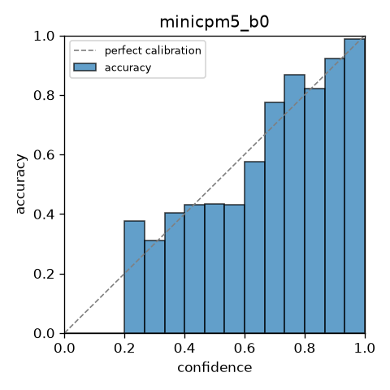
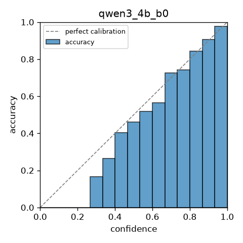
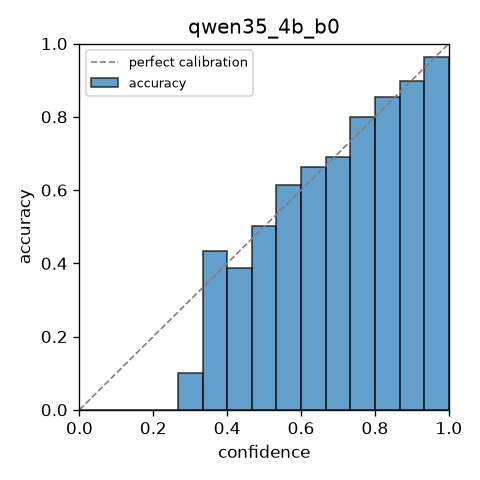

# M1: eval harness and B0 bake-off

Plan reference: `docs/design/2026-09-23-nanohunch/plan-parts/phase-3.md` step 11.

## Bake-off (test split, T-scaled)

| run | n | acc_gold | ece_width | nll | brier | baseline_delta | ci_lo | ci_hi |
|---|---|---|---|---|---|---|---|---|
| minicpm5_b0 | 3500 | 0.6380 | 0.0678 | 0.7546 | 0.4410 | - | - | - |
| qwen3_4b_b0 | 3500 | 0.7974 | 0.0192 | 0.4588 | 0.2709 | 0.1594 | 0.1316 | 0.1867 |
| qwen35_4b_b0 | 3500 | 0.8271 | 0.0143 | 0.4687 | 0.2561 | - | - | - |

`baseline_delta` is each run's paired accuracy delta against `minicpm5_b0` (95% CI, group-bootstrapped
by state). Q4 (ADR-0001 Amendment 3): Qwen3-4B-Base was chosen as the MVP training base on the
**cal**-split comparison (delta +0.1855, CI +0.1581 to +0.2133); the test-split numbers above are
published but did not drive that decision.

## Accuracy and calibration by qtype

| run | qtype | n | acc_gold | ece_width | nll | brier |
|---|---|---|---|---|---|---|
| minicpm5_b0 | choice | 1800 | 0.6739 | 0.0187 | 0.8770 | 0.4452 |
| minicpm5_b0 | noul | 1700 | 0.6000 | 0.1254 | 0.6251 | 0.4366 |
| qwen3_4b_b0 | choice | 1800 | 0.8450 | 0.0213 | 0.4243 | 0.2172 |
| qwen3_4b_b0 | noul | 1700 | 0.7471 | 0.0297 | 0.4953 | 0.3277 |
| qwen35_4b_b0 | choice | 1800 | 0.8250 | 0.0135 | 0.5230 | 0.2570 |
| qwen35_4b_b0 | noul | 1700 | 0.8294 | 0.0265 | 0.4112 | 0.2551 |

## Order-flip rates (Choice, >=3 options)

| run | suite | flip_rate |
|---|---|---|
| minicpm5_b0 | reverse | 0.2889 |
| minicpm5_b0 | perm_seed_1 | 0.2594 |
| minicpm5_b0 | perm_seed_2 | 0.2417 |
| minicpm5_b0 | perm_seed_3 | 0.2394 |
| qwen3_4b_b0 | reverse | 0.1439 |
| qwen3_4b_b0 | perm_seed_1 | 0.1161 |
| qwen3_4b_b0 | perm_seed_2 | 0.1250 |
| qwen3_4b_b0 | perm_seed_3 | 0.1228 |
| qwen35_4b_b0 | reverse | 0.1594 |
| qwen35_4b_b0 | perm_seed_1 | 0.1289 |
| qwen35_4b_b0 | perm_seed_2 | 0.1333 |
| qwen35_4b_b0 | perm_seed_3 | 0.1206 |

## Accuracy by input length

| run | length_bucket | n | acc_gold |
|---|---|---|---|
| minicpm5_b0 | le512 | 2700 | 0.6656 |
| minicpm5_b0 | 512_2k | 496 | 0.5383 |
| minicpm5_b0 | 2k_4k | 154 | 0.5649 |
| minicpm5_b0 | gt4k | 150 | 0.5467 |
| qwen3_4b_b0 | le512 | 2700 | 0.8322 |
| qwen3_4b_b0 | 512_2k | 496 | 0.7036 |
| qwen3_4b_b0 | 2k_4k | 154 | 0.6429 |
| qwen3_4b_b0 | gt4k | 150 | 0.6400 |
| qwen35_4b_b0 | le512 | 2700 | 0.8307 |
| qwen35_4b_b0 | 512_2k | 496 | 0.8246 |
| qwen35_4b_b0 | 2k_4k | 154 | 0.8052 |
| qwen35_4b_b0 | gt4k | 150 | 0.7933 |

## Reliability diagrams

  

## SemIf authored144 (mean family-balanced accuracy)

| run | family_balanced_accuracy |
|---|---|
| MiniCPM5-2B-Base (ours, B0) | 0.5278 |
| MiniCPM5-2B (SemIf published, native BF16) | 0.6860 |
| Qwen3.5-4B-Base (ours, B0, re-encode) | 0.7014 |
| Qwen3.5-4B (SemIf published, native BF16) | 0.8130 |
| Qwen3-0.6B (SemIf published, native BF16, reference only) | 0.4400 |

Checkpoint and prompt caveat: SemIf's published MiniCPM5-2B row uses `openbmb/MiniCPM5-2B`
(native BF16, chat-template JSON prompt); we only have `MiniCPM5-2B-Base` cached and score it
with the nanohunch prompt. Both checkpoint and serialization differ, so the gap below SemIf's
0.686 is not diagnosable as a readout bug from this comparison alone (bounded 3h audit done,
see `.jarvis/PROGRESS.md` Phase 3.7). The Qwen3.5-4B-Base row has the same caveat against SemIf's
0.813 (their row is the non-Base Qwen3.5-4B checkpoint).

## JevBench public items (self-run, not an official JevBench score)

| tier (source file) | n | accuracy | ece_width |
|---|---|---|---|
| original | 60 | 0.3667 | 0.1755 |
| easy | 48 | 0.8333 | 0.0920 |
| hard | 105 | 0.3810 | 0.2144 |

The official JevBench score also covers sealed items, speed and cost; this is accuracy and
ECE on the public half only, self-run in our harness.

## pngwn

pngwn arm B is published at accuracy 0.752, ECE 0.015 (T-scaled), 37.5% order flips. We could not
run our own pngwn row for M1: `configs/eval_m1.yaml external.pngwn_test.fields` is still empty
because the pngwn schema (`data/raw/pngwn/typed-decisions-v2`) was unavailable during this phase.
The number above is a reference point, not a comparison on the same data.

## M1 latency (bench/latency_p2.py, W0/W1/W2, plan Phase 2 step 11)

## Latency: openbmb/MiniCPM5-2B-Base (engine (branching), batch 1, bf16)

| workload | state tokens | questions | median ms | synthetic ms | ratio |
|---|---|---|---|---|---|
| W0 | 256 | 4 | 297 | 318 | 0.93x |
| W1 | 1024 | 16 | 1261 | 893 | 1.41x |
| W2 | 8192 | 16 | 4386 | 6600 | 0.66x |

## Latency: Qwen/Qwen3-4B-Base (engine (branching), batch 1, bf16)

| workload | state tokens | questions | median ms | synthetic ms | ratio |
|---|---|---|---|---|---|
| W0 | 256 | 4 | 596 | 318 | 1.88x |
| W1 | 1024 | 16 | 2060 | 893 | 2.31x |
| W2 | 8192 | 16 | 7654 | 6600 | 1.16x |

## Latency: Qwen/Qwen3.5-4B-Base (re-encode, batch 1, bf16)

| workload | state tokens | questions | median ms | synthetic ms | ratio |
|---|---|---|---|---|---|
| W0 | 256 | 4 | 972 | 318 | 3.06x |
| W1 | 1024 | 16 | 12923 | 893 | 14.47x |
| W2 | 8192 | 16 | 126528 | 6600 | 19.17x |


## Core line count

```
fmt.py            91 /  130
engine.py         82 /  200
calibrate.py      74 /  170
train.py           0 /  220
dataset.py       146 /  150
evaluate.py      227 /  130  OVER (soft)
core total       620 / 1000
```

## Contamination caveat

BoolQ, ARC, CommonsenseQA and HotpotQA (the four public sources behind `eval_v1`) are likely
present in both MiniCPM5-2B-Base's and Qwen3-4B-Base's/Qwen3.5-4B-Base's pretraining data. Accuracy
on these sources is not a clean held-out signal for either base model.

## Jev (footnote)

Jev's own published numbers are vendor-reported, not reproduced here.

## Calibration grouping (Phase 3.8, closed)

Checked `option_count_buckets` in the bake-off runs: bucket `2` is Noul-only, bucket `3-5` is
Choice-only, so the plan's within-qtype bucket-ECE comparison has nothing to compare on `eval_v1`.
Kept a single `T` per `(qtype, n_perms)`; re-check at Phase 6 step 15 once v2 adds 6-8 option
Choice items.

## Interpretation

_(not generated: report and model-card prose is written by hand, not by jarvis -- AGENTS.md Rule 2
and `.jarvis/PROJECT.md` Ownership. Add your read of the numbers above, then `git tag m1` and push.)_
